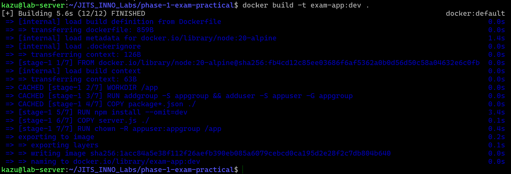

# Task Submission Template

> Mỗi task = 1 thư mục con + 1 PR/MR riêng. Copy template này vào `README.md` của task.

## Task: `Phase 1 / Exam / Practical`

- **Intern**: `Nguyễn Quang Dũng`
- **Phase / Week / Day**: `Phase 1 / Exam`
- **Branch**: `phase-1/exam`
- **Submitted at**: `2026-07-03 23:00` (timezone +07)
- **Time spent**: `6h`

## 1. Mục tiêu
Thiết lập quy trình triển khai ứng dụng cơ bản (Mini Deploy Pipeline) thông qua việc đóng gói ứng dụng, cấu hình hệ thống đa dịch vụ, khởi tạo luồng tích hợp liên tục và cấu hình hạ tầng.

## 2. Cách chạy
```bash
# Tải mã nguồn ứng dụng
git clone https://github.com/KwangZung/phase-1-exam-practical.git
cd phase-1-exam-practical

# Task 1: Kiểm tra bản dựng Docker
docker build -t exam-app:dev .
```

## 3. Kết quả

Mã nguồn ứng dụng được lưu tại repo:
[https://github.com/KwangZung/phase-1-exam-practical](https://github.com/KwangZung/phase-1-exam-practical)

### Task 1: Containerize
**Cách thực hiện:**
- Thiết lập tệp `server.js` xử lý phản hồi yêu cầu sức khỏe hệ thống (healthcheck) kèm theo việc khởi tạo đối tượng kết nối cơ sở dữ liệu dựa trên biến môi trường.
- Thiết lập tệp `package.json` với kịch bản phục vụ quá trình tự động kiểm thử.
- Khai báo tệp `.dockerignore` nhằm bỏ qua các tập tin dư thừa, tối ưu hóa kích thước ngữ cảnh bản dựng.
- Viết tệp `Dockerfile` sử dụng kỹ thuật xây dựng đa giai đoạn, khởi tạo một nhóm và người dùng không chứa quyền hệ thống (non-root), đồng thời áp dụng lệnh `HEALTHCHECK` định kỳ.

**Kết quả đạt được:**



## 4. Khó khăn & cách giải quyết
- Vấn đề 1 → cách fix.
- Vấn đề 2 → cách fix.

## 5. Reference
- Đã đọc gì để làm task này (link cụ thể, không vague).

## 6. Self-check
- [ ] Code chạy được trên máy sạch.
- [ ] README có hướng dẫn run lại.
- [ ] Không hard-code secret.
- [ ] Commit message theo Conventional Commits.
- [ ] Đã review lại code 1 lượt.