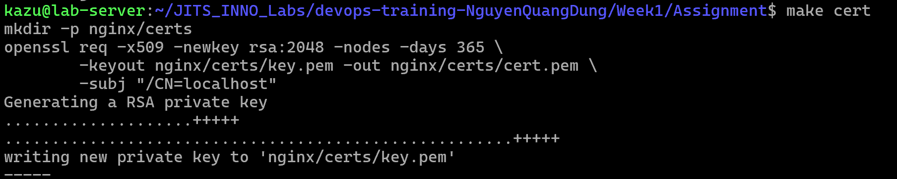
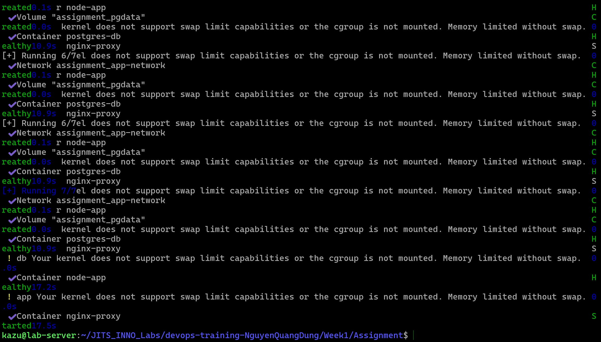
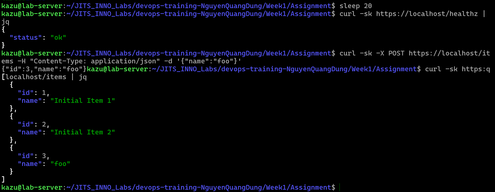
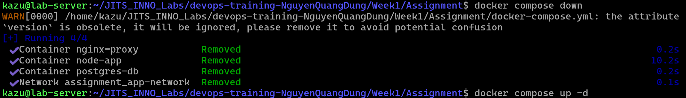
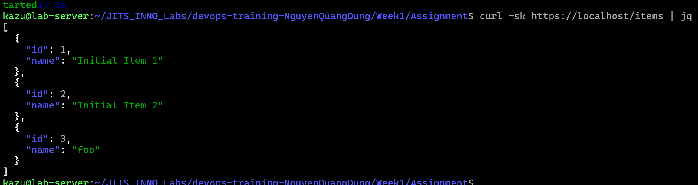

# Task Submission Template

> Mỗi task = 1 thư mục con + 1 PR/MR riêng. Copy template này vào `README.md` của task.

## Task: Assignment Week 1

- **Intern**: `Nguyễn Quang Dũng`
- **Phase / Week / Day**: `Phase 1 / Week 1 / Assignment`
- **Branch**: `phase-1/week-1/assignment`
- **Submitted at**: `2026-07-03 09:59` (timezone +07)
- **Time spent**: `6h`

## 1. Mục tiêu
Triển khai thành công cụm hệ thống 3-tier (Nginx - Node.js - PostgreSQL) bằng Docker Compose, đảm bảo các tiêu chí bảo mật (chứng chỉ HTTPS tự ký, giới hạn tài nguyên, phân quyền non-root) và dữ liệu được lưu trữ bền vững kể cả khi sập nguồn.

## 2. Cách làm chi tiết
Hệ thống được thiết kế theo mô hình 3 lớp biệt lập, trong đó mỗi lớp đảm nhận một nhiệm vụ chuyên biệt:

### 2.1. Lớp điều hướng mạng (Nginx)
- **File `nginx/nginx.conf`**: Cấu hình Reverse Proxy chịu trách nhiệm lắng nghe cổng 80 và 443. Toàn bộ luồng truy cập HTTP (80) đều bị ép chuyển hướng (301 redirect) sang HTTPS (443) an toàn. Lớp này làm nhiệm vụ giải mã chứng chỉ số và trỏ luồng giao tiếp vào biến môi trường `$proxy_add_x_forwarded_for` để chuyển về máy chủ phụ trợ.
- **Chứng chỉ tự ký**: Được sinh tự động và lưu vào thư mục `nginx/certs` thông qua lệnh tự động trong Make.

### 2.2. Lớp xử lý nghiệp vụ (Node.js App)
- **File `app/src/index.js`**: Ứng dụng Node.js kết nối trực tiếp với PostgreSQL thông qua thư viện `pg`. Ứng dụng cung cấp 3 API: `GET /healthz` (kiểm tra hoạt động của hệ thống), `GET /items` (lấy danh sách) và `POST /items` (chèn dữ liệu mới).
- **File `app/Dockerfile`**: Đóng gói vùng chứa bằng kỹ thuật nhiều giai đoạn (multi-stage build) để tối ưu dung lượng và bắt buộc chạy bằng phân quyền người dùng bị hạn chế (`USER node`) nhằm đảm bảo tiêu chí bảo mật non-root của hệ thống.

### 2.3. Lớp cơ sở dữ liệu (PostgreSQL)
- **File `db/init.sql`**: Chứa kịch bản SQL tự động tạo bảng `items` và chèn hai bản ghi mẫu ban đầu khi hệ thống lần đầu khởi động.

### 2.4. Công cụ tự động hóa và điều phối
- **File `docker-compose.yml`**: Trái tim của hệ thống, kết nối 3 vùng chứa vào chung một mạng ảo `app-network`. Tệp này khai báo các giới hạn tài nguyên chặt chẽ (`cpus: 0.5`, `memory: 256M`), ghi nhật ký xoay vòng (`max-size: 10m`) và thiết lập luồng khởi động tuần tự khép kín (App chờ DB, Nginx chờ App) qua cơ chế `healthcheck`.
- **File `Makefile`**: Định nghĩa các lệnh tự động hóa như `make cert` (tạo chứng chỉ), `make up` (chạy), `make clean` (dọn dẹp toàn bộ dữ liệu).

## 3. Cách chạy
```bash
git clone <your-repo>
cd assignment
cp .env.example .env       # sửa nếu cần
make cert
docker compose up -d
sleep 20
curl -sk https://localhost/healthz | jq    # expect 200 ok
curl -sk -X POST https://localhost/items -H "Content-Type: application/json" -d '{"name":"foo"}'
curl -sk https://localhost/items | jq
docker compose down
docker compose up -d
curl -sk https://localhost/items | jq      # data còn nguyên
```

## 4. Kết quả
### 4.1. Khởi tạo cert (make cert)


### 4.2. Khởi động toàn hệ thống


### 4.3. Kiểm tra các chức năng giao tiếp API
Bao gồm: healthcheck, chèn thêm dữ liệu động (POST) và truy vấn lại danh sách bản ghi (GET):


### 4.4. make down


### 4.5. Xác nhận tính bền vững của dữ liệu
Sau khi khởi động lại hệ thống, dữ liệu "foo" mới chèn trước khi tắt hệ thống vẫn còn nguyên vẹn:


## 5. Khó khăn & cách giải quyết
- **Lỗi 1**: Hệ thống không nhận lệnh `docker compose` do phiên bản cũ. 
  - *Cách fix*: Tiến hành nâng cấp Docker Engine gốc.
- **Lỗi 2**: Lệnh `npm ci` báo lỗi thiếu tệp khóa trong quá trình đóng gói image. 
  - *Cách fix*: Đổi thành `npm install` trong `Dockerfile` để lấy linh hoạt gói thư viện từ `package.json`.
- **Lỗi 3**: Nginx sập ngay khi vừa bật do sai tên biến HTTP. 
  - *Cách fix*: Thay biến cấu hình lỗi `$proxy_addrs` thành đúng chuẩn `$proxy_add_x_forwarded_for`.
- **Lỗi 4**: Xung đột cổng mạng 80 do máy chủ đã có sẵn dịch vụ web rác. 
  - *Cách fix*: Dùng lệnh `sudo lsof -i :80` để truy tìm, dùng `systemctl stop apache2` để tắt vĩnh viễn rồi mới bật lại hệ thống của ta.

## 6. Self-check
- [x] Code chạy được trên máy sạch (Reproducibility).
- [x] README có hướng dẫn chi tiết cách chạy lại.
- [x] Không hard-code cấu hình nhạy cảm (secrets).
- [x] Commit message phân mảnh theo đúng chuẩn Conventional Commits.
- [x] Đã đánh giá và kiểm tra kiến trúc toàn diện 1 lượt.