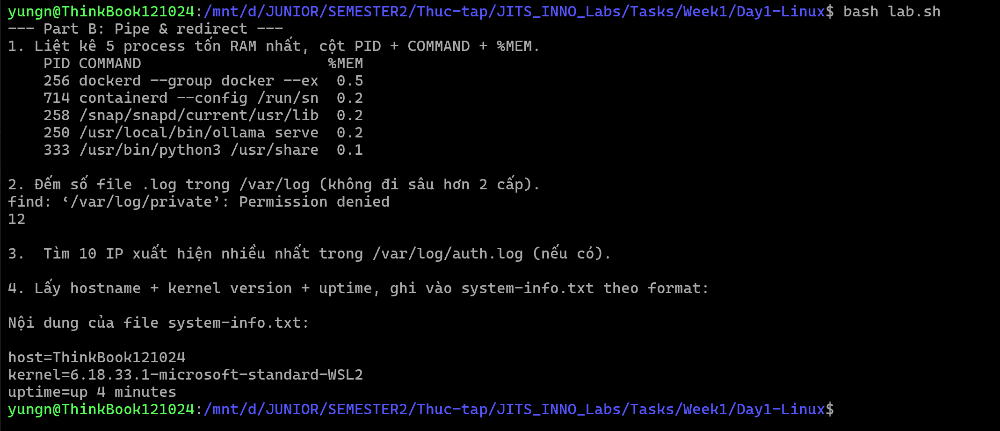
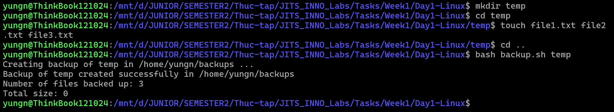

# Task Submission Template

## Task: `Day 1 — Linux Fundamentals`

- **Intern**: `Nguyễn Quang Dũng`
- **Phase / Week / Day**: `Phase 1 / Week 1 / Day 1`
- **Branch**: `phase-1/week-1/day-1-linux`
- **Submitted at**: `2026-06-17 23:35` (timezone +07)
- **Time spent**: `5h`

## 1. Mục tiêu
- Làm quen và hiểu công dụng của hơn 55 lệnh Linux cơ bản.
- Áp dụng Pipe và Redirect để phân tích log hệ thống.
- Viết bash script có xử lý exit code, tham số và ứng dụng thực tế để nén, backup file.

## 2. Cách chạy
Trước khi chạy những lệnh dưới đây, anh cần cd vào thư mục chứa các file thực thi này
```bash
# Part B
bash lab.sh

# Part C
mkdir temp
cd temp
touch file1.txt file2.txt file3.txt
cd ..
bash backup.sh temp
```

## 3. Kết quả
- Hoàn thành đầy đủ giải thích tiếng Việt cho các lệnh ở Part A (trong `notes.md`).
- Hoàn thành Part B và C.
- Các ảnh kết quả chạy lệnh (screenshot):
  
  

## 4. Khó khăn & cách giải quyết
- Vấn đề 1: Lỗi "improper AIX field descriptor" khi chạy `ps -eo PID,COMMAND,%MEM`
  → Cách fix: Xóa bỏ khoảng trắng và viết thường các tên biến (VD: `%mem`).
- Vấn đề 2: Lỗi không tạo được thư mục backup vì nhầm lẫn giữa `~` và biến `$HOME` khi nằm trong ngoặc kép.
  → Cách fix: Dùng `BACKUP_DIR="$HOME/backups"` thay vì `BACKUP_DIR="~/backups"`.

## 5. Reference
- [Missing Semester — Shell](https://missing.csail.mit.edu/2020/course-shell/)
- [Linux Journey — Command Line](https://linuxjourney.com/lesson/the-shell)
- Cheatsheet: https://github.com/trinib/Linux-Bash-Commands
- [Conventional Commits](https://www.conventionalcommits.org/)

## 6. Self-check
- [x] Code chạy được trên máy sạch.
- [x] README có hướng dẫn run lại.
- [x] Không hard-code secret.
- [x] Commit message theo Conventional Commits.
- [x] Đã review lại code 1 lượt.
