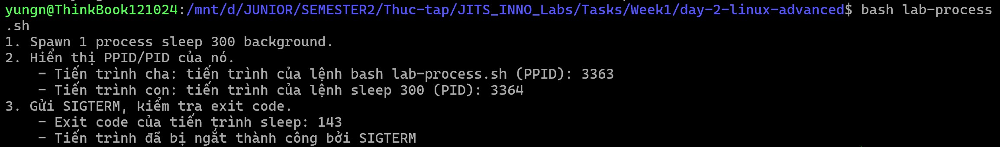
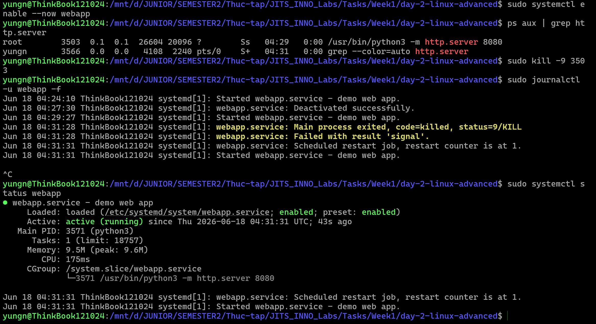
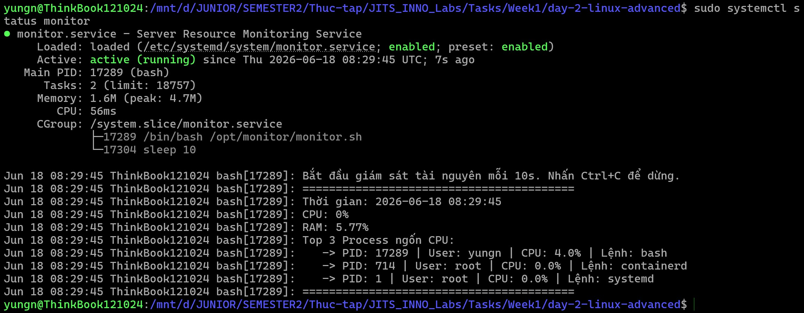
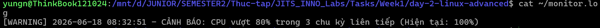

# Task Submission: Day 2 - Linux Advanced

## Task: `Linux Advanced (Process, systemd, Permission, Networking)`

- **Intern**: `Nguyễn Quang Dũng`
- **Phase / Week / Day**: `Phase 1 / Week 1 / Day 2`
- **Branch**: `phase-1/week-1/day-2-linux-advanced`
- **Submitted at**: `2026-06-18`
- **Time spent**: `5h30p`

## 1. Mục tiêu
- **Part A:** Nắm vững lý thuyết về Process & Signal (`SIGTERM`, `SIGKILL`, Zombie Process...). Chạy ngầm tiến trình, bắt PID và điều khiển bằng signal.
- **Part B:** Đã tạo file systemd unit (`webapp.service`) để daemonize Python HTTP Server và cấu hình tự động hồi sinh.
- **Part C:** Đã hoàn thành cấu hình quản lý permission nâng cao (setgid, setfacl) và viết docs tái hiện.
- **Part D:** Đã viết xong script `monitor.sh` giám sát tài nguyên (CPU/MEM) và daemonize nó bằng systemd (`monitor.service`).

## 2. Cách chạy
**(Part A: Process & Signal)**
Cấp quyền thực thi và chạy script thực hành:
```bash
chmod +x lab-process.sh
./lab-process.sh
```

**(Part B: Systemd Webapp)**
Copy file service vào hệ thống và kích hoạt:
```bash
sudo mkdir -p /opt/webapp
echo "<h1>Hello JITS</h1>" | sudo tee /opt/webapp/index.html
sudo cp webapp.service /etc/systemd/system/
sudo systemctl daemon-reload
sudo systemctl enable --now webapp
```

**(Part D: Monitoring Script)**
Thiết lập thư mục, cấu hình quyền và kích hoạt service giám sát bằng systemd:
```bash
sudo mkdir -p /opt/monitor
sudo cp monitor.sh /opt/monitor
sudo chmod +x /opt/monitor/monitor.sh
sudo cp monitor.service /etc/systemd/system/
sudo systemctl daemon-reload
sudo systemctl enable --now monitor
sudo systemctl status monitor

# Ép CPU để kiểm tra tính năng cảnh báo với máy có 16 nhân CPU
stress --cpu 16 --timeout 40

# Đọc file monitor.log để kiểm tra log cảnh báo
cat ~/monitor.log
```

## 3. Kết quả
### Part A: Process & Signal
- Đã hoàn thành trả lời 5 câu hỏi lý thuyết tại file: [`notes.md`](./notes.md) (Có chèn ảnh minh họa cấu trúc lệnh `ps auxf` và cấu trúc Zombie process).
- Đã hoàn thành file thực hành [`lab-process.sh`](./lab-process.sh):
  - Chạy `sleep 300` dưới nền (background).
  - Xuất ra PID và PPID chuẩn xác.
  - Gửi thành công tín hiệu `SIGTERM` (15) để ngắt chương trình và xác nhận Exit Code là `143`.
  - Có demo bổ sung lệnh `nohup` và cách dùng `pkill -f`.

**Ảnh minh chứng kết quả chạy script `lab-process.sh`:**


### Part B: Systemd Service
- Đã tạo thành công file [`webapp.service`](./webapp.service) phục vụ chạy ngầm web server bằng lệnh `python3 -m http.server`.
- Cấu hình thành công tính năng auto restart)dưới 5 giây thông qua cờ `Restart=on-failure` và `RestartSec=3`.
- Đã test diệt tiến trình bằng cờ `-9` và kiểm chứng qua logs bằng lệnh `journalctl -u webapp -f` thấy systemd tự động khởi tạo lại tiến trình với PID mới.

**Ảnh minh chứng kết quả chạy và hồi sinh `webapp.service`:**


### Part C: Permission Lab
- Hoàn thành cấu hình phân quyền nâng cao trên thư mục `/tmp/shared-lab`.
- Đã thiết lập thành công **setgid** để kế thừa group `devops`.
- Đã cấu hình **ACL (setfacl)** cho phép cấp quyền read-only.
- Chi tiết các bước thiết lập, giải thích và ảnh minh chứng lệnh tại: [`permissions-lab.md`](./permissions-lab.md)

### Part D: Monitoring script
- Viết thành công `monitor.sh` đáp ứng: in ra số liệu CPU%, RAM% mỗi 10 giây và lọc ra top 3 process chiếm dụng CPU.
- Cấu hình thuật toán đếm số lần vi phạm: log cảnh báo ra `~/monitor.log` nếu CPU vọt quá ngưỡng 80% trong 3 lần lấy mẫu liên tiếp.
- Đã bẫy (trap) thành công tín hiệu `SIGINT` và `SIGTERM` để dọn dẹp hệ thống trước khi ngắt (Graceful Exit).
- Thiết lập file unit `monitor.service` hoàn chỉnh để biến script thành Daemon chạy ngầm liên tục trên hệ điều hành.

**Ảnh minh chứng kết quả chạy cấu hình và status của `monitor.service`:**


**Ảnh minh chứng test ép xung CPU bằng lệnh stress và ghi log cảnh báo thành công:**


## 4. Khó khăn & cách giải quyết
- **Vấn đề:** Dễ nhầm lẫn giữa chức năng của `nohup`, `&`, `disown` và `setsid` khi muốn giữ tiến trình chạy ngầm.
  - **Cách giải quyết:** Nghiên cứu kỹ và phân tách rạch ròi 2 khái niệm: miễn nhiễm với tín hiệu `SIGHUP` khi tắt terminal và chạy trong background để trả lại quyền gõ lệnh cho terminal. Đã note chi tiết vào `notes.md`.
- **Vấn đề:** Không hiểu tại sao tiến trình chết vì signal lại sinh ra exit code `143`.
  - **Cách giải quyết:** Tìm hiểu về quy ước exit code của bash shell đối với các tiến trình bị ngắt bằng tín hiệu (128 + mã signal). Với `SIGTERM` có signal 15, kết quả là 128 + 15 = 143.
- **Vấn đề (Part B):** Dùng lệnh `kill <PID>` thông thường để test Auto Restart của systemd nhưng service không chịu khởi động lại mà báo "Deactivated successfully".
  - **Cách giải quyết:** Đã phát hiện ra `kill` không cờ mặc định gửi tín hiệu `SIGTERM`. Systemd coi `SIGTERM` là thao tác tắt an toàn hợp lệ (như `systemctl stop`), nên cờ `Restart=on-failure` bị vô hiệu hóa. Phải dùng `kill -9 <PID>` (gửi tín hiệu `SIGKILL`) để ép ứng dụng chết phi lý (crashes), lúc này systemd mới chịu kích hoạt cơ chế hồi sinh.
- **Vấn đề (Part C):** Đã set Default ACL (`setfacl -d`) cho thư mục nhưng user `guest1` vẫn bị "Permission denied" khi đọc các file đã tồn tại từ trước.
  - **Cách giải quyết:** Hiểu ra rằng cờ `-d` (default) chỉ áp đặt "di chúc" lên các file **sẽ được tạo mới trong tương lai**, hoàn toàn không có tính hồi tố (retroactive). Để user có quyền trên file cũ, bắt buộc phải dùng `setfacl -m` cấp quyền trực tiếp lên file đó.
- **Vấn đề (Part D - Bug Bash):** Khi ép CPU chạm ngưỡng 100%, lệnh `top` xuất ra kết quả bị mất khoảng trắng (space) khiến cột giá trị bị xô lệch thành chữ `id,`. Hậu quả là bash tính toán sai và báo lỗi `syntax error: operand expected`.
  - **Cách giải quyết:** Thay vì trích xuất cứng nhắc theo cột `$8` trong lệnh `awk`, em đã thay đổi thuật toán thành dùng vòng lặp tìm đúng chữ `id` rồi lấy giá trị ở cột ngay phía trước nó `$(i-1)`. Đảm bảo script luôn chạy ổn định dù giao diện của lệnh `top` có bị bóp méo do số quá lớn.
- **Vấn đề (Part D - Testing):** Chạy lệnh `stress` xong nhưng không thấy file `monitor.log` sinh ra.
  - **Cách giải quyết:** Phát hiện ra logic script yêu cầu phải vượt quá 80% CPU trong 3 chu kỳ liên tiếp (30 giây), nhưng do chạy lệnh `stress` xong xuôi rồi mới xem `monitor` nên script toàn ghi nhận CPU ở mức 2% (chệch múi giờ). Đã đổi kịch bản test: Bật `journalctl -f` theo dõi trực tiếp, rồi mở terminal thứ 2 chạy `stress` song song để đảm bảo script "bắt quả tang" đúng thời điểm CPU đang vọt.

## 5. Reference
- [systemd for Administrators (Lennart Poettering)](https://0pointer.de/blog/projects/systemd-for-admins-1.html)
- [Linux permissions deep dive](https://www.redhat.com/sysadmin/linux-permissions-explained)
- Tìm hiểu về bash background jobs và Signal qua man pages.

## 6. Self-check
- [x] Code chạy được trên máy sạch.
- [x] README có hướng dẫn run lại.
- [x] Không hard-code secret.
- [x] Commit message theo Conventional Commits (Sẽ tuân thủ khi đẩy lên Git).
- [x] Đã review lại code 1 lượt.
