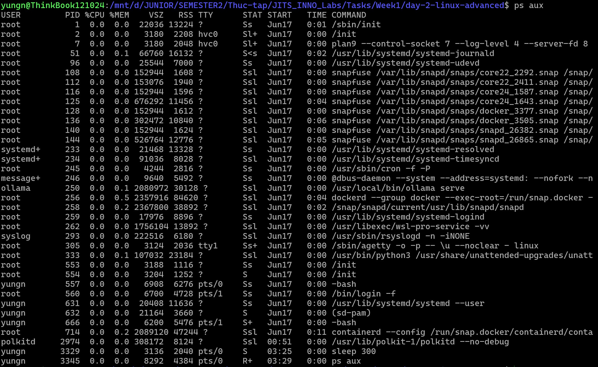
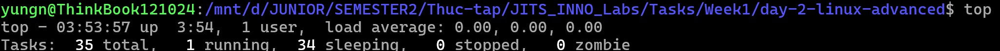

# Part A — Process & Signal

### 1. Sự khác nhau giữa SIGTERM, SIGKILL, SIGHUP, SIGINT?

- **`SIGTERM` (Signal Terminate - Signal 15)**: Tín hiệu yêu cầu kết thúc tiến trình một cách an toàn. Tiến trình nhận tín hiệu này để dọn dẹp tài nguyên (lưu file, đóng kết nối db) trước khi thoát, hoặc có thể chọn phớt lờ nó. Đây là tín hiệu mặc định của lệnh `kill`.
- **`SIGKILL` (Signal Kill - Signal 9)**: Tín hiệu ép buộc giết tiến trình ngay lập tức. Tiến trình không thể catch hay phớt lờ tín hiệu này. Hệ điều hành sẽ nhảy vào dọn dẹp và thu hồi tài nguyên ngay tức thì.
- **`SIGHUP` (Signal Hang Up - Signal 1)**: Dùng để ngắt các tiến trình con của terminal khi kết nối tới terminal bị ngắt. Hiện nay, nhiều tiến trình chạy ngầm (daemons như Nginx, Apache) sử dụng tín hiệu này như một cách để reload lại file cấu hình mà không cần khởi động lại toàn bộ tiến trình.
- **`SIGINT` (Signal Interrupt - Signal 2)**: Thường được hệ thống sinh ra khi người dùng nhấn tổ hợp phím Ctrl+C trên terminal, có tính chất tương tự SIGTERM nhưng chủ yếu dùng cho các tiến trình chạy nổi trên bề mặt.

Để gửi tín hiệu này cho 1 tiến trình cụ thể ta sẽ dùng lệnh:
`kill -<SignalNumber> <PID>` hoặc `kill -<SignalName> <PID>`.
Ví dụ: 
`kill -15 1234` hoặc `kill -SIGTERM 1234`.

### 2. `nohup` vs `disown` vs `setsid` khác nhau thế nào?
Cả 3 lệnh này đều giúp một tiến trình tiếp tục chạy nền kể cả khi chúng ta đóng terminal hoặc thoát phiên SSH, nhưng cơ chế khác nhau:
- **`nohup` (viết tắt của "No Hang Up")**: Bao bọc lệnh khi khởi chạy để tiến trình *phớt lờ* tín hiệu `SIGHUP`. Output hay log được sinh ra bởi lệnh được bao bọc sẽ mặc định được chuyển hướng vào file `nohup.out`. Cú pháp chạy lệnh này: `nohup <command> &`.
- **`disown` (nghĩa là chối bỏ)**: Dùng để gỡ một tiến trình đã được chạy nền ra khỏi sự quản lý của terminal hiện tại. Khi terminal thoát, nó không thấy tiến trình này trong danh sách nữa nên không gửi `SIGHUP` tới tiến trình đó. Cú pháp chạy lệnh này: `<command> &` rồi chạy `disown`.
- **`setsid` (viết tắt của "Set Session ID")**: Chạy một chương trình trong một session mới tinh, cách ly hoàn toàn với terminal hiện tại. Nó trở thành leader của session mới và không có terminal điều khiển. Khi terminal sinh ra nó đóng, nó hoàn toàn không bị ảnh hưởng. Cú pháp chạy lệnh này: `setsid <command>`.

### 3. Khi nào dùng `pkill -f`?
- Lệnh **`pkill` (viết tắt của Pattern Kill)** sử dụng biểu thức chính quy (Regular Expression) để tìm và diệt các tiến trình có tên tiến trình khớp với từ khóa. Tên tiến trình do Linux quản lý thường bị cắt ngắn, giới hạn ở 15 ký tự đầu. 
  - *Ví dụ 1* Nếu chạy một file tên `./my_super_long_background_service`, Hệ điều hành có thể chỉ lưu tên tiến trình là `my_super_long_b`. Lệnh `pkill my_super_long_background_service` sẽ thất bại vì không khớp chuỗi. Ta thêm cờ `-f` để mở rộng phạm vi tìm kiếm
- Ta cũng có thể dùng thêm cờ `-f` (full) khi muốn `pkill` mở rộng phạm vi tìm kiếm ra toàn bộ dòng lệnh khởi chạy bao gồm cả đường dẫn thực thi và các tham số.
  - *Ví dụ 2* Khi chạy lệnh `python3 script_ai.py`, tên tiến trình trong hệ thống chỉ đơn thuần là `python3`. Nếu ta gõ `pkill script_ai`, lệnh sẽ vô tác dụng. Nếu gõ `pkill python3`, nó lại giết nhầm mọi tiến trình python khác đang chạy. Do đó, ta phải dùng `pkill -f "python3 script_ai.py"` để quét trên toàn bộ dòng lệnh và tóm chính xác mục tiêu.

### 4. Đọc output `ps auxf` — giải thích cột STAT (R, S, D, Z, T)

Cột `STAT` (Trạng thái của tiến trình) có các mã phổ biến:
- **`R` (Running hoặc Runnable)**: Tiến trình đang chạy trên CPU hoặc đang nằm trong hàng đợi chờ cấp phát CPU để chạy.
- **`S` (Interruptible Sleep)**: Tiến trình đang đang chờ một sự kiện nào đó như chờ người dùng nhập phím, chờ dữ liệu mạng.... Nó có thể bị đánh thức tức thì bằng một signal.
- **`D` (Uninterruptible Sleep)**: Tiến trình đang ngủ sâu, thường là chờ xử lý phần cứng I/O, ví dụ đọc ghi đĩa. Không thể ngắt hay đánh thức nó bằng signal, kể cả `SIGKILL`.
- **`Z` (Zombie)**: Tiến trình đã chạy xong và giải phóng tài nguyên, nhưng hệ điều hành vẫn giữ lại bản ghi của nó để lưu trữ exit code, chờ tiến trình cha tới nhận thông qua hàm `wait()`.
- **`T` (Stopped)**: Tiến trình đã bị tạm dừng, thường là do nhận tín hiệu `SIGSTOP` khi người dùng nhấn `Ctrl+Z`. Tiến trình bị tạm dừng hoàn toàn có thể được chạy tiếp khi nhận tín hiệu `SIGCONT`.

### 5. Zombie process là gì, làm sao nhận diện?
- **Định nghĩa**: Là một tiến trình con đã hoàn tất công việc, nhưng tiến trình cha của nó chưa kịp xử lý và chưa đọc lại exit status của nó. Nếu có quá nhiều zombie, OS có thể cạn kiệt PID và không mở được app mới.
- **Cách nhận diện**: 
  - Gõ lệnh `top`, nhìn dòng thứ hai (Tasks), phần `zombie` sẽ hiển thị tổng số tiến trình zombie.
  - Hoặc dùng `ps aux`, nhìn vào cột STAT, những tiến trình nào có chữ **`Z`**  chính là zombie process.

