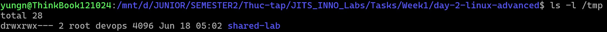
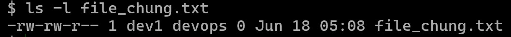
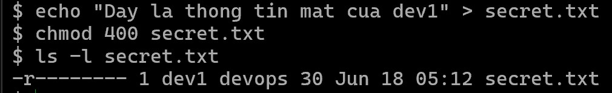
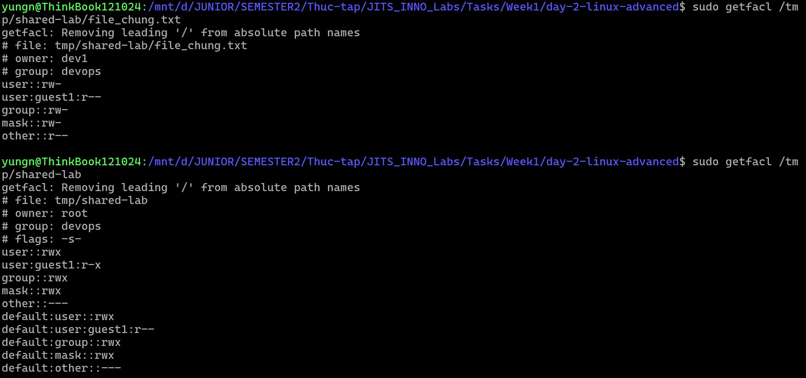
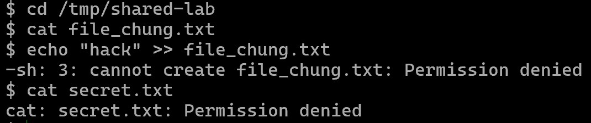

# Part C — Permission Lab

## 1. Chuẩn bị User và Group
Chạy bằng quyền `root` (hoặc `sudo`):
```bash
# Cài đặt gói acl
sudo apt update && sudo apt install acl -y

# Tạo group devops
sudo groupadd devops

# Tạo user dev1 thuộc group devops
sudo useradd -mG devops dev1

# Tạo 1 user khác tên là guest1
sudo useradd -m guest1
```

## 2. Tạo thư mục và cấu hình cơ bản
Yêu cầu: Thư mục `/tmp/shared-lab` cho Group `devops` cùng đọc/ghi.
```bash
sudo mkdir -p /tmp/shared-lab

# Trao quyền group sở hữu thư mục cho devops
sudo chgrp devops /tmp/shared-lab

# Cấp quyền rwx cho Owner và Group (devops), người khác không có quyền
sudo chmod 770 /tmp/shared-lab
```

**Ảnh minh chứng Group Owner của `/tmp/shared-lab`:**


## 3. Cấu hình setgid bit
Yêu cầu: File mới tạo trong đó phải tự inherit group devops.
```bash
# Bật bit setgid (+s) cho group
sudo chmod g+s /tmp/shared-lab
```

*Kiểm chứng:*
```bash
# Đổi sang user dev1
sudo su - dev1
cd /tmp/shared-lab

# Tạo file mới
touch file_chung.txt

# Xem quyền của file
ls -l file_chung.txt
```

**Ảnh minh chứng cấu hình setgid thành công:**


## 4. Tạo file secret.txt chỉ owner đọc được
Vẫn đang đóng vai `dev1` trong `/tmp/shared-lab`:
```bash
# Tạo file secret
echo "Day la thong tin mat cua dev1" > secret.txt

# Chỉ owner có quyền đọc
chmod 400 secret.txt

# Kiểm tra lại quyền
ls -l secret.txt

exit
```

**Ảnh minh chứng quyền truy cập file `secret.txt`:**


## 5. Dùng ACL (setfacl) cho phép 1 user khác chỉ đọc

**💡 ACL (Access Control List):**
- Vấn đề: Hệ thống phân quyền truyền thống của Linux (dùng lệnh `chmod`) chỉ cho phép mỗi file/thư mục chỉ được sở hữu bởi đúng 1 Owner và 1 Group. Ở các bước trên, ta đã gán thư mục `/tmp/shared-lab` cho group `devops`. Vì thế không thể nào cấp quyền cho một user thứ ba mà không nhét họ vào group `devops` hoặc cấp quyền cho tất cả mọi người.
- **ACL (Access Control List)** là giải pháp. Nó cho phép ta cấp quyền tùy chỉnh cho vô số user hoặc group khác nhau trên cùng một thư mục/file.

**Thực hành:**
Yêu cầu: Cho phép 1 user khác (`guest1`) chỉ đọc, không ghi.
```bash
# 1. Cấp quyền truy cập (rx) vào thư mục cho guest1
sudo setfacl -m u:guest1:rx /tmp/shared-lab

# 2. Cấp quyền chỉ đọc (r) trên các file cho guest1
sudo setfacl -m u:guest1:r /tmp/shared-lab/file_chung.txt

# 3. Thiết lập Default ACL để guest1 tự động có quyền đọc (r) với các file mới sinh ra sau này
sudo setfacl -d -m u:guest1:r /tmp/shared-lab
```

## 6. Kiểm chứng và Output `getfacl`
**Lấy bằng chứng `getfacl` (Pass criteria):**
```bash
sudo getfacl /tmp/shared-lab
sudo getfacl /tmp/shared-lab/file_chung.txt
```

**Test với quyền `guest1`:**
```bash
sudo su - guest1
cd /tmp/shared-lab

cat file_chung.txt

echo "hack" >> file_chung.txt

cat secret.txt
exit
```

**Ảnh minh chứng Output `getfacl` và kiểm thử quyền:**


