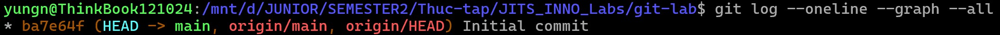
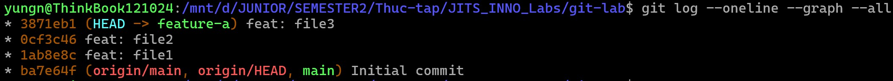
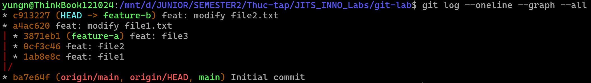
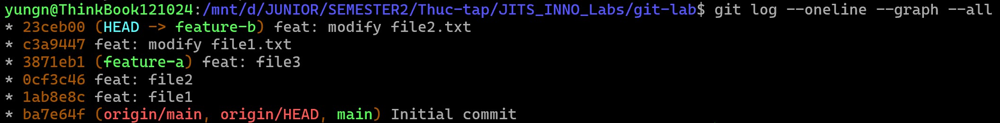
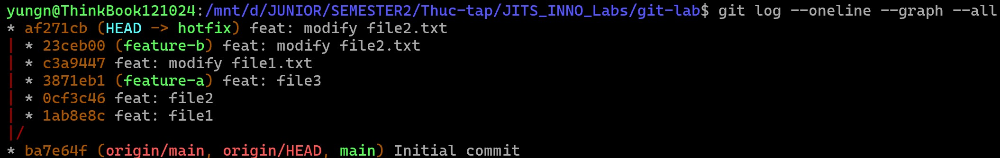
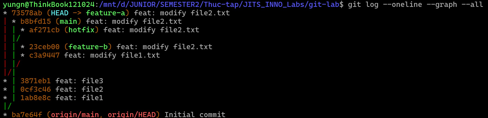
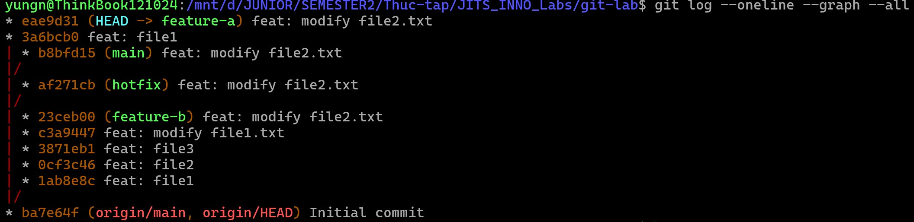

### Part A — Rebase + cherry-pick + conflict



1. Tạo branch `feature-a`, commit 3 lần (3 file khác nhau).
```bash
git checkout -b feature-a
touch file1.txt file2.txt file3.txt
echo "a" > file1.txt
echo "b" > file2.txt
echo "c" > file3.txt
git add file1.txt
git commit -m "feat: file1"
git add file2.txt
git commit -m "feat: file2"
git add file3.txt
git commit -m "feat: file3"
```


2. Quay về `main`, tạo branch `feature-b`, commit 2 lần (chỉnh đè cùng file với `feature-a`).
```bash
git checkout main
git checkout -b feature-b
echo "content A" > file1.txt
git add file1.txt
git commit -m "feat: modify file1.txt"
echo "content B" > file2.txt
git add file2.txt
git commit -m "feat: modify file2.txt"
```


3. Rebase `feature-b` lên `feature-a` → **chủ động gây conflict** → resolve thủ công.
```bash
git rebase feature-a
# Sửa nội dung các file bị conflict, xoá các marker phân chia
git add file1.txt
git add file2.txt
git rebase --continue
```


4. Tạo branch `hotfix`, commit 1 fix.
```bash
git checkout main
git checkout -b hotfix
echo "content C" > file2.txt
git add file2.txt
git commit -m "feat: modify file2.txt"
```


5. `cherry-pick` commit hotfix sang cả `main` và `feature-a`.
```bash
git checkout main
git cherry-pick af271cb
git checkout feature-a
git cherry-pick af271cb
# Lúc này xuất hiện conflict giữa file2.txt => resolve thủ công
git add file2.txt
git cherry-pick --continue
```


6. Squash 3 commit của `feature-a` thành 1 bằng `rebase -i`.
```bash
# Vì nhánh feature-a hiện có 4 commit (3 commit tạo file + 1 commit hotfix), cần đếm lùi 4 bước:
git rebase -i HEAD~4

# Trong màn hình editor hiện ra, sửa chữ 'pick' thành chữ 's' (squash) ở 2 commit muốn gộp:
# pick <hash1> feat: file1
# s <hash2> feat: file2
# s <hash3> feat: file3
# pick <hash4> feat: modify file2.txt (commit hotfix giữ nguyên)

# Lưu và thoát.
# Git mở editor thứ hai để sửa commit message cho commit gộp.
# Không sửa gì, lưu và thoát

# Lưu và thoát để hoàn tất việc gộp.
```

