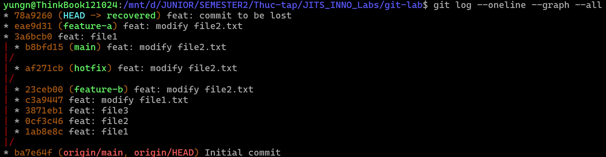

# Part B — Tìm lại commit bị "mất"

### Yêu cầu:

1. Commit 1 file rồi `git reset --hard HEAD~1` (mất commit).
2. Dùng `git reflog` tìm lại SHA, restore commit về branch mới `recovered`.
3. Ghi cách làm vào `reflog-lab.md`.

### Các bước thực hiện:

**1. Tạo commit và "cố tình" làm mất:**
```bash
echo "Noi dung quan trong" > lost_file.txt
git add lost_file.txt
git commit -m "feat: commit to be lost"

# làm mất commit vừa tạo
git reset --hard HEAD~1
```

**2. Dùng git reflog để tìm lại mã SHA của commit đã mất:**
```bash
git reflog
```


*Commit bị mất có mã SHA 78a9260*

**3. Khôi phục commit đó vào một branch mới tên là `recovered`:**
```bash
git checkout -b recovered 78a9260
```
*kiểm tra lại đã thấy file `lost_file.txt` đã xuất hiện trở lại nguyên vẹn.*


