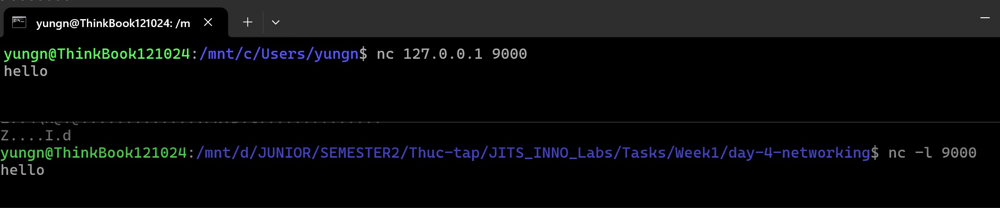

# Task Submission Template

> Mỗi task = 1 thư mục con + 1 PR/MR riêng. Copy template này vào `README.md` của task.

## Task: Day 4: Networking Essentials

- **Intern**: Nguyễn Quang Dũng
- **Phase / Week / Day**: Phase 1 / Week 1 / Day 4
- **Branch**: `phase-1/week-1/day-4-networking`
- **Submitted at**: `2026-19-06 23:00`
- **Time spent**: `5h`

## 1. Mục tiêu
- Hiểu mô hình OSI / TCP-IP layers.
- Phân biệt TCP và UDP, biết khi nào dùng giao thức nào.
- Đọc và phân tích HTTP/HTTPS request bằng `curl -v`, `tcpdump`, `wireshark`.
- Hiểu DNS resolution, các bản ghi A/AAAA/CNAME/MX/TXT.
- Biết khái niệm TLS handshake, certificate chain.

## 2. Cách chạy

### Part E: Port và socket

**Câu 1 và 2: Khởi tạo tiến trình lắng nghe và kiểm tra trạng thái cổng**

- **Bước 1:** Tại môi trường dòng lệnh thứ nhất (*terminal A*), khởi chạy một tiến trình lắng nghe TCP (*TCP listener*) ở cổng 9000 bằng công cụ `nc`:
  ```bash
  nc -l 9000
  ```
  *(Tiến trình sẽ chuyển sang trạng thái chờ kết nối mạng gửi đến trên cổng 9000).*

- **Bước 2:** Mở một phiên làm việc mới (*terminal B*), thực thi lệnh sau để kiểm chứng xem hệ điều hành đã thực sự mở cổng 9000 hay chưa:
  ```bash
  ss -tlnp | grep 9000
  ```

**Kết quả minh chứng cổng 9000 đã được mở thành công:**


**Câu 3: Kết nối socket và gửi dữ liệu**

- **Bước 3:** Mở phiên làm việc thứ ba (*terminal C*) đóng vai trò là máy khách (*client*), thực hiện kết nối đến cổng 9000 trên địa chỉ cục bộ (*localhost*) bằng lệnh sau:
  ```bash
  nc 127.0.0.1 9000
  ```
  Sau khi lệnh được kích hoạt, hệ thống sẽ thiết lập kết nối TCP giữa *terminal C* và *terminal A*. Tiến hành gõ chuỗi văn bản `hello` và nhấn phím Enter. Chuỗi dữ liệu này sẽ được truyền tải trực tiếp qua *socket* và xuất hiện lập tức trên màn hình của *terminal A*, minh họa rõ ràng luồng truyền dữ liệu thực tế giữa hai tiến trình độc lập.

**Kết quả minh chứng quá trình truyền dữ liệu TCP:**


**Câu 4: Ý nghĩa các tham số của lệnh kiểm tra trạng thái mạng `ss`**

- Tham số `ss -tln`: Hiển thị danh sách các kết nối mạng thuộc giao thức TCP (cờ `t`) đang ở trạng thái chờ kết nối (cờ `l` - *listen*). Cờ `n` yêu cầu hệ thống xuất thẳng ra số của cổng (*port*) thay vì phân giải thành tên dịch vụ, giúp thao tác kiểm tra diễn ra nhanh chóng hơn.
- Tham số `ss -uln`: Hiển thị danh sách các cổng đang mở để chờ dữ liệu thuộc giao thức UDP (cờ `u`). Hai cờ còn lại đóng vai trò tương tự như trên.
- Tham số `ss -anp`: Hiển thị tất cả các kết nối mạng (cờ `a` - *all*) bất chấp trạng thái hiện tại hay loại giao thức. Điểm nhấn ở lệnh này là cờ `p` (*process*), yêu cầu hệ thống liệt kê chi tiết định danh tiến trình (PID) và tên của phần mềm đang trực tiếp quản lý *socket* đó.

**Câu 5: Các trạng thái vòng đời cơ bản của một socket**

- Trạng thái LISTEN: *Socket* đã được khởi tạo và đang mở tĩnh tại một cổng cụ thể trên máy chủ, luôn trong tư thế sẵn sàng tiếp nhận các luồng yêu cầu kết nối từ máy khách gửi đến.
- Trạng thái ESTABLISHED: Quá trình bắt tay thiết lập kết nối giữa hai bên đã diễn ra thành công. Luồng truyền thông hai chiều đã được tạo lập vững chắc để thực hiện việc gửi và nhận dữ liệu ứng dụng.
- Trạng thái TIME_WAIT: Xảy ra ở bên chủ động đưa ra yêu cầu ngắt kết nối. Mặc dù tiến trình đóng đã xong, hệ điều hành vẫn treo giữ *socket* này trong một khoảng thời gian chờ (thường là 2MSL) nhằm mục đích bắt nốt những gói tin đi lạc và đảm bảo không xảy ra xung đột cổng cho các kết nối trong tương lai gần.
- Trạng thái CLOSE_WAIT: Xảy ra ở bên bị động khi nhận được yêu cầu ngắt mạng từ đối phương, nhưng bản thân phần mềm đang chạy lại chưa gọi hàm giải phóng *socket* của chính nó. Nếu trạng thái này xuất hiện nhiều, đó là biểu hiện của việc rò rỉ tài nguyên (*resource leak*) do lỗi lập trình mã nguồn ứng dụng.

## 3. Kết quả
- Ảnh chụp màn hình in log (kèm trong `./screenshots/`).
- Chi tiết câu trả lời các part A, B, C, D nằm ở các file: `notes.md`, `dns-lab.md`, `tls-lab.md`, `tcpdump-lab.md`.

## 4. Khó khăn và cách giải quyết
- **Lỗi `dig +trace` bị timeout trên môi trường WSL2**: 
  - **Vấn đề**: Khi chạy lệnh `dig +trace google.com`, lệnh bị lỗi `;; communications error to 10.255.255.254#53: timed out` không thể kết nối tới DNS cục bộ, mặc dù lệnh `ping google.com` vẫn phân giải và chạy bình thường.
  - **Nguyên nhân**: WSL2 tự động tạo tập tin `/etc/resolv.conf` trỏ về địa chỉ IP của vSwitch ảo nối với hệ điều hành máy chủ Windows (ví dụ `10.255.255.254`). Lệnh `dig` tạo các gói UDP Raw gửi trực tiếp vào địa chỉ IP này nhưng cấu hình tường lửa mạng của Windows thường sẽ chặn các gói truy vấn máy chủ gốc trực tiếp từ trong môi trường ảo gửi đi. Trong khi đó, `ping` dùng hàm cấp cao của hệ điều hành nên vẫn lấy được IP.
  - **Cách giải quyết**: Chỉ định lệnh `dig` đi vòng qua DNS ảo của WSL và truy vấn trực tiếp lên máy chủ DNS công cộng ngoài Internet (ví dụ dùng 8.8.8.8 của Google). Cú pháp: `dig @8.8.8.8 +trace google.com`.

## 5. Tài liệu tham khảo
- **Nguồn tài liệu cho Part A (Lý thuyết cơ bản)**:
  - So sánh OSI/TCP-IP, CIDR, NAT, Proxy: Lấy từ kiến thức mạng căn bản (giáo trình CCNA/Network+) và các quy chuẩn mạng như [RFC 1918 (Private IP)](https://datatracker.ietf.org/doc/html/rfc1918).
  - Kiến thức phân tích chi tiết TCP và UDP: Lấy từ [High Performance Browser Networking: Ch.1, 2 (free)](https://hpbn.co/).
- **Nguồn tài liệu cho Part B, C, D (Thực hành HTTPS, DNS, TCPDump)**:
  - Phân tích cơ chế hoạt động của HTTPS: [How HTTPS works: comic](https://howhttps.works/)
  - Sách hướng dẫn sử dụng các lệnh trên Linux: `man tcpdump`, `man dig`.

## 6. Self-check
- [x] Code chạy được trên máy sạch.
- [x] README có hướng dẫn chạy lại.
- [x] Không hard-code secret.
- [x] Commit message theo Conventional Commits.
- [x] Đã review lại code một lượt.
