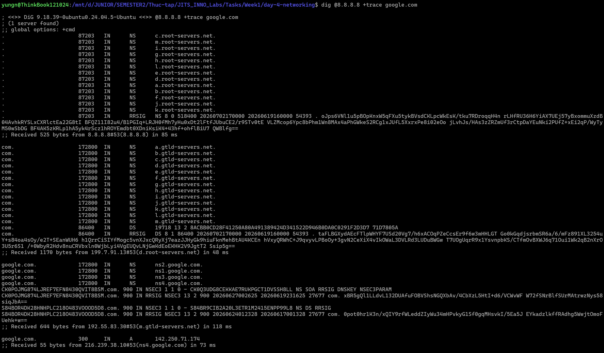
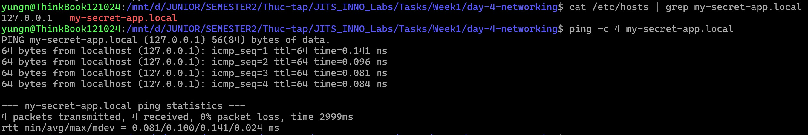

# Part B — DNS Lab

## 1. Giải thích output của lệnh `dig +trace google.com`



Lệnh `dig +trace` yêu cầu công cụ thực hiện quá trình phân giải tên miền theo cơ chế iterative. Quá trình này truy vấn từ gốc rễ của mạng Internet xuống tận máy chủ quản lý tên miền cuối cùng. Dựa vào output từ Terminal thực tế như trên, tiến trình phân giải diễn ra qua 4 bước:

1. **Truy vấn Root Server:** 
   - Lệnh khởi chạy bằng việc lấy thông tin từ Local DNS hoặc từ DNS `8.8.8.8` nếu được chỉ định (cách làm hiện tại) để xuất ra danh sách 13 cụm máy chủ gốc của Internet (Root Servers, có ký hiệu miền là `.`, từ `a.root-servers.net` đến `m.root-servers.net`).
   ```text
   .                       87203   IN      NS      f.root-servers.net.
   ... (đã rút gọn) ...
   .                       87203   IN      NS      h.root-servers.net.
   ;; Received 525 bytes from 8.8.8.8#53(8.8.8.8) in 57 ms
   ```
2. **Truy vấn Top-Level Domain Server:** 
   - Tiếp theo, hệ thống gửi truy vấn đến một Root Server bất kỳ (Ví dụ: `a.root-servers.net`) để hỏi thông tin Name Server đang quản lý đuôi `.com`. 
   - Root Server phản hồi bằng danh sách các máy chủ TLD (từ `a.gtld-servers.net` đến `m.gtld-servers.net`).
   ```text
   com.                    172800  IN      NS      l.gtld-servers.net.
   ... (đã rút gọn) ...
   com.                    172800  IN      NS      e.gtld-servers.net.
   ;; Received 1170 bytes from 198.41.0.4#53(a.root-servers.net) in 193 ms
   ```
3. **Truy vấn Máy chủ sở hữu/quản lý tên miền:** 
   - Có được địa chỉ TLD, hệ thống tiếp tục hỏi một TLD Server (Ví dụ: `h.gtld-servers.net`) xem máy chủ nào đang chịu trách nhiệm lưu trữ tên miền `google.com`.
   - TLD Server trả về danh sách các Name Server do chính tổ chức Google quản lý (bao gồm `ns1.google.com` đến `ns4.google.com`).
   ```text
   google.com.             172800  IN      NS      ns2.google.com.
   google.com.             172800  IN      NS      ns1.google.com.
   google.com.             172800  IN      NS      ns3.google.com.
   google.com.             172800  IN      NS      ns4.google.com.
   ;; Received 644 bytes from 192.54.112.30#53(h.gtld-servers.net) in 184 ms
   ```
4. **Truy xuất địa chỉ IP:** 
   - Cuối cùng, hệ thống kết nối thẳng đến máy chủ đích vừa lấy được (Ví dụ: `ns4.google.com`) để xin thông tin phân giải.
   - Máy chủ Name Server của Google lập tức trả về bản ghi `A` với địa chỉ IPv4 (VD: `142.250.71.174`). Quá trình phân giải tên miền hoàn tất thành công.
   ```text
   google.com.             300     IN      A       142.250.71.174
   ;; Received 55 bytes from 216.239.38.10#53(ns4.google.com) in 69 ms
   ```

## 2. Cấu hình file `hosts` để map tên miền giả

1. Dùng quyền sudo in nối tên miền giả vào cuối file `/etc/hosts`
   ```bash
   echo "127.0.0.1   my-secret-app.local" | sudo tee -a /etc/hosts
   ```

2. Xác nhận lại tên miền đã được map
   ```bash
   cat /etc/hosts | grep my-secret-app.local
   ```

3. Kiểm tra kết quả:
   ```bash
   ping -c 4 my-secret-app.local
   ```
   
   Kết quả:
   

## 3. Phân biệt `/etc/hosts`, `/etc/resolv.conf`, và `systemd-resolved`

Ba thành phần dưới đây đóng vai trò quan trọng trong cơ chế phân giải tên miền trên hệ điều hành Linux:

- **`/etc/hosts` (Local DNS Mapping):**
  - Đóng vai trò là file cấu hình bản đồ DNS tĩnh cục bộ.
  - Hệ điều hành sẽ luôn tra cứu tên miền trong file này đầu tiên. Nếu tìm thấy bản ghi khớp, hệ thống sẽ sử dụng IP đó ngay lập tức. Tính năng này thường được sử dụng để ghi đè tên miền phục vụ mục đích local development mà không cần cấu hình trên DNS Server thật.

- **`/etc/resolv.conf` (DNS Resolver Configuration):**
  - Khai báo danh sách địa chỉ IP của các máy chủ DNS mà hệ thống sẽ truy vấn tiếp theo trong trường hợp không tìm thấy bản ghi tên miền ở `/etc/hosts`.
  - Cấu trúc phổ biến thường bao gồm các dòng cấu hình như: `nameserver 8.8.8.8`.

- **`systemd-resolved` (Local DNS Caching Service):**
  - Là một service chạy ngầm được tích hợp sẵn trong các bản Linux hiện đại.
  - Nó tạo ra một Local DNS Stub Listener (một dạng proxy) hoạt động tại IP `127.0.0.53`.
  - Khi service này hoạt động, file `/etc/resolv.conf` thường sẽ được tạo liên kết và chỉ trỏ duy nhất tới dòng `nameserver 127.0.0.53`. Việc này nhằm mục đích để hệ điều hành giao phó toàn bộ tác vụ phân giải DNS cho `systemd-resolved` quản lý.
  - Ưu điểm: Service này giúp quản lý hiệu quả hơn nhờ tính năng DNS Caching cục bộ (giúp truy vấn nhanh hơn), xử lý luồng DNS linh hoạt theo từng interface mạng (hữu ích khi sử dụng VPN), và hỗ trợ cấu hình sẵn các giao thức bảo mật như DNSSEC hoặc DNS over TLS.
