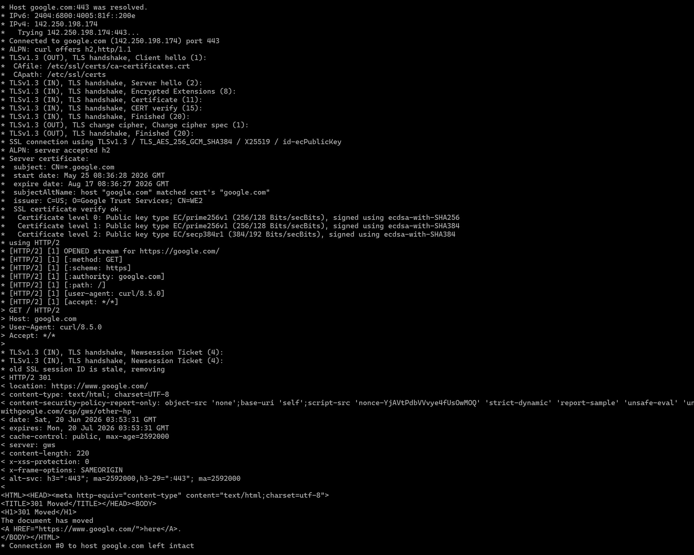

# Part C — HTTP/HTTPS Deep Dive

## 1. Phân tích luồng kết nối qua lệnh `curl -v`



**Giai đoạn 1: DNS Resolution**
```text
* Host google.com:443 was resolved.
* IPv6: 2404:6800:4005:81f::200e
* IPv4: 142.250.198.174
```
Hệ thống gọi DNS để lấy địa chỉ IP của đích đến.

**Giai đoạn 2: Bắt tay TCP**
```text
*   Trying 142.250.198.174:443...
* Connected to google.com (142.250.198.174) port 443
```
Thiết lập kết nối tầng Transport thành công qua cổng bảo mật 443.

**Giai đoạn 3: TLS Handshake**
```text
* ALPN: curl offers h2,http/1.1
* TLSv1.3 (OUT), TLS handshake, Client hello (1):
* TLSv1.3 (IN), TLS handshake, Server hello (2):
...
* SSL connection using TLSv1.3 / TLS_AES_256_GCM_SHA384 / X25519 / id-ecPublicKey
...
* Server certificate:
*  subject: CN=*.google.com
...
*  issuer: C=US; O=Google Trust Services; CN=WE2
*  SSL certificate verify ok.
```
Hai bên thương lượng sử dụng giao thức TLS bản mới nhất (1.3), chốt bộ mã hoá `TLS_AES_256_GCM_SHA384`. Client kiểm tra và xác nhận chứng chỉ của máy chủ Google (Certificate verify ok).

**Giai đoạn 4: Trao đổi HTTP Request/Response Headers**
- **HTTP Request Headers:**
```text
> GET / HTTP/2
> Host: google.com
> User-Agent: curl/8.5.0
> Accept: */*
```
- **HTTP Response Headers:**
```text
< HTTP/2 301
< location: https://www.google.com/
< content-type: text/html; charset=UTF-8
...
< cache-control: public, max-age=2592000
< server: gws
< content-length: 220
```

## 2. Kiểm tra Certificate Chain bằng `openssl s_client`

Sử dụng lệnh `openssl s_client -connect google.com:443 -showcerts` để xuất toàn bộ Certificate Chain mà máy chủ Google trả về.

**Kết quả thực thi:**
```text
CONNECTED(00000003)
depth=2 C = US, O = Google Trust Services LLC, CN = GTS Root R1
verify return:1
depth=1 C = US, O = Google Trust Services LLC, CN = GTS CA 1C3
verify return:1
depth=0 CN = *.google.com
verify return:1
---
Certificate chain
 0 s:CN = *.google.com
   i:C = US, O = Google Trust Services LLC, CN = GTS CA 1C3
   a:PKEY: id-ecPublicKey, 256 (bit); sigalg: RSA-SHA256
   v:NotBefore: May 25 08:36:28 2026 GMT; NotAfter: Aug 17 08:36:27 2026 GMT
-----BEGIN CERTIFICATE-----
MIIEczCCA1qgAwIBAgIRA...
...
-----END CERTIFICATE-----
 1 s:C = US, O = Google Trust Services LLC, CN = GTS CA 1C3
   i:C = US, O = Google Trust Services LLC, CN = GTS Root R1
   a:PKEY: rsaEncryption, 2048 (bit); sigalg: RSA-SHA256
   v:NotBefore: Aug 13 00:00:42 2020 GMT; NotAfter: Sep 30 00:00:42 2027 GMT
-----BEGIN CERTIFICATE-----
MIIFjTCCA3WgAwIBAgIRA...
...
-----END CERTIFICATE-----
---
Server certificate
subject=CN = *.google.com
issuer=C = US, O = Google Trust Services LLC, CN = GTS CA 1C3
---
...
```

## 3a. Giản đồ quá trình TLS 1.3 Handshake

Điểm ưu việt lớn nhất của TLS 1.3 so với phiên bản cũ TLS 1.2 là rút ngắn thời gian thiết lập kết nối từ 2 RTT xuống chỉ còn 1-RTT.

```text
Client                                               Server
  |                                                    |
  | --- Client Hello --------------------------------> | (1) Báo cáo TLS version hỗ trợ, gửi kèm luôn Key Share.
  |                                                    |
  | <--- Server Hello, Encrypted Extensions, --------- | (2) Chốt bộ mã hoá, gửi Certificate,
  |      Certificate, Certificate Verify, Finished     |     xác thực và hoàn tất từ phía server.
  |                                                    |
  | --- Finished ------------------------------------> | (3) Client xác nhận. Kết nối bảo mật hoàn tất.
  |                                                    |
  | <=================== HTTP Data ==================> | (4) Bắt đầu truyền Application Data một cách an toàn.
```

## 3b. Các khái niệm chuyên sâu trong TLS

- **SNI (Server Name Indication):** Là một extension gửi kèm trong bản tin "Client Hello". Khi một địa chỉ IP chạy chung cho nhiều trang web khác nhau (Virtual Hosting), SNI giúp báo cho server biết chính xác client đang muốn truy cập vào tên miền nào, để server chọn và trả về đúng chứng chỉ SSL của tên miền đó.
- **ALPN (Application-Layer Protocol Negotiation):** Là cơ chế giúp Client và Server thoả thuận luôn giao thức lớp ứng dụng (như HTTP/1.1 hay HTTP/2) ngay trong quá trình TLS Handshake (Như trong log ta thấy `ALPN: server accepted h2`). Cơ chế này giúp tiết kiệm 1 lượt RTT thay vì đợi kết nối xong mới đi hỏi nhau xem hỗ trợ giao thức nào.
- **OCSP (Online Certificate Status Protocol):** Giao thức dùng để kiểm tra tính hợp lệ thời gian thực của chứng chỉ. Thay vì tải toàn bộ danh sách chứng chỉ bị thu hồi khổng lồ (CRL) về máy, client chỉ cần gửi mã số chứng chỉ lên máy chủ OCSP của tổ chức cấp phát (CA) để hỏi nhanh xem chứng chỉ này còn dùng được hay đã bị thu hồi/đánh cắp.
- **SAN (Subject Alternative Name):** Nằm trong phần mở rộng của chứng chỉ. Tính năng này cho phép một chứng chỉ duy nhất có thể bảo vệ hợp lệ cho nhiều tên miền hoặc tên miền con khác nhau (Ví dụ chứng chỉ cấp cho `google.com` nhưng trong phần SAN khai báo thêm `*.google.com`, `youtube.com`, thì chứng chỉ đó sẽ hợp lệ với tất cả tên miền được liệt kê).
