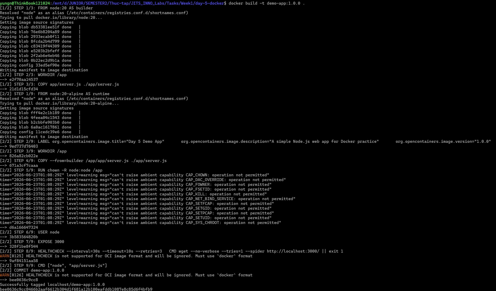
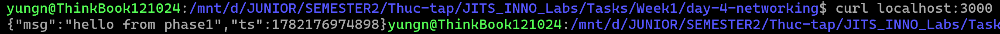
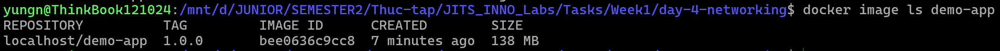

# Task Submission Template

> Mỗi task = 1 thư mục con + 1 PR/MR riêng. Copy template này vào `README.md` của task.

## Task: Day 5: Docker

- **Intern**: Nguyễn Quang Dũng
- **Phase / Week / Day**: Phase 1 / Week 1 / Day 5
- **Branch**: `phase-1/week-1/day-5-docker`
- **Submitted at**: `2026-21-06 21:00`
- **Time spent**: `5h`

## 1. Mục tiêu
- Hiểu và nắm vững các khái niệm Docker cơ bản: Image, Container, Volume, Network.
- Thực hành viết Dockerfile sử dụng Multi-stage build để tối ưu dung lượng Image.
- Dockerize thành công một ứng dụng web (Node.js/Python).
- Push Docker Image lên registry (Docker Hub).

## 2. Cách chạy

### Part B — Dockerize 1 web app

**Bước 1: Build Docker Image**
Chạy lệnh sau tại thư mục chứa Dockerfile:
```bash
docker build -t demo-app:1.0.0 .
```

**Bước 2: Khởi chạy container**
```bash
docker run --rm -p 3000:3000 -e NAME=phase1 demo-app:1.0.0
```

**Bước 3: Kiểm tra dung lượng image**
```bash
docker image ls demo-app
```

**Bước 4: Security Scan bằng Trivy**
```bash
docker save -o demo-app.tar demo-app:1.0.0
trivy image --input demo-app.tar > security-report.txt
rm demo-app.tar
```

## 3. Kết quả

### Part B — Dockerize 1 web app

**1. Kết quả lệnh build thành công**


**2. Kết quả khởi chạy container và curl**


**3. Kết quả kiểm tra dung lượng image**


**4. Báo cáo Security Scan**
Kết quả ghi trong file: [security-report.txt](./security-report.txt)

## 4. Khó khăn và cách giải quyết

- **Vấn đề với lệnh dive**: Khi sử dụng công cụ `dive` qua Docker container trên WSL để phân tích image, hệ thống báo lỗi `permission denied while trying to connect to the Docker daemon socket`.
  - **Nguyên nhân**: User mặc định bên trong container không có đủ quyền để truy cập vào socket của Docker, đặc biệt khi hệ thống đang sử dụng Podman thay vì Docker thuần.
  - **Cách giải quyết**: Cấp quyền truy cập đọc và ghi cho docker socket bằng lệnh `sudo chmod 666 /var/run/docker.sock` trước khi thực thi container.

- **Vấn đề với công cụ quét bảo mật Trivy**: Khi cài đặt Trivy qua phần mềm Snap và quét trực tiếp image, công cụ báo lỗi không tìm thấy Podman socket hoặc không thấy image.
  - **Nguyên nhân**: Các ứng dụng cài qua Snap bị đưa vào môi trường sandbox rất khắt khe nên không thể truy cập trực tiếp vào socket của hệ thống thật. Ngoài ra đường dẫn socket mặc định của Podman cũng khác Docker khiến công cụ bị nhầm lẫn.
  - **Cách giải quyết**: Chuyển hướng sang quét gián tiếp. Xuất (save) image ra thành một file nén độc lập (`.tar`), sau đó yêu cầu Trivy quét file đó. Cú pháp: `docker save -o demo-app.tar demo-app:1.0.0` và `trivy image --input demo-app.tar > security-report.txt`.
## 5. Tài liệu tham khảo
- [Docker Documentation](https://docs.docker.com/)
- [Best practices for writing Dockerfiles](https://docs.docker.com/develop/develop-images/dockerfile_best-practices/)

## 6. Self-check
- [ ] Code chạy được trên máy sạch.
- [ ] README có hướng dẫn chạy lại.
- [ ] Không hard-code secret.
- [ ] Commit message theo Conventional Commits.
- [ ] Đã review lại code một lượt.
