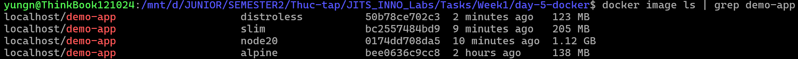
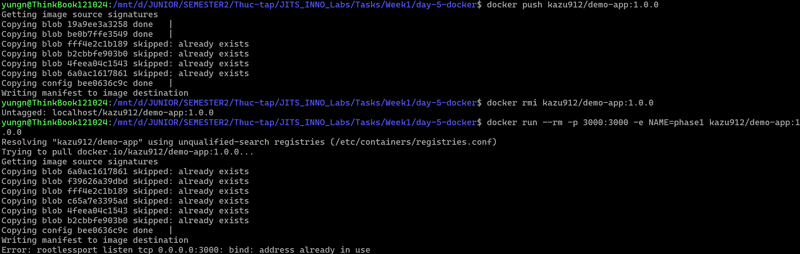

# Task Submission Template

> Mỗi task = 1 thư mục con + 1 PR/MR riêng. Copy template này vào `README.md` của task.

## Task: Day 5: Docker

- **Intern**: Nguyễn Quang Dũng
- **Phase / Week / Day**: Phase 1 / Week 1 / Day 5
- **Branch**: `phase-1/week-1/day-5-docker`
- **Submitted at**: `2026-23-06 10:00`
- **Time spent**: `7h`

## 1. Mục tiêu
- Hiểu và nắm vững các khái niệm Docker cơ bản: Image, Container, Volume, Network.
- Thực hành viết Dockerfile sử dụng Multi-stage build để tối ưu dung lượng Image.
- Dockerize thành công một ứng dụng web (Node.js/Python).
- Push Docker Image lên registry (Docker Hub).

## 2. Cách chạy

### Part B — Dockerize 1 web app

**Bước 1: Build Docker Image**
Chạy lệnh sau tại thư mục chứa Dockerfile:
```bash
docker build -t demo-app:1.0.0 .
```

**Bước 2: Khởi chạy container**
```bash
docker run --rm -p 3000:3000 -e NAME=phase1 demo-app:1.0.0
```

**Bước 3: Kiểm tra dung lượng image**
```bash
docker image ls demo-app
```

**Bước 4: Security Scan bằng Trivy**
```bash
docker save -o demo-app.tar demo-app:1.0.0
trivy image --input demo-app.tar > security-report.txt
rm demo-app.tar
```

### Part D — Push image

**Bước 1: Đăng nhập vào Docker Hub**
```bash
docker login
```

**Bước 2: Đổi tên image theo tên đăng nhập Docker Hub**
```bash
docker tag demo-app:1.0.0 kazu912/demo-app:1.0.0
```

**Bước 3: Đẩy image lên repo trực tuyến**
```bash
docker push kazu912/demo-app:1.0.0
```

**Bước 4: Xóa image trên máy và thử pull từ Docker Hub**
```bash
# Xóa image local để chắc chắn Docker sẽ phải tải từ trên mạng về
docker rmi kazu912/demo-app:1.0.0
docker run --rm -p 3000:3000 -e NAME=phase1 kazu912/demo-app:1.0.0
```

### Part E — Bonus

**So sánh dung lượng các loại Base Image**
Để thấy sự khác biệt, em build ứng dụng `demo-app` với 4 base image khác nhau.


1. Sửa thành: FROM node:20 AS runtime
```bash
docker build -t demo-app:node20 .
```

2. Sửa thành: FROM node:20-slim AS runtime
```bash
docker build -t demo-app:slim .
```

3. Bản alpine đã build ở Part B
```bash
docker tag demo-app:1.0.0 demo-app:alpine
```

4. Bản Distroless

File Dockerfile:

```dockerfile
# Stage 1: Builder
FROM node:20 AS builder
WORKDIR /app
COPY app/server.js ./app/server.js

# Stage 2: Runtime với Distroless
FROM gcr.io/distroless/nodejs20-debian11 AS runtime
LABEL org.opencontainers.image.title="Day 5 Demo App" \
      org.opencontainers.image.description="A simple Node.js web app for Docker practice" \
      org.opencontainers.image.version="1.0.0"

WORKDIR /app
COPY --from=builder /app/app/server.js ./app/server.js

USER nonroot
EXPOSE 3000

CMD ["app/server.js"]
```

Sau khi lưu dockerfile, chạy lệnh build:
```bash
docker build -t demo-app:distroless .
```

5. Kiểm tra dung lượng để thấy sự khác biệt của ứng dụng khi dùng các base khác nhau:
```bash
docker image ls | grep demo-app
```


## 3. Kết quả

### Part B — Dockerize 1 web app

**1. Kết quả lệnh build thành công**


**2. Kết quả khởi chạy container và curl**


**3. Kết quả kiểm tra dung lượng image**


**4. Báo cáo Security Scan**
Kết quả ghi trong file: [security-report.txt](./security-report.txt)

### Part D — Push image

**1. Kết quả lệnh Push, lệnh run sau khi xóa để kiểm tra pull**


**2. Link Image trên Docker Hub**: https://hub.docker.com/r/kazu912/demo-app

### Part E — Bonus

**1. Báo cáo Security Scan**
Đã thực hiện ở part B và lưu kết quả trong file [security-report.txt](./security-report.txt)

**2. So sánh dung lượng Base Image**


## 4. Khó khăn và cách giải quyết

- **Vấn đề với lệnh dive**: Khi sử dụng công cụ `dive` qua Docker container trên WSL để phân tích image, hệ thống báo lỗi `permission denied while trying to connect to the Docker daemon socket`.
  - **Nguyên nhân**: User mặc định bên trong container không có đủ quyền để truy cập vào socket của Docker, đặc biệt khi hệ thống đang sử dụng Podman thay vì Docker thuần.
  - **Cách giải quyết**: Cấp quyền truy cập đọc và ghi cho docker socket bằng lệnh `sudo chmod 666 /var/run/docker.sock` trước khi thực thi container.

- **Vấn đề với công cụ quét bảo mật Trivy**: Khi cài đặt Trivy qua phần mềm Snap và quét trực tiếp image, công cụ báo lỗi không tìm thấy Podman socket hoặc không thấy image.
  - **Nguyên nhân**: Các ứng dụng cài qua Snap bị đưa vào môi trường sandbox rất khắt khe nên không thể truy cập trực tiếp vào socket của hệ thống thật. Ngoài ra đường dẫn socket mặc định của Podman cũng khác Docker khiến công cụ bị nhầm lẫn.
  - **Cách giải quyết**: Chuyển hướng sang quét gián tiếp. Xuất (save) image ra thành một file nén độc lập (`.tar`), sau đó yêu cầu Trivy quét file đó. Cú pháp: `docker save -o demo-app.tar demo-app:1.0.0` và `trivy image --input demo-app.tar > security-report.txt`.

- **Vấn đề khi build image với Distroless**: Khi đổi base image sang `gcr.io/distroless/nodejs20-debian11`, tiến trình build báo lỗi `stat /bin/sh: no such file or directory` ở dòng `RUN chown`.
  - **Nguyên nhân**: Đặc trưng của Distroless là bị lược bỏ sạch sẽ mọi thành phần hệ điều hành cơ bản (không có shell `/bin/sh`, không có các lệnh core OS như `chown`, `mkdir`, `wget`...). Do đó, các chỉ thị trong Dockerfile gọi lệnh OS (như `RUN`) sẽ thất bại ngay lập tức.
  - **Cách giải quyết**: Phải thiết kế lại cấu trúc Dockerfile ở stage runtime riêng cho Distroless: xóa bỏ lệnh `RUN chown`, xóa bỏ `HEALTHCHECK` (vì không có `wget`), dùng user `nonroot` có sẵn của Distroless, và chỉnh lại `CMD` gọi thẳng file js.
  
## 5. Tài liệu tham khảo
- [Docker Documentation](https://docs.docker.com/)
- [Best practices for writing Dockerfiles](https://docs.docker.com/develop/develop-images/dockerfile_best-practices/)

## 6. Self-check
- [x] Code chạy được trên máy sạch.
- [x] README có hướng dẫn chạy lại.
- [x] Không hard-code secret.
- [x] Commit message theo Conventional Commits.
- [x] Đã review lại code một lượt.
