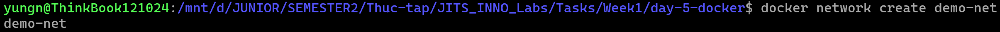
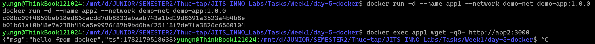
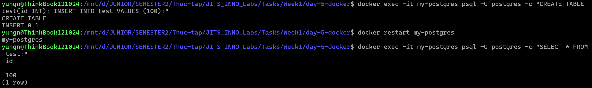
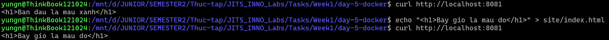

# Part C — Network & Volume

### 1. Tạo 1 bridge network riêng demo-net.

```bash
docker network create demo-net
```



---

### 2. Run 2 container demo-app (tên app1, app2) cùng network → từ app1 curl được http://app2:3000.

```bash
# Khởi chạy 2 container cùng mạng
docker run -d --name app1 --network demo-net demo-app:1.0.0
docker run -d --name app2 --network demo-net demo-app:1.0.0

# Dùng app1 gọi thử tới app2
docker exec app1 wget -qO- http://app2:3000
```



---

### 3. Run postgres:16-alpine mount volume pgdata:/var/lib/postgresql/data, restart container → data còn nguyên.

```bash
# Khởi chạy container gắn kèm volume
docker run -d --name my-postgres -e POSTGRES_PASSWORD=secret -v pgdata:/var/lib/postgresql/data postgres:16-alpine

# Đợi vài giây để DB khởi động, sau đó tạo bảng và chèn dữ liệu
docker exec -it my-postgres psql -U postgres -c "CREATE TABLE test(id INT); INSERT INTO test VALUES (100);"

# Khởi động lại container
docker restart my-postgres

# Kiểm tra lại xem dữ liệu có bị mất không
docker exec -it my-postgres psql -U postgres -c "SELECT * FROM test;"
```



---

### 4. Demo bind-mount (-v $PWD/site:/usr/share/nginx/html) với nginx, sửa file → reload thấy đổi.

**Lệnh thực thi:**
```bash
# Tạo thư mục và file giao diện ban đầu
mkdir site
echo "<h1>Ban dau la mau xanh</h1>" > site/index.html

# Chạy Nginx và bind-mount thư mục vừa tạo
docker run -d -p 8081:80 --name my-nginx -v $(pwd)/site:/usr/share/nginx/html nginx:1.27-alpine

# Kiểm tra giao diện ban đầu
curl http://localhost:8081

# Sửa nội dung file gốc
echo "<h1>Bay gio la mau do</h1>" > site/index.html

# Kiểm tra giao diện lúc sau
curl http://localhost:8081
```

