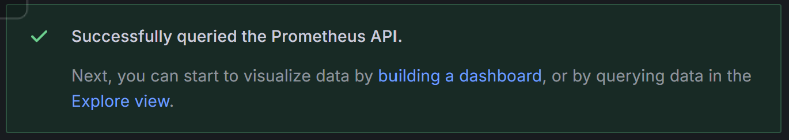
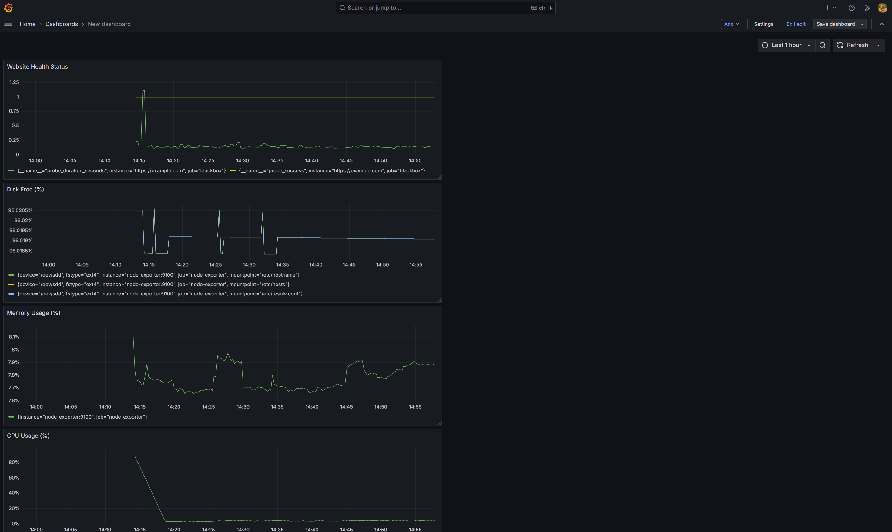

# Task Submission Template

> Mỗi task = 1 thư mục con + 1 PR/MR riêng. Copy template này vào `README.md` của task.

## Task: Observability

- **Intern**: `Nguyễn Quang Dũng`
- **Phase / Week / Day**: `Phase 1 / Week 2 / Day 10`
- **Branch**: `phase-1/week-2/day-10-observability`
- **Submitted at**: `2026-06-30 12:00` (timezone +07)
- **Time spent**: `6h`

## 1. Mục tiêu

- Hiểu 3 trụ cột: **logs, metrics, traces**.
- Dựng được stack mini: Prometheus + Grafana + node-exporter.
- Biết khái niệm SLO / SLI / Error Budget.

## 2. Cách chạy
### Part B: Stack docker-compose
- Mở terminal tại thư mục bài tập và khởi chạy mạng lưới giám sát bằng lệnh:
```bash
docker compose up -d
```
- Truy cập vào giao diện Grafana tại địa chỉ: `http://localhost:3000` với tài khoản mặc định `admin`/`admin`.

### Part C: Grafana Dashboard
- Đăng nhập vào Grafana, chọn **Connections** -> **Data sources** -> **Prometheus** và nhập URL `http://prometheus:9090`, sau đó nhấn **Save & test**.
- Tạo một Dashboard mới và vẽ 4 biểu đồ (Panel) bằng các câu lệnh truy vấn PromQL sau:
  - **Mức sử dụng CPU:** `100 - (avg by (instance) (rate(node_cpu_seconds_total{mode="idle"}[5m])) * 100)`
  - **Mức sử dụng RAM:** `100 * (1 - (node_memory_MemAvailable_bytes / node_memory_MemTotal_bytes))`
  - **Tỷ lệ ổ cứng còn trống:** `100 * (node_filesystem_free_bytes{fstype=~"ext4|xfs"} / node_filesystem_size_bytes{fstype=~"ext4|xfs"})`
  - **Sức khỏe trang web:** Sử dụng đồng thời hai câu lệnh `probe_duration_seconds` (đo độ trễ) và `probe_success` (trạng thái phản hồi).
- Nhấn nút **Settings** -> chọn **JSON Model** -> Sao chép toàn bộ mã nguồn -> Tạo tệp `dashboards/host.json` và dán toàn bộ mã vào.

## 3. Kết quả
### Part B: Stack docker-compose
- Khởi động thành công 4 bộ chứa Docker gồm: Prometheus, Grafana, Node Exporter, và Blackbox Exporter.
- Đã liên kết nguồn dữ liệu Prometheus vào Grafana thông qua URL nội bộ `http://prometheus:9090`.
- Đã thiết kế bảng điều khiển với 4 biểu đồ: Mức sử dụng CPU, RAM, ổ cứng và độ trễ trang web.
- Tệp tin xuất ra của bảng điều khiển được lưu tại `dashboards/host.json`.
- Các ảnh screenshots:
  - 
  - 

### Part C: Grafana Dashboard
- Đã kết nối thành công nguồn dữ liệu Prometheus vào Grafana.
- Đã vẽ thành công bảng điều khiển chứa 4 biểu đồ giám sát kỹ thuật theo đúng yêu cầu bài toán.
- Đã xuất thành công tệp cấu hình của bảng điều khiển bằng phương pháp dự phòng JSON Model và lưu tại `dashboards/host.json`.
- Các ảnh screenshots:
  - 
  - 

## 4. Khó khăn & cách giải quyết
- **Vấn đề 1:** Lỗi không tải được ảnh `prom/prometheus:v2.55`. 
  - **Cách giải quyết:** Phát hiện tài liệu viết thiếu phiên bản vá lỗi, đã sửa lại thành `v2.55.0` cho khớp với kho lưu trữ Docker Hub.
- **Vấn đề 2:** Lỗi không truy cập được Grafana sau khi đổi cổng.
  - **Cách giải quyết:** Do sử dụng sai cơ chế ánh xạ cổng (`3001:3001` thay vì `3001:3000`), sau đó đã chỉnh lại thành `3000:3000` vì cổng 3000 hoàn toàn rảnh rỗi.
- **Vấn đề 3:** Trình duyệt hiển thị trang web rác từ nhiều tháng trước ở cổng 3000 thay vì hiển thị Grafana.
  - **Cách giải quyết:** Nguyên nhân do cơ chế nhớ đệm Service Worker của trình duyệt chặn yêu cầu. Đã khắc phục bằng cách truy cập thông qua thẻ Ẩn danh (Incognito) hoặc xóa sạch bộ nhớ đệm.
- **Vấn đề 4:** Không tìm thấy nút xuất tệp tin (Export/Share) trên thanh công cụ của Grafana.
  - **Cách giải quyết:** Do bảng điều khiển đang ở trạng thái nháp (chưa được lưu). Đã áp dụng cách xử lý vào phần Cài đặt (Settings) -> JSON Model để sao chép trực tiếp mã nguồn thô của bảng điều khiển.

## 5. Reference
- [Docker Compose Documentation](https://docs.docker.com/compose/)
- [Prometheus Documentation](https://prometheus.io/docs/introduction/overview/)
- [Node Exporter Metrics](https://github.com/prometheus/node_exporter)
- [Blackbox Exporter](https://github.com/prometheus/blackbox_exporter)
- [Grafana Documentation](https://grafana.com/docs/grafana/latest/)
- [PromQL Basics](https://prometheus.io/docs/prometheus/latest/querying/basics/)
- [Google SRE Book: Service Level Objectives](https://sre.google/sre-book/service-level-objectives/)

## 6. Self-check
- [x] Code chạy được trên máy sạch.
- [x] README có hướng dẫn run lại.
- [x] Không hard-code secret.
- [x] Commit message theo Conventional Commits.
- [x] Đã review lại code 1 lượt.