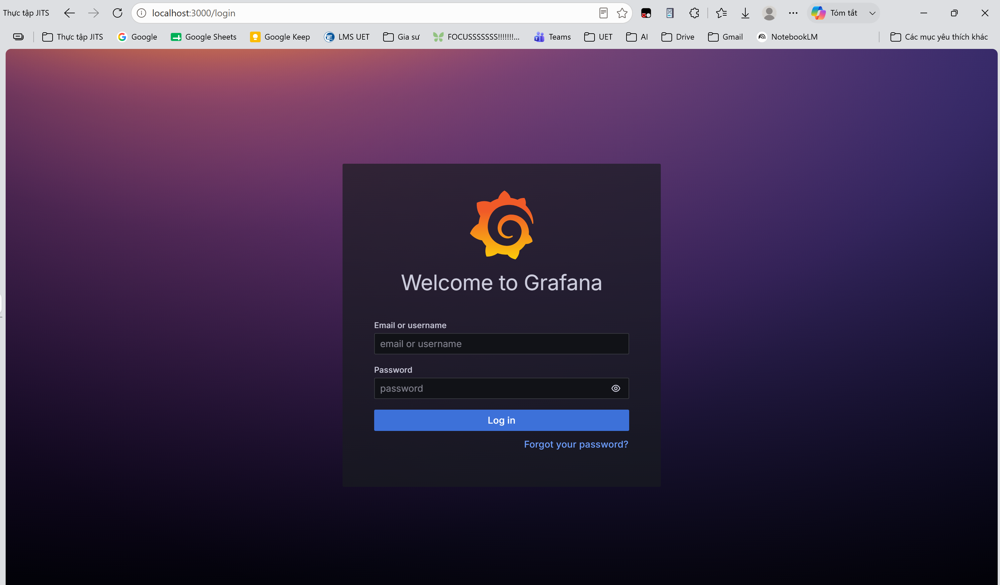
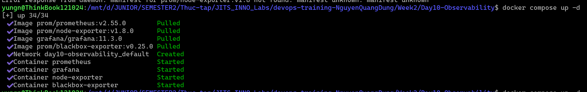

# Task Submission Template

> Mỗi task = 1 thư mục con + 1 PR/MR riêng. Copy template này vào `README.md` của task.

## Task: Observability

- **Intern**: `Nguyễn Quang Dũng`
- **Phase / Week / Day**: `Phase 1 / Week 2 / Day 10`
- **Branch**: `phase-1/week-2/day-10-observability`
- **Submitted at**: `2026-06-30 12:00` (timezone +07)
- **Time spent**: `6h`

## 1. Mục tiêu

- Hiểu 3 trụ cột: **logs, metrics, traces**.
- Dựng được stack mini: Prometheus + Grafana + node-exporter.
- Biết khái niệm SLO / SLI / Error Budget.

## 2. Cách chạy
### Part B: Stack docker-compose
- Mở terminal tại thư mục bài tập và khởi chạy mạng lưới giám sát bằng lệnh:
```bash
docker compose up -d
```
- Truy cập vào giao diện Grafana tại địa chỉ: `http://localhost:3000` với tài khoản mặc định `admin`/`admin`.

## 3. Kết quả
### Part B: Stack docker-compose
- Khởi động thành công 4 bộ chứa Docker gồm: Prometheus, Grafana, Node Exporter, và Blackbox Exporter.
- Đã liên kết nguồn dữ liệu Prometheus vào Grafana thông qua URL nội bộ `http://prometheus:9090`.
- Đã thiết kế bảng điều khiển với 4 biểu đồ: Mức sử dụng CPU, RAM, ổ cứng và độ trễ trang web.
- Tệp tin xuất ra của bảng điều khiển được lưu tại `dashboards/host.json`.
- Các ảnh screenshots:
  - 
  - 

## 4. Khó khăn & cách giải quyết
- **Vấn đề 1:** Lỗi không tải được ảnh `prom/prometheus:v2.55`. 
  - **Cách giải quyết:** Phát hiện tài liệu viết thiếu phiên bản vá lỗi, đã sửa lại thành `v2.55.0` cho khớp với kho lưu trữ Docker Hub.
- **Vấn đề 2:** Lỗi không truy cập được Grafana sau khi đổi cổng.
  - **Cách giải quyết:** Do sử dụng sai cơ chế ánh xạ cổng (`3001:3001` thay vì `3001:3000`), sau đó đã chỉnh lại thành `3000:3000` vì cổng 3000 hoàn toàn rảnh rỗi.
- **Vấn đề 3:** Trình duyệt hiển thị trang web rác từ nhiều tháng trước ở cổng 3000 thay vì hiển thị Grafana.
  - **Cách giải quyết:** Nguyên nhân do cơ chế nhớ đệm Service Worker của trình duyệt chặn yêu cầu. Đã khắc phục bằng cách truy cập thông qua thẻ Ẩn danh (Incognito) hoặc xóa sạch bộ nhớ đệm.

## 5. Reference
- Đã đọc gì để làm task này (link cụ thể, không vague).

## 6. Self-check
- [ ] Code chạy được trên máy sạch.
- [ ] README có hướng dẫn run lại.
- [ ] Không hard-code secret.
- [ ] Commit message theo Conventional Commits.
- [ ] Đã review lại code 1 lượt.