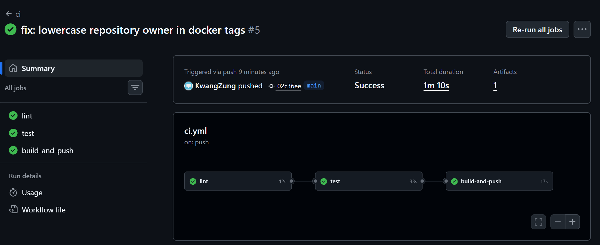
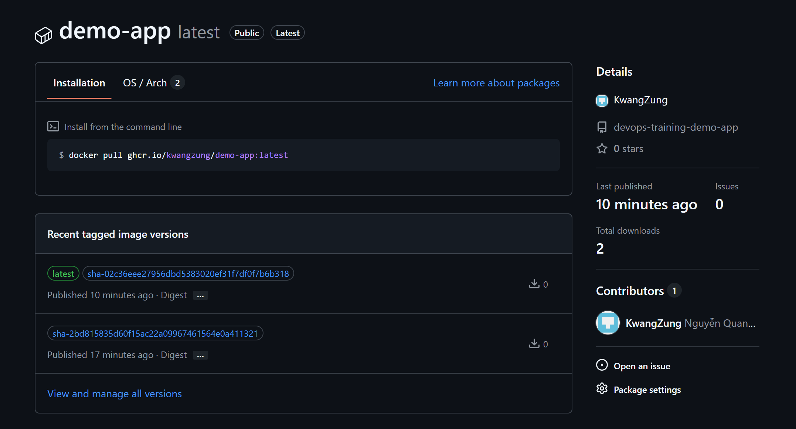
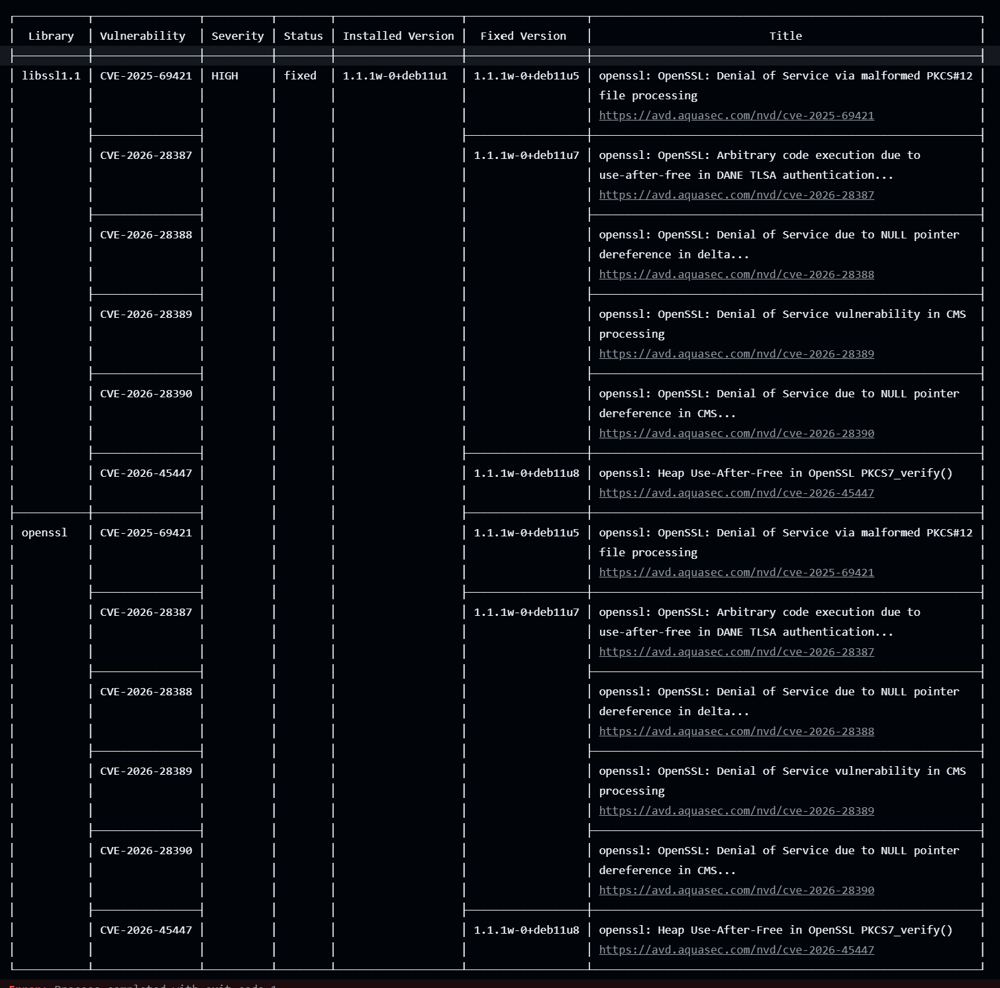
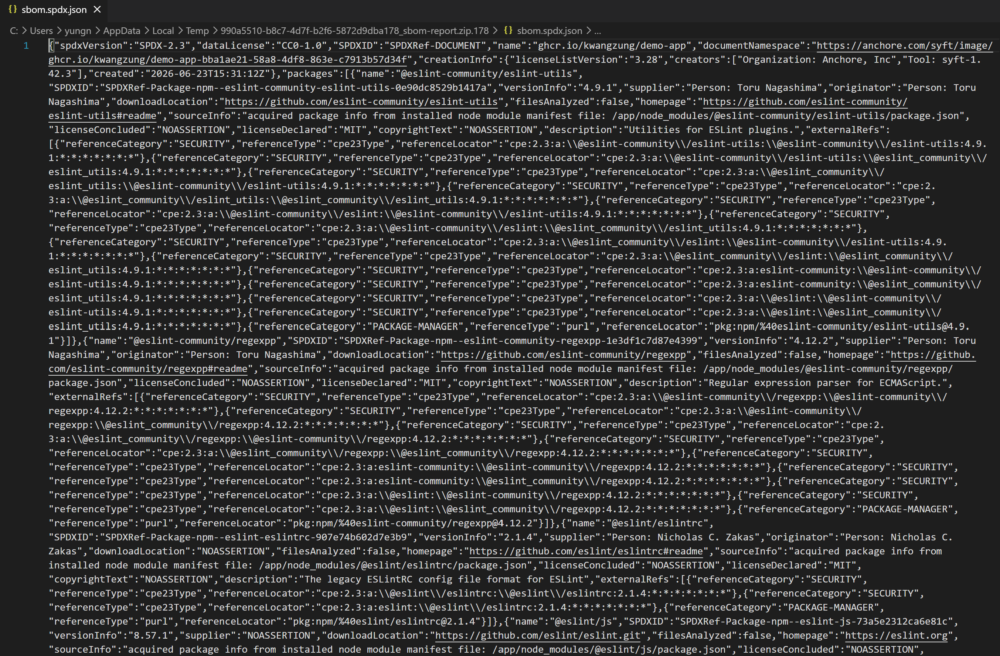

# Task: CI/CD Basics

- **Intern**: Nguyễn Quang Dũng
- **Phase / Week / Day**: Phase 1 / Week 2 / Day 6 (W2-D1)
- **Branch**: `phase-1/week-2/day-1-cicd-basics`
- **Submitted at**: `2026-06-23 22:30`
- **Time spent**: `6h`

## 1. Mục tiêu
- Hiểu sự khác biệt giữa CI, CD và Continuous Deployment, cũng như các khái niệm quan trọng như DORA metrics.
- Viết được pipeline GitHub Actions/GitLab CI cho ứng dụng `demo-app`.
- Tự động hóa các bước: `lint` -> `test` -> `build & push` image lên GHCR.

## 2. Cách triển khai & Cách chạy
**Cách triển khai (Part B):**
1. Khởi tạo Node.js project (có `package-lock.json`), cấu hình `eslint` và viết 2 test case cơ bản bằng `node:test`.
2. Định nghĩa `Dockerfile` sử dụng multi-stage build với image tĩnh gọn nhẹ (distroless).
3. Tạo file cấu hình tự động hóa `.github/workflows/ci.yml` thiết lập 3 tiến trình (jobs) móc xích với nhau: `lint` -> `test` -> `build-and-push`.
4. Tách mã nguồn thành một Repo riêng biệt và đẩy lên GitHub để luồng CI/CD tự động nhận diện và kích hoạt.

**Cách triển khai (Part C - Bonus):**
1. Bổ sung step `aquasecurity/trivy-action` vào cuối pipeline để tự động quét lỗ hổng bảo mật của Image vừa build. Thiết lập cờ `exit-code: '1'` và `severity: 'CRITICAL,HIGH'` để làm fail pipeline nếu phát hiện rủi ro nghiêm trọng.
2. Bổ sung step `anchore/sbom-action` để dùng công cụ Syft dò quét Image, xuất Software Bill of Materials và tải lên GitHub dưới dạng tệp đính kèm Artifact có tên `sbom-report`.

**Cách chạy trên local:**
- Tại thư mục chứa dự án:
```bash
npm install
npm run lint
npm test
```
- Trên GitHub: Pipeline sẽ tự động kích hoạt khi có thao tác push code hoặc mở Pull Request vào nhánh `main`.

## 3. Kết quả
- Part A - Lý thuyết: [notes.md](./notes.md).
- Link repo có workflow: https://github.com/KwangZung/devops-training-demo-app/tree/main
- Link image trên GHCR: https://github.com/KwangZung/devops-training-demo-app/pkgs/container/demo-app
- Run number: 7
- Part C:
  - Trivy scan: tìm được 12 lỗ hổng trong hệ điều hành Debian, dẫn đến pipeline fail
  - SBOM: tạo và tải về thành công thông qua link: https://github.com/KwangZung/devops-training-demo-app/actions/runs/28037113671/artifacts/7825495886
- Hình ảnh minh họa:
  - Pipeline Success: 
  - GHCR Package: 
  - Part C - Trivy scan: 
  - Part C - Syft SBOM Artifact: 

## 4. Khó khăn & cách giải quyết
- **Lỗi từ chối push thư mục Workflow (remote rejected)**: Khi thực hiện lệnh `git push origin main` lần đầu để đẩy mã nguồn và thư mục `.github/workflows/ci.yml` lên GitHub, hệ thống báo lỗi từ chối truy cập vì Personal Access Token lưu trên máy chưa được cấp quyền can thiệp vào file cấu hình pipeline.
  - **Cách giải quyết**: Truy cập vào GitHub Developer Settings, tạo một Personal Access Token mới (classic) và bắt buộc chọn cấp thêm quyền `workflow`. Sau đó, tiến hành cập nhật lại đường dẫn remote tại máy cục bộ bằng lệnh `git remote set-url origin https://<username>:<token_mới>@github.com/...` và thực hiện push code lại thành công.
- **Lỗi thiếu file package-lock.json khi dùng Cache**: Pipeline báo lỗi `Dependencies lock file is not found` ở Job `lint` và `test`. Nguyên nhân do tính năng cache npm của `actions/setup-node` bắt buộc phải có tệp `package-lock.json` để tính toán bộ nhớ đệm, nhưng ban đầu tệp này chưa được đẩy lên.
  - **Cách giải quyết**: Chạy lệnh `npm install` ở trên laptop để hệ thống tự động sinh ra tệp `package-lock.json`, sau đó commit và push tệp này lên repo.
- **Lỗi invalid tag do tên tài khoản chứa chữ in hoa**: Khi chạy Job build Docker Image, hệ thống báo lỗi `repository name must be lowercase`. Nguyên nhân do tên tài khoản GitHub của em (KwangZung) có chứa chữ cái in hoa, trong khi Docker Registry quy định toàn bộ tên kho lưu trữ Image phải viết thường.
  - **Cách giải quyết**: Chèn thêm một bước trung gian vào file `ci.yml` sử dụng lệnh Bash `echo "REPO_OWNER=${OWNER,,}" >> $GITHUB_ENV` để tự động chuyển đổi biến `${{ github.repository_owner }}` thành chữ thường 100% trước khi truyền vào cấu hình gắn thẻ (tags) của Docker.

## 5. Reference
- [GitHub Actions — Quickstart](https://docs.github.com/en/actions/quickstart) - Hướng dẫn cơ bản về các khái niệm của GitHub Actions và cách sử dụng runners.
- [GitLab CI — Tutorial](https://docs.gitlab.com/ee/ci/quick_start/) - Tìm hiểu tổng quan về pipeline dưới góc độ của GitLab CI.
- [The Twelve-Factor App](https://12factor.net/) - Nguyên lý 12 yếu tố để xây dựng ứng dụng web SaaS hiện đại.
- [What is CI/CD? (Red Hat)](https://www.redhat.com/en/topics/devops/what-is-ci-cd) - Tài liệu làm rõ khái niệm CI, CD và Continuous Deployment.
- [Are you an Elite DevOps performer? (Google Cloud - DORA)](https://cloud.google.com/blog/products/devops-sre/using-the-four-keys-to-measure-your-devops-performance) - Khái niệm về 4 chỉ số DORA trong việc đánh giá hiệu suất đội ngũ phát triển phần mềm.
- [Docker Build and Push Action](https://github.com/docker/build-push-action) - Hướng dẫn sử dụng action của Docker để build và push image lên GHCR.
- [actions/setup-node (Caching)](https://github.com/actions/setup-node) - Hướng dẫn thiết lập tính năng cache cho thư viện npm giúp tối ưu thời gian chạy pipeline.
- [Aquasecurity Trivy Action](https://github.com/aquasecurity/trivy-action) - Tài liệu cấu hình Trivy để quét lỗ hổng bảo mật trong Image và thiết lập exit code làm fail pipeline.
- [Anchore SBOM Action](https://github.com/anchore/sbom-action) - Tài liệu sử dụng công cụ Syft đóng gói dưới dạng Action để tạo và upload báo cáo Software Bill of Materials.

## 6. Self-check
- [x] Code chạy được trên máy sạch.
- [x] README có hướng dẫn run lại.
- [x] Không hard-code secret.
- [x] Commit message theo Conventional Commits.
- [x] Đã review lại code 1 lượt.
