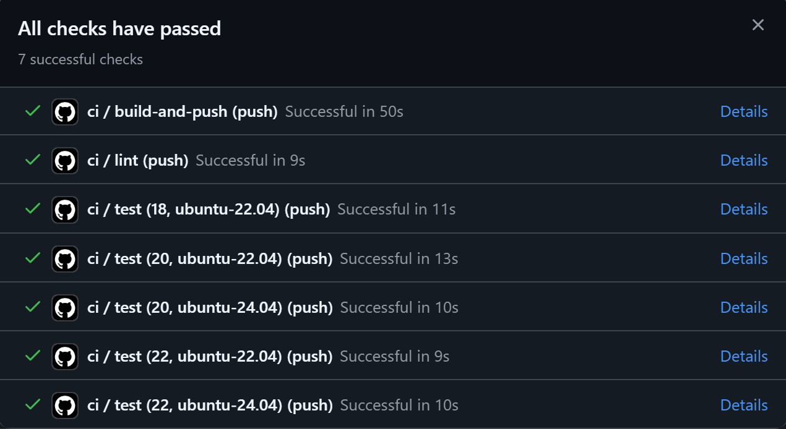

# Task Submission Template

> Mỗi task = 1 thư mục con + 1 PR/MR riêng. Copy template này vào `README.md` của task.

## Task: `CI/CD Advanced`

- **Intern**: Nguyễn Quang Dũng
- **Phase / Week / Day**: `Phase 1 / Week 2 / Day 2`
- **Branch**: `phase-1/week-2/day-7-cicd-advanced`
- **Submitted at**: `2026-06-28 00:12` (timezone +07)
- **Time spent**: `6h`

## 1. Mục tiêu
Thực hành CI/CD nâng cao với GitHub Actions:
- **Part A:** Sử dụng Matrix strategy để cấu hình job test chạy song song trên nhiều phiên bản Node.js và Ubuntu, đồng thời loại trừ một số tổ hợp cụ thể.
- **Part B:** Tách workflow ra thành file dùng chung (Reusable workflow) để tái sử dụng logic đóng gói và quét bảo mật.

## 2. Cách chạy

### Part A - Matrix Strategy
```bash
# 1. Thay đổi cấu hình file .github/workflows/ci.yml
# - Chỉnh sửa job `test` để thêm `strategy.matrix`.
# - Đặt `runs-on: ${{ matrix.os }}` và tham số node-version thành `${{ matrix.node }}`.

# 2. Commit và push code
git add .
git commit -m "feat(w2d7): add matrix strategy for test job"
git push origin HEAD
```

### Part B - Reusable Workflow
```bash
# 1. Tạo file .github/workflows/reusable-build.yml chứa logic build image và cấu hình nhận tham số.
# 2. Cập nhật file .github/workflows/ci.yml: Xóa các step cũ của job build-and-push và thay bằng cú pháp uses gọi đến file reusable.

# 3. Commit và push code
git add .
git commit -m "feat(w2d7): add reusable workflow for build job"
git push origin HEAD
```

## 3. Kết quả
- Link repo có workflow: https://github.com/KwangZung/devops-training-demo-app/tree/main
- Link image trên GHCR: https://github.com/KwangZung/devops-training-demo-app/pkgs/container/demo-app

### Part A - Matrix Strategy
Đoạn cấu hình đã áp dụng thành công trong file `ci.yml`:
```yaml
  test:
    needs: lint
    runs-on: ${{ matrix.os }}
    strategy:
      fail-fast: false
      matrix:
        node: [18, 20, 22]
        os:   [ubuntu-22.04, ubuntu-24.04]
        exclude:
          - { node: 18, os: ubuntu-24.04 }
    steps:
      - uses: actions/checkout@v4
      - uses: actions/setup-node@v4
        with: { node-version: '${{ matrix.node }}', cache: 'npm' }
      - run: npm ci
      - run: npm test
```

- **Screenshot Pipeline chạy 5 combo:**
  

### Part B - Reusable Workflow
- **Đã xóa:** Toàn bộ danh sách các bước (`steps`) cài đặt bên trong job `build-and-push` (như `actions/checkout`, đăng nhập GHCR, sử dụng `docker/build-push-action`, quét Trivy và tạo file SBOM).
- **Đã thêm:** Cấu hình mới dùng để trỏ tới template workflow thông qua `uses`, kèm theo các biến được truyền trực tiếp vào tham số `image_name` và `image_tag`. Cụ thể:
```yaml
  build-and-push:
    needs: test
    if: github.event_name == 'push' && github.ref == 'refs/heads/main'
    uses: ./.github/workflows/reusable-build.yml
    with:
      image_name: demo-app
      image_tag: sha-${{ github.sha }}
```

## 4. Khó khăn & cách giải quyết
- Vấn đề 1 → cách fix.
- Vấn đề 2 → cách fix.

## 5. Reference
- Đã đọc gì để làm task này (link cụ thể, không vague).

## 6. Self-check
- [ ] Code chạy được trên máy sạch.
- [ ] README có hướng dẫn run lại.
- [ ] Không hard-code secret.
- [ ] Commit message theo Conventional Commits.
- [ ] Đã review lại code 1 lượt.