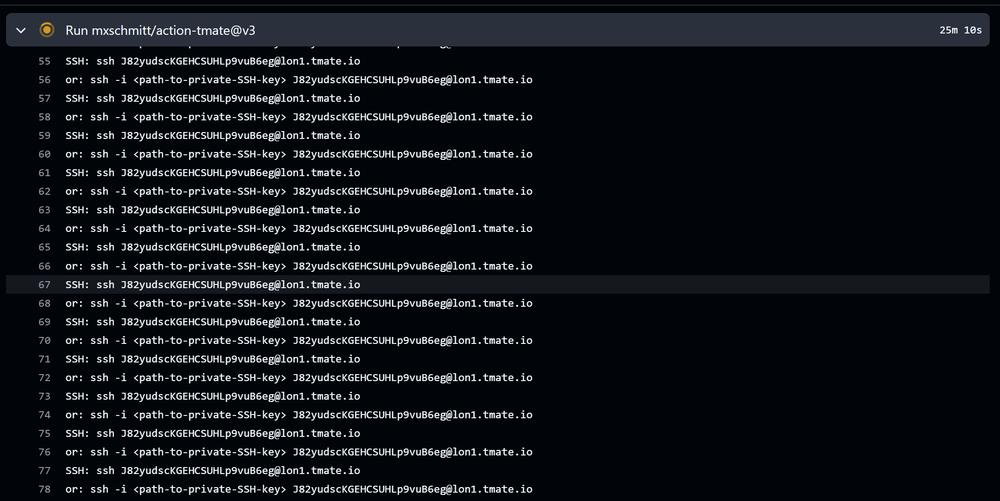

# Part E — Failure scenarios

**1. Khi pipeline thất bại ở step push, làm sao retry nhanh không build lại?**

Để tránh việc hệ thống phải đóng gói lại từ đầu, chúng ta cần tận dụng cơ chế lưu bộ nhớ đệm. Khi định nghĩa bước đóng gói Docker, thiết lập các tham số `cache-from` và `cache-to` trỏ về vùng đệm mặc định của GitHub Actions. Nhờ vậy, nếu luồng bị lỗi mạng ở bước đẩy mã nguồn lên kho, khi ấn nút chạy lại luồng thất bại đó, hệ thống sẽ tự động kéo toàn bộ dữ liệu đã xử lý từ bộ nhớ đệm ra dùng lại ngay lập tức mà không tốn công tính toán lại.

**2. Cách debug 1 job mà chỉ fail trên runner (không tái hiện local)?**

Có hai phương pháp debug hiệu quả thường được áp dụng:
- Kích hoạt chế độ nhật ký chi tiết bằng cách cấu hình biến bí mật `ACTIONS_STEP_DEBUG` mang giá trị `true` trên giao diện cài đặt kho lưu trữ.
- Chèn thêm công cụ hỗ trợ kết nối từ xa như tmate vào trực tiếp tệp quy trình. Khi hệ thống chạy đến bước này, nó sẽ tạm dừng và sinh ra một chuỗi lệnh kết nối, cho phép bạn thâm nhập trực tiếp vào bên trong máy chủ ảo đang chạy lỗi để tự tay kiểm tra hệ sinh thái thực tế.

> **Thực hành trên dự án demo-app:** chèn thêm cấu hình `- uses: mxschmitt/action-tmate@v3` vào bên dưới lệnh chạy test trong tệp `ci.yml`. Khi đẩy mã nguồn lên, luồng chạy sẽ tự động đóng băng và sinh ra một dòng lệnh `ssh` giúp truy cập.
> 
> 

**3. So sánh `needs` vs `if` vs `concurrency group`.**
- **Thuộc tính `needs`:** Dùng để quy định thứ tự chạy ưu tiên giữa các luồng công việc. Luồng phụ thuộc bắt buộc phải đợi luồng gốc báo cáo thành công thì mới được phép bắt đầu.
- **Thuộc tính `if`:** Dùng để thiết lập các điều kiện kiểm tra logic. Hệ thống sẽ dựa vào kết quả đúng hoặc sai của biểu thức để quyết định việc có nên tiếp tục chạy luồng hiện tại hay tự động bỏ qua nó.
- **Thuộc tính `concurrency`:** Dùng để quản lý số lượng luồng chạy đồng thời cùng chung một nhóm. Tính năng này đóng vai trò quan trọng trong việc tự động hủy các luồng cũ đang chạy dở nếu hệ thống phát hiện có mã nguồn mới vừa được đẩy lên, giúp tránh lãng phí tài nguyên máy chủ ảo.

**4. Tại sao nên dùng OIDC để auth AWS thay vì static access key?**

Giải pháp OIDC an toàn hơn rất nhiều vì nó sử dụng cơ chế cấp phát khóa truy cập ngắn hạn. Nếu sử dụng khóa bảo mật tĩnh, hệ thống sẽ sử dụng một chuỗi ký tự cố định và không bao giờ hết hạn. Khi chuỗi này bị lộ, tin tặc có thể lạm dụng để chiếm quyền vô thời hạn cho đến khi bạn tự phát hiện. Với giải pháp OIDC, hai nền tảng tự động xác thực chéo và chỉ cấp một chuỗi khóa động có thời gian tồn tại trong vòng vài phút. Hết thời gian quy định khóa sẽ tự hủy, giúp ngăn chặn triệt để nguy cơ đánh cắp và giảm bớt gánh nặng phải đổi khóa định kỳ.
