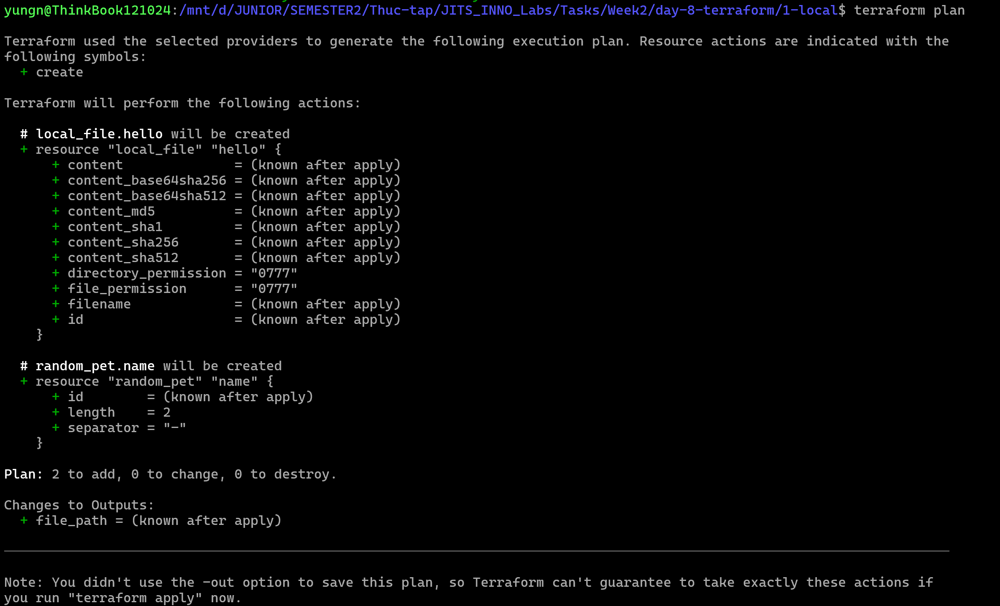
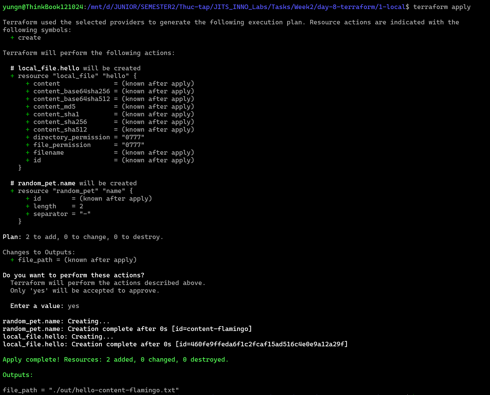
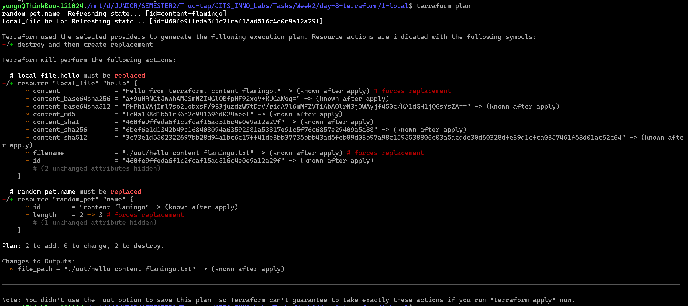
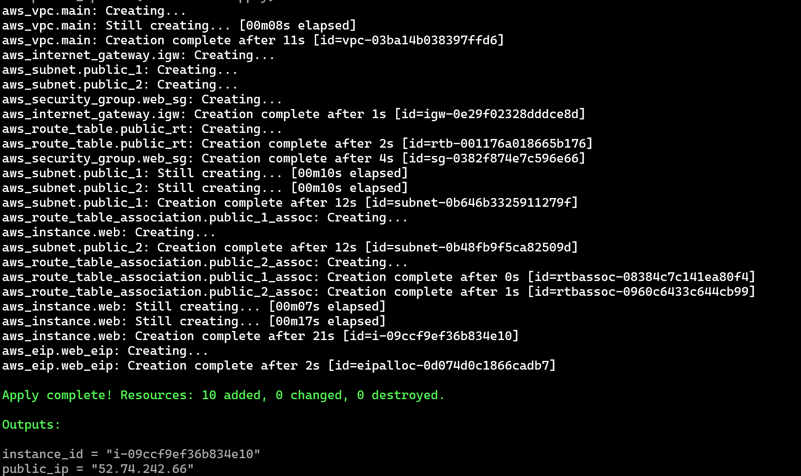
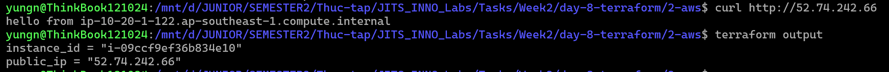

# Task Submission Template

> Mỗi task = 1 thư mục con + 1 PR/MR riêng. Copy template này vào `README.md` của task.

## Task: `Day 8 - Terraform`

- **Intern**: `Nguyễn Quang Dũng`
- **Phase / Week / Day**: `Phase 1 / Week 2 / Day 8`
- **Branch**: `phase-1/week-2/day-8-terraform`
- **Submitted at**: `2026-06-29 00:11` (timezone +07)
- **Time spent**: `6h`

## 1. Mục tiêu
Tóm tắt yêu cầu task trong 2–3 dòng.

## 2. Cách chạy
**Part B: Local-only (Thử nghiệm Terraform căn bản)**
```bash
cd 1-local
terraform init
terraform plan
terraform apply
# Đổi length = 2 thành 3 trong main.tf
terraform plan
terraform apply
terraform destroy -auto-approve
```

**Part C: AWS VPC + EC2 (Sử dụng AWS thật)**
```bash
cd 2-aws
# Cấu hình khóa bảo mật AWS CLI (Access Key & Secret Key)
aws configure

terraform init
terraform plan
terraform apply -auto-approve
# Dọn dẹp hạ tầng sau khi nghiệm thu
terraform destroy -auto-approve
```

## 3. Kết quả
**Part B: Local-only**
- Toàn bộ log hiển thị quá trình chạy đã được lưu tại: [1-local-transcript.log](./1-local/1-local-transcript.log).
- Ảnh chụp màn hình minh chứng:
  - 
  - 
  Khi thay đổi `length = 2` thành `length = 3`:
  - 

**Part C: AWS VPC + EC2**
- Triển khai thành công hạ tầng mạng (VPC, Subnets, IGW, Route Table, Security Group) và máy chủ web Nginx (EC2) trên nền tảng AWS thật.
- Ảnh screenshot minh chứng kết quả chạy `apply`:

- Ảnh screenshot khi chạy `curl` và `terraform output`:


## 4. Khó khăn & cách giải quyết
- **Lỗi cài đặt Terraform qua Snap (Part B)**: Khi chạy lệnh cài đặt Terraform bằng snap trên WSL bị báo lỗi cảnh báo an toàn do thiếu quyền truy cập hệ thống.
  - Cách khắc phục: Thêm cờ `--classic` vào cuối câu lệnh cài đặt để xác nhận cấp quyền (`sudo snap install terraform --classic`).
- **Từ chối phương thức thanh toán AWS (Part C)**: Tài khoản AWS ban đầu báo lỗi "Payment method not valid" do không xác minh được thẻ thanh toán.
  - Cách khắc phục: Tạm thời dùng LocalStack để thử nghiệm, sau đó xử lý thẻ thanh toán để kích hoạt thành công tài khoản AWS thật và quay lại sử dụng AWS.
- **Lỗi xác thực bản quyền LocalStack (Part C)**: Khi chuyển sang dùng thử LocalStack CLI, hệ thống bắt buộc đăng nhập tài khoản và báo lỗi xung đột Python (`'split' object error`) trên WSL.
  - Cách khắc phục: Khởi chạy trực tiếp bản LocalStack cũ qua Docker bằng lệnh `docker run --rm -d -p 4566:4566 -p 4510-4559:4510-4559 localstack/localstack:3.4.0`. Sau khi xử lý xong thẻ thanh toán, dự án đã được chuyển về chạy 100% trên AWS thật.

## 5. Reference
- Đã đọc gì để làm task này (link cụ thể, không vague).

## 6. Self-check
- [ ] Code chạy được trên máy sạch.
- [ ] README có hướng dẫn run lại.
- [ ] Không hard-code secret.
- [ ] Commit message theo Conventional Commits.
- [ ] Đã review lại code 1 lượt.