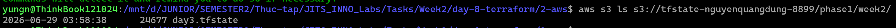

# Task Submission Template

> Mỗi task = 1 thư mục con + 1 PR/MR riêng. Copy template này vào `README.md` của task.

## Task: `Day 8 - Terraform`

- **Intern**: `Nguyễn Quang Dũng`
- **Phase / Week / Day**: `Phase 1 / Week 2 / Day 8`
- **Branch**: `phase-1/week-2/day-8-terraform`
- **Submitted at**: `2026-06-29 08:11` (timezone +07)
- **Time spent**: `6h`

## 1. Mục tiêu
- Hiểu mô hình IaC declarative.
- Nắm vững: provider, resource, variable, output, state, data source.
- Provision được hạ tầng cơ bản trên AWS (hoặc LocalStack nếu chưa có account).

## 2. Cách chạy
**Part B: Local-only**
```bash
cd 1-local
terraform init
terraform plan
terraform apply
# Đổi length = 2 thành 3 trong main.tf
terraform plan
terraform apply
terraform destroy -auto-approve
```

**Part C: AWS VPC + EC2**
```bash
cd 2-aws
# Cấu hình khóa bảo mật AWS CLI (Access Key & Secret Key)
aws configure

terraform init
terraform plan
terraform apply -auto-approve
terraform destroy -auto-approve
```

**Part D: Remote Backend (Bonus)**
```bash
# Tạo S3 Bucket và DynamoDB Table thông qua AWS CLI
aws s3api create-bucket --bucket tfstate-nguyenquangdung-8899 --region ap-southeast-1 --create-bucket-configuration LocationConstraint=ap-southeast-1
aws dynamodb create-table --table-name tfstate-lock --attribute-definitions AttributeName=LockID,AttributeType=S --key-schema AttributeName=LockID,KeyType=HASH --billing-mode PAY_PER_REQUEST --region ap-southeast-1
```

Cấu hình backend "s3" vào tệp `versions.tf`, sau đó đồng bộ state lên S3:
```bash
terraform {
  required_version = ">= 1.6"
   backend "s3" {
    bucket         = "tfstate-nguyenquangdung-8899"
    key            = "phase1/week2/day3.tfstate"
    region         = "ap-southeast-1"
    dynamodb_table = "tfstate-lock"
    encrypt        = true
  }
  required_providers {
    aws = {
      source  = "hashicorp/aws"
      version = "~> 5.0"
    }
  }
}
```
```bash
terraform init -migrate-state

# Kiểm tra tệp state đã lưu trên S3
aws s3 ls s3://tfstate-nguyenquangdung-8899/phase1/week2/
```

Dọn dẹp Backend:
```bash
# 1. Xóa khối cấu hình backend "s3" trong tệp versions.tf, sau đó rút state về lại local:
terraform init -migrate-state
# 2. Xóa toàn bộ file trong S3 bucket và phá hủy bucket:
aws s3 rm s3://tfstate-nguyenquangdung-8899 --recursive
aws s3api delete-bucket --bucket tfstate-nguyenquangdung-8899 --region ap-southeast-1
# 3. Phá hủy bảng DynamoDB:
aws dynamodb delete-table --table-name tfstate-lock --region ap-southeast-1
```

## 3. Kết quả
**Part B: Local-only**
- Toàn bộ log hiển thị quá trình chạy đã được lưu tại: [1-local-transcript.log](./1-local/1-local-transcript.log).
- Ảnh chụp màn hình minh chứng:
  - 
  - 
  Khi thay đổi `length = 2` thành `length = 3`:
  - 

**Part C: AWS VPC + EC2**
- Triển khai thành công hạ tầng mạng (VPC, Subnets, IGW, Route Table, Security Group) và máy chủ web Nginx (EC2) trên nền tảng AWS thật.
- Ảnh screenshot minh chứng kết quả chạy `apply`:

- Ảnh screenshot khi chạy `curl` và `terraform output`:


**Part D: Remote Backend**
- Khởi tạo thành công S3 Bucket và DynamoDB Table để quản lý tệp state.
- Cấu hình thành công block `backend "s3"` và migrate tệp state cục bộ lên đám mây S3.
- Ảnh screenshot minh chứng tệp state đã được chuyển lên S3 thành công:


## 4. Khó khăn & cách giải quyết
- **Lỗi cài đặt Terraform qua Snap (Part B)**: Khi chạy lệnh cài đặt Terraform bằng snap trên WSL bị báo lỗi cảnh báo an toàn do thiếu quyền truy cập hệ thống.
  - Cách khắc phục: Thêm cờ `--classic` vào cuối câu lệnh cài đặt để xác nhận cấp quyền (`sudo snap install terraform --classic`).
- **Từ chối phương thức thanh toán AWS (Part C)**: Tài khoản AWS ban đầu báo lỗi "Payment method not valid" do không xác minh được thẻ thanh toán.
  - Cách khắc phục: Tạm thời dùng LocalStack để thử nghiệm, sau đó xử lý thẻ thanh toán để kích hoạt thành công tài khoản AWS thật và quay lại sử dụng AWS.
- **Lỗi xác thực bản quyền LocalStack (Part C)**: Khi chuyển sang dùng thử LocalStack CLI, hệ thống bắt buộc đăng nhập tài khoản và báo lỗi xung đột Python (`'split' object error`) trên WSL.
  - Cách khắc phục: Khởi chạy trực tiếp bản LocalStack cũ qua Docker bằng lệnh `docker run --rm -d -p 4566:4566 -p 4510-4559:4510-4559 localstack/localstack:3.4.0`. Sau khi xử lý xong thẻ thanh toán, dự án đã được chuyển về chạy 100% trên AWS thật.

## 5. Reference
- [Install Terraform CLI](https://developer.hashicorp.com/terraform/tutorials/aws-get-started/install-cli) - Hướng dẫn cài đặt Terraform (Snap/Apt) trên Linux/WSL.
- [AWS Provider Documentation](https://registry.terraform.io/providers/hashicorp/aws/latest/docs) - Tài liệu tra cứu cú pháp các tài nguyên AWS (VPC, Subnet, EC2, SG, EIP).
- [Terraform S3 Backend](https://developer.hashicorp.com/terraform/language/settings/backends/s3) - Hướng dẫn chi tiết cấu hình Remote Backend lưu trữ state trên S3 và khóa bằng DynamoDB.
- [AWS CLI Configuration Basics](https://docs.aws.amazon.com/cli/latest/userguide/cli-configure-quickstart.html) - Cách thiết lập khóa truy cập Access Key thông qua lệnh `aws configure`.
- [LocalStack Docker Installation](https://docs.localstack.cloud/getting-started/installation/#docker) - Giải pháp giả lập AWS môi trường local bằng Docker.

## 6. Self-check
- [x] Code chạy được trên máy sạch.
- [x] README có hướng dẫn run lại.
- [x] Không hard-code secret.
- [x] Commit message theo Conventional Commits.
- [x] Đã review lại code 1 lượt.