# Task: AWS IAM & S3 Basics (Day 9)

- **Intern**: `Nguyễn Quang Dũng`
- **Phase / Week / Day**: `Phase 1 / Week 2 / Day 9`
- **Branch**: `phase-1/week-2/day-9-aws-basics`
- **Submitted at**: `2026-06-30 10:00`
- **Time spent**: `6h`

## 1. Mục tiêu
- Hiểu **IAM** (user, group, role, policy, trust policy).
- Làm chủ S3: bucket policy, static site, presigned URL.
- Nắm sơ đồ VPC, subnet public/private, NAT, IGW.
- Biết khái niệm: region, AZ, edge location.

## 2. Cách chạy
### Part A - Lý thuyết
- Đọc câu trả lời tại [notes.md](./notes.md).

### Part B - IAM
- Để kiểm thử cấu hình IAM của Part B dưới local, thiết lập AWS CLI với cấu hình của user `test-ro`:
```bash
# Setup profile
aws configure --profile test-ro

aws --profile test-ro s3 ls

aws --profile test-ro s3 cp test.txt s3://dung-static-5555/
```

### Part C - S3 Static Site
- Source code giao diện web tĩnh và Bucket Policy mẫu nằm trong thư mục [s3-static](./s3-static/).
- Các bước thực hiện cấu hình trực tiếp trên giao diện web AWS:
  1. Tạo S3 Bucket (`dung-static-5555`) và vô hiệu hóa cài đặt **Block Public Access**.
  2. Kích hoạt tính năng **Static website hosting** trong tab *Properties*, điền `index.html` cho Index document và `error.html` cho Error document.
  3. Upload các file mã nguồn (từ mục [s3-static](./s3-static/)) lên bucket thông qua tab *Objects*.
  4. Chỉnh sửa **Bucket Policy** trong tab *Permissions* với nội dung JSON chuẩn nhằm cấp quyền `s3:GetObject` công khai cho mọi truy cập.
  5. Mở đường dẫn *Bucket website endpoint* được cung cấp ở tab *Properties* trên trình duyệt để kiểm tra web tĩnh.

### Part D - Presigned URL
- Code Python dùng `boto3` nằm trong thư mục [s3-presign](./s3-presign/).
- Các bước chạy:
  1. Tạo bucket private (đảm bảo Block Public Access đang BẬT) tên là `private-dung-5555` và tải file PDF `private.pdf` lên S3.
  2. Tạo Presigned URL có thời hạn 5 phút thông qua AWS CLI:
     ```bash
     aws s3 presign s3://private-dung-5555/private.pdf --expires-in 300 --region ap-southeast-1
     ```
  3. Chạy script Python `presign.py` để sinh URL tự động bằng code:
     ```bash
     python3 s3-presign/presign.py
     ```

## 3. Kết quả
### Part B: Lab IAM
- IAM Group `s3-readonly`:

- IAM User `test-ro` đã được tạo và phân vào nhóm `s3-readonly`:

- Đã thu hồi/vô hiệu hóa Access Key của `test-ro` sau khi kiểm thử xong:

- Log chạy command dưới Terminal được lưu tại: [iam-lab/transcript.log](./iam-lab/transcript.log).

### Part C: S3 Static Site
- Cấu hình Static Website Hosting:
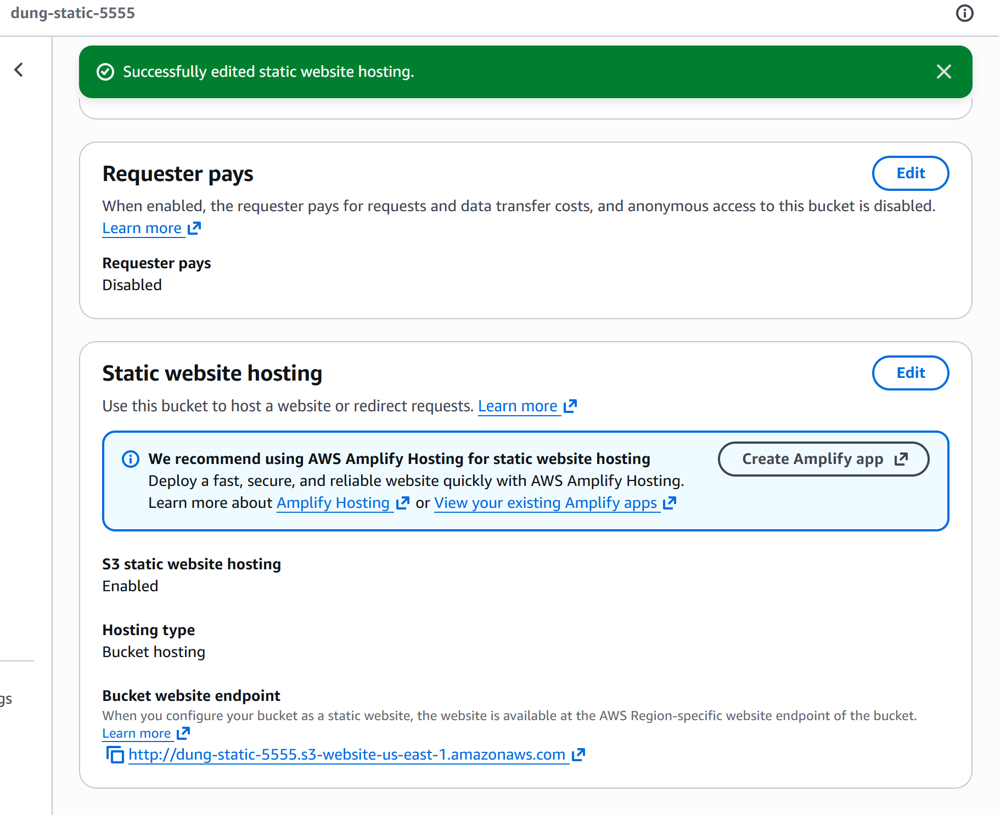
- Tải file giao diện lên S3:
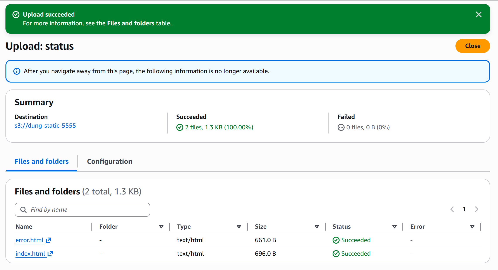
- Cập nhật Bucket Policy cho phép Public Read:
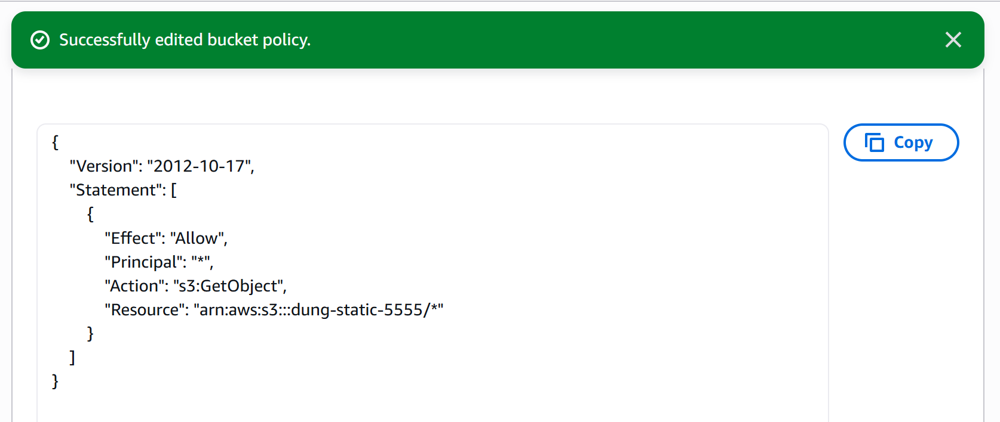
- Trạng thái Bucket hiển thị Public:

- Truy cập giao diện Web tĩnh qua Endpoint thành công:
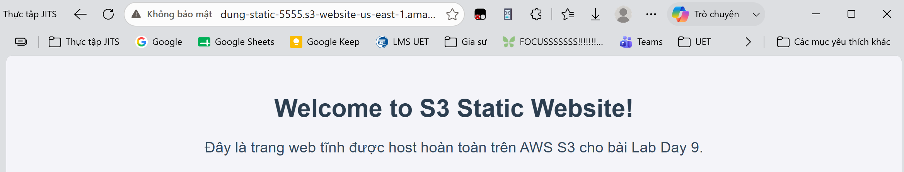

### Part D: Presigned URL
- Tải file PDF lên Private Bucket thành công:
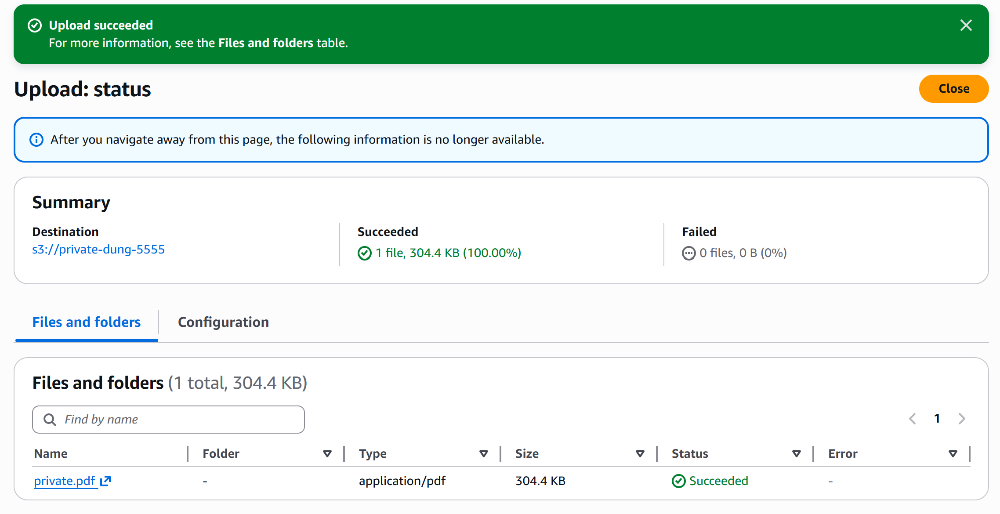
- Sinh link Presigned qua AWS CLI:
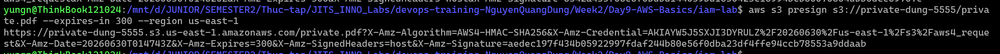
- Sinh link Presigned bằng script Python `boto3`:
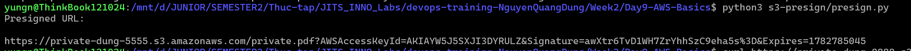
- Truy cập thành công thông qua link sinh từ CLI:
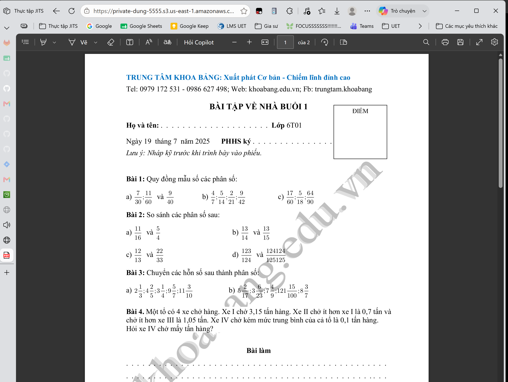
- Truy cập thành công thông qua link sinh từ Python:
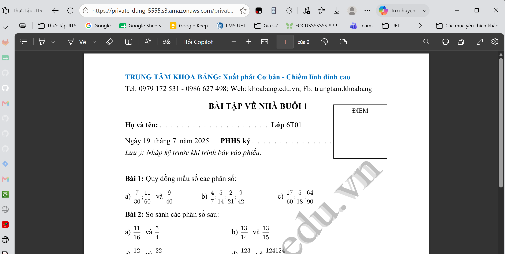

### Part E: VPC topology
- Sơ đồ kiến trúc mạng VPC:


### Cleanup
- Tất cả các S3 Buckets đã được empty và delete hoàn toàn:
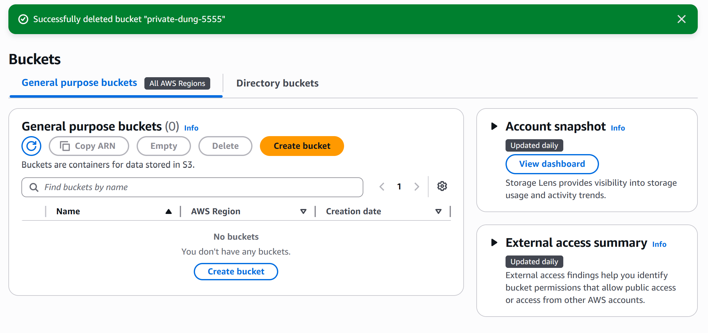
- Access Key của IAM User đã được xóa vĩnh viễn nhằm đảm bảo bảo mật:
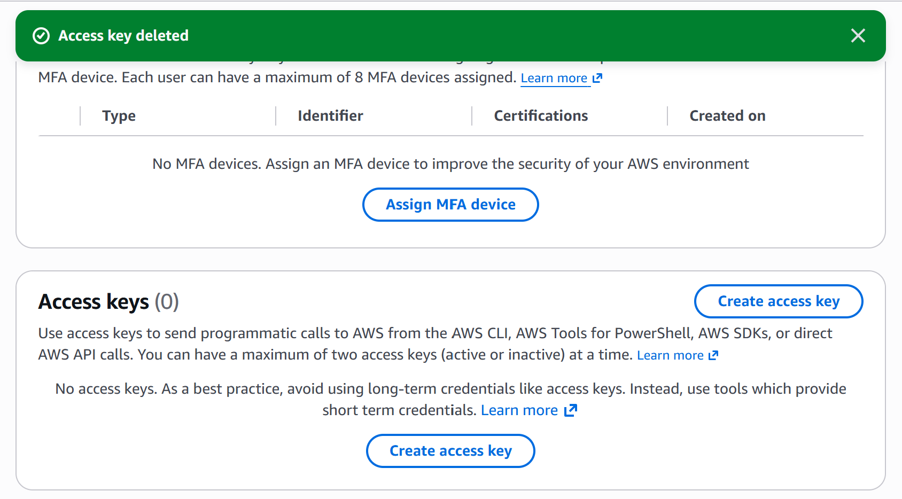
- Kiểm tra chi phí (Billing) đang ở Free Tier:
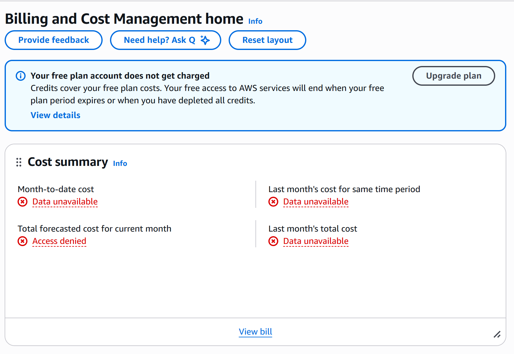

## 4. Khó khăn & cách giải quyết
- Ở phần kiểm tra giới hạn phân quyền tại Part B, do tài khoản AWS hoàn toàn trống (chưa từng tạo bucket nào) nên lệnh đẩy file `s3 cp` trả về lỗi NoSuchBucket (bucket không tồn tại) thay vì AccessDenied (bị từ chối) như yêu cầu của Lab.
- **Cách giải quyết:** Triển khai bước tạo Bucket của Part C trước, sau đó tái sử dụng chính Bucket đó để làm bucket mục tiêu kiểm thử trong lệnh tải file ở Part B. Kết quả đã trả về đúng lỗi `AccessDenied`.
- Ở Part D, khi truy cập vào Presigned URL thì gặp mã lỗi XML `PermanentRedirect`.
- **Cách giải quyết:** Vấn đề này xảy ra do AWS CLI đang lấy mặc định region `ap-southeast-1` để sinh link nhưng Bucket lại được tạo ở region khác. Cách khắc phục là chèn thêm flag `--region <tên_region_thực_tế>` (ở đây là us-east-1) vào câu lệnh sinh link (hoặc chỉ định đúng tham số `region_name` bên trong code Python) để tương thích chính xác vị trí địa lý.

## 5. Reference
- [AWS Free Tier dos & don'ts](https://aws.amazon.com/free/)
- [IAM Best Practices](https://docs.aws.amazon.com/IAM/latest/UserGuide/best-practices.html)
- [Hosting a static website using Amazon S3](https://docs.aws.amazon.com/AmazonS3/latest/userguide/WebsiteHosting.html) 
- [Boto3 S3 Presigned URLs](https://boto3.amazonaws.com/v1/documentation/api/latest/guide/s3-presigned-urls.html) 
- [Amazon VPC fundamentals](https://docs.aws.amazon.com/vpc/latest/userguide/what-is-amazon-vpc.html)

## 6. Self-check
- [x] Code chạy được trên máy sạch.
- [x] README có hướng dẫn run lại.
- [x] Không hard-code secret (Đã vô hiệu hóa Access Key).
- [x] Đã trả lời đủ 5 câu hỏi lý thuyết IAM.
- [x] Đã review lại file và định dạng markdown 1 lượt.