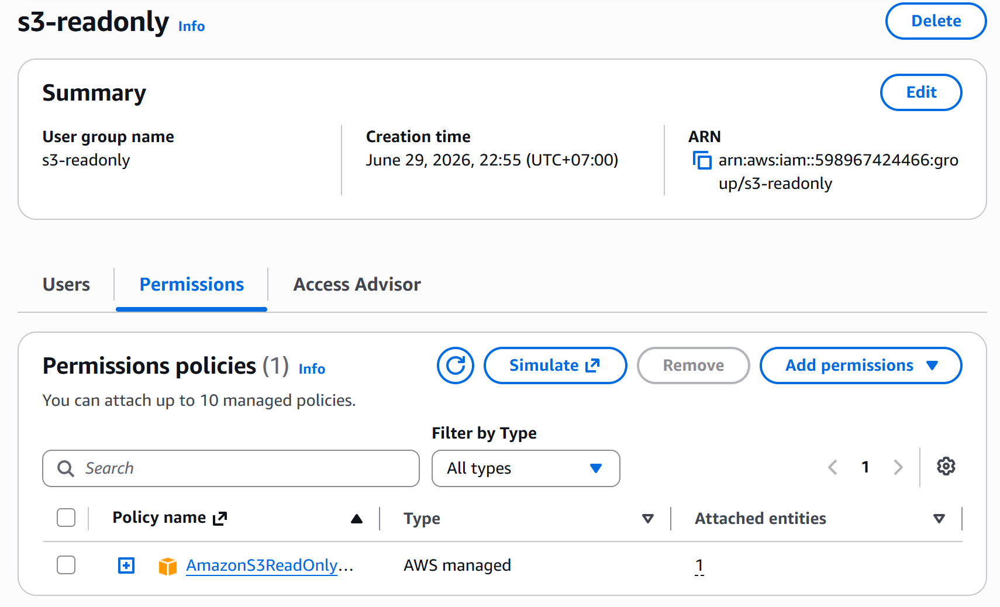
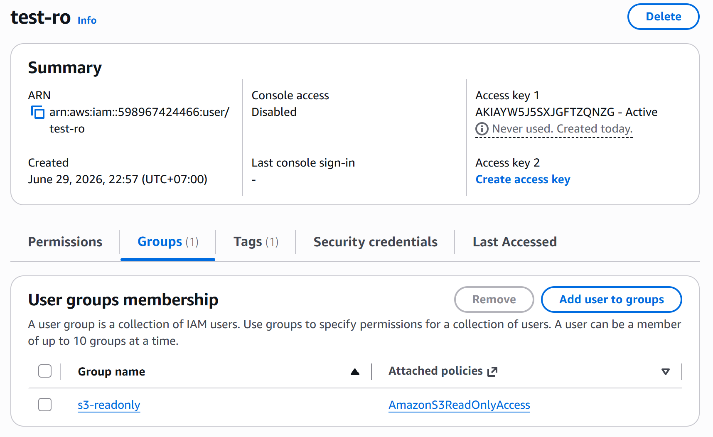
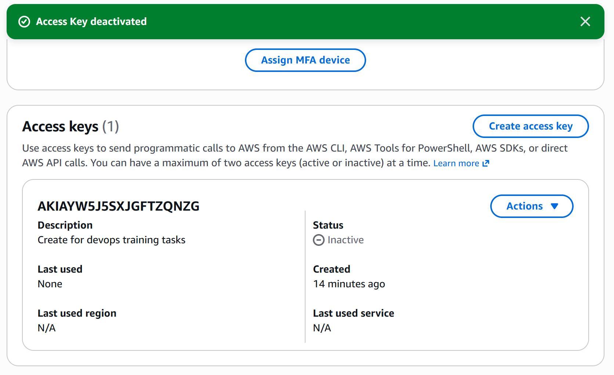
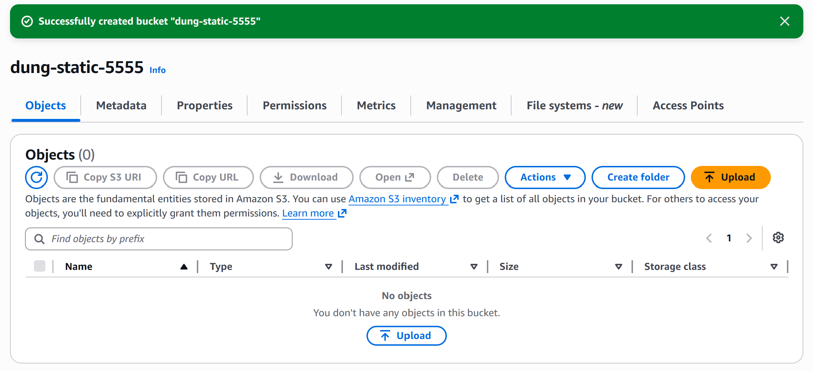

# Task: AWS IAM & S3 Basics (Day 9)

- **Intern**: `Nguyễn Quang Dũng`
- **Phase / Week / Day**: `Phase 1 / Week 2 / Day 9`
- **Branch**: `phase-1/week-2/day-9-aws-basics`
- **Submitted at**: `2026-06-29`
- **Time spent**: `3h`

## 1. Mục tiêu
Thực hành cấu hình quản lý quyền truy cập trên AWS với IAM (User, Group, Policy, Access Key) và cấu hình Amazon S3 Host Static Website. Nắm vững khái niệm về phân quyền tối thiểu (Least Privilege) và bảo mật Access Key.

## 2. Cách chạy
### Part A - Lý thuyết
- Đọc câu trả lời tại [notes.md](./notes.md).

### Part B - IAM
- Để kiểm thử cấu hình IAM của Part B dưới local, thiết lập AWS CLI với cấu hình của user `test-ro`:
```bash
# Setup profile
aws configure --profile test-ro

aws --profile test-ro s3 ls

aws --profile test-ro s3 cp test.txt s3://dung-static-5555/
```

### Part C - S3 Static Site
- Source code giao diện web tĩnh của Part C và Bucket Policy mẫu nằm trong thư mục [s3-static](./s3-static/).

## 3. Kết quả
### Part B: Lab IAM
- IAM Group `s3-readonly`:

- IAM User `test-ro` đã được tạo và phân vào nhóm `s3-readonly`:

- Đã thu hồi/vô hiệu hóa Access Key của `test-ro` sau khi kiểm thử xong:

- Log chạy command dưới Terminal được lưu tại: [iam-lab/transcript.log](./iam-lab/transcript.log).

### Part C: S3 Static Site
- Giao diện quản lý Bucket S3 hiển thị thông tin Public:


## 4. Khó khăn & cách giải quyết
- Ở phần kiểm tra giới hạn phân quyền tại Part B, do tài khoản AWS hoàn toàn trống (chưa từng tạo bucket nào) nên lệnh đẩy file `s3 cp` trả về lỗi NoSuchBucket (bucket không tồn tại) thay vì AccessDenied (bị từ chối) như yêu cầu của Lab.
- **Cách giải quyết:** Triển khai bước tạo Bucket của Part C trước, sau đó tái sử dụng chính Bucket đó để làm bucket mục tiêu kiểm thử trong lệnh tải file ở Part B. Kết quả đã trả về đúng lỗi `AccessDenied`.

## 5. Reference
- [IAM best practices](https://docs.aws.amazon.com/IAM/latest/UserGuide/best-practices.html)
- Hướng dẫn cấu hình S3 Static Website Hosting.

## 6. Self-check
- [x] Code chạy được trên máy sạch.
- [x] README có hướng dẫn run lại.
- [x] Không hard-code secret (Đã vô hiệu hóa Access Key).
- [x] Đã trả lời đủ 5 câu hỏi lý thuyết IAM.
- [x] Đã review lại file và định dạng markdown 1 lượt.