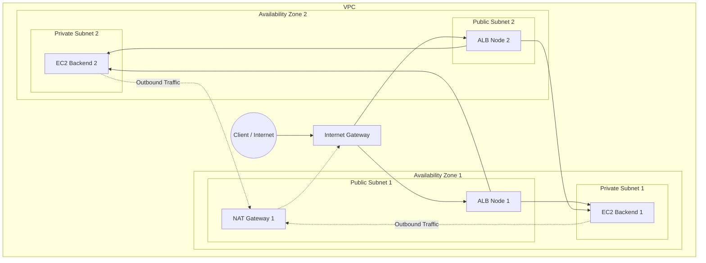
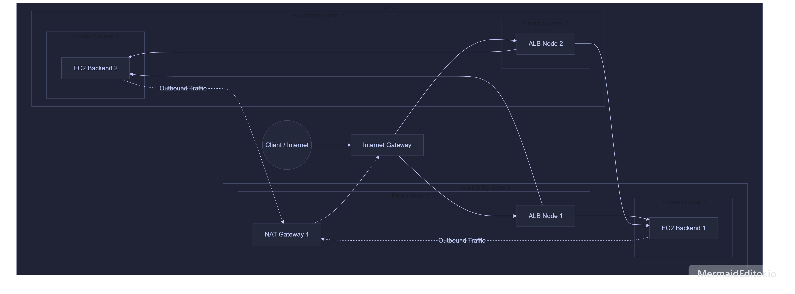

# Day 9 - Part A: IAM

## 1. Phân biệt User, Group, Role, Policy
- User: Đại diện cho một cá nhân hoặc ứng dụng cụ thể tương tác với AWS thông qua thông tin đăng nhập hoặc khóa truy cập riêng biệt.
- Group: Tập hợp bao gồm nhiều User. Quản trị viên gắn quyền cho nhóm thì tất cả các thành viên trong nhóm tự động nhận được quyền đó.
- Role: Một danh tính không gắn với một cá nhân cố định. Vai trò này được cấp phát chứng chỉ tạm thời để các dịch vụ hoặc người dùng khác đảm nhận khi cần thực hiện tác vụ.
- Policy: Tài liệu định dạng JSON dùng để xác định các quyền hạn chi tiết, quy định việc cho phép hoặc từ chối một hành động trên tài nguyên cụ thể.

## 2. Phân biệt Trust policy, Identity policy, Resource policy
- Trust policy: Chính sách gắn với một Role nhằm xác định chính xác đối tượng nào được phép đảm nhận Role đó.
- Identity policy: Chính sách gắn trực tiếp với danh tính như User, Group hoặc Role để cấp quyền thực hiện các hành động trên AWS.
- Resource policy: Chính sách gắn trực tiếp lên tài nguyên cụ thể để quy định danh tính nào được phép truy cập vào tài nguyên đó.

## 3. Tại sao Role tốt hơn User key cho hệ thống EC2 và CI/CD
Sử dụng Role giúp loại bỏ nhu cầu lưu trữ khóa bí mật dài hạn trên máy chủ hoặc trong mã nguồn. AWS tự động cấp phát và xoay vòng chứng chỉ tạm thời cho Role. Phương pháp này giảm thiểu tối đa rủi ro lộ lọt thông tin xác thực và dễ dàng quản lý quyền truy cập tập trung.

## 4. Giải thích cấu trúc policy JSON
- Version: Phiên bản quy tắc của ngôn ngữ chính sách. Phiên bản 2012-10-17 là chuẩn hiện tại.
- Statement: Khối dữ liệu chính chứa các quy tắc phân quyền chi tiết.
- Effect: Chỉ định kết quả của quy tắc là cho phép đối với các hành động bên dưới.
- Action: Liệt kê các thao tác cụ thể được thực thi. Ở đây là hành động đọc dữ liệu s3:GetObject.
- Resource: Chỉ định tài nguyên chịu tác động của chính sách. Ở đây là tất cả các đối tượng bên trong bucket có tên my-bucket.
- Condition: Điều kiện bổ sung để chính sách có hiệu lực. Hành động chỉ được phép nếu yêu cầu bắt nguồn từ dải địa chỉ mạng 203.0.113.0/24.

## 5. Kết quả khi User thuộc Group có Allow nhưng User có Deny
Kết quả cuối cùng là quyền truy cập bị từ chối. Trong quá trình đánh giá quyền truy cập của AWS, một lệnh `deny` rõ ràng luôn ghi đè lên mọi lệnh `allow` từ các policy khác.

---

# Day 9 - Part E: VPC topology

## 1. Sơ đồ kiến trúc VPC
Mô hình bao gồm 1 VPC trải dài trên 2 Availability Zones (AZ). Mỗi AZ có 1 Public Subnet và 1 Private Subnet.

## 2. Giải thích kiến trúc
- **Tại sao backend phải ở private subnet?**
  Để tăng cường bảo mật tối đa. Đặt backend (chứa code xử lý logic hoặc kết nối database) trong private subnet giúp cô lập hoàn toàn hệ thống khỏi mạng Internet công cộng (không có IP Public, không thể bị scan port hay tấn công trực tiếp từ bên ngoài). Mọi luồng truy cập đi vào (inbound) đều bắt buộc phải đi qua một cổng chặn trung gian được kiểm soát nghiêm ngặt là Application Load Balancer (ALB) nằm ở Public Subnet.

- **Outbound internet qua đâu?**
  Khi các EC2 backend bên trong private subnet cần chủ động kết nối ra ngoài Internet (ví dụ để tải thư viện NPM, update OS, gọi API bên thứ ba), luồng mạng sẽ được dẫn đường thông qua Route Table của Private Subnet trỏ thẳng tới **NAT Gateway** (thiết bị này nằm ở Public Subnet). NAT Gateway sẽ đại diện thực hiện Network Address Translation, chuyển tiếp gói tin đó tới **Internet Gateway (IGW)** để ra ngoài Internet. Cơ chế này cho phép các backend lấy được dữ liệu về mà vẫn che giấu được IP thực tế bên trong.
