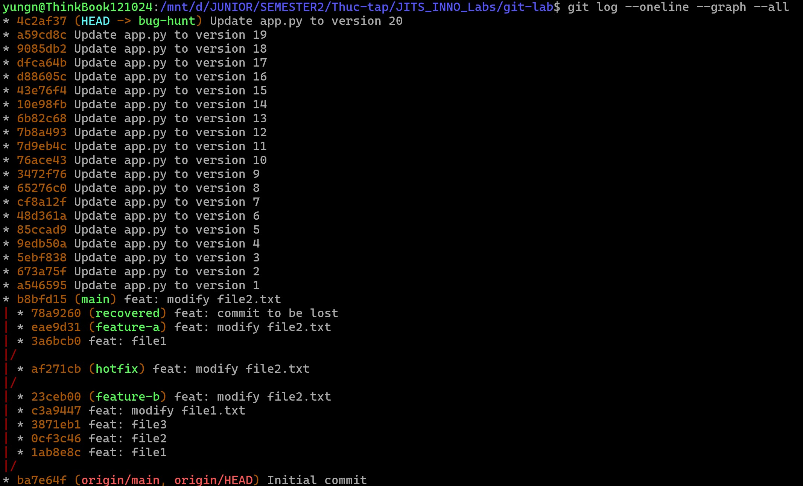
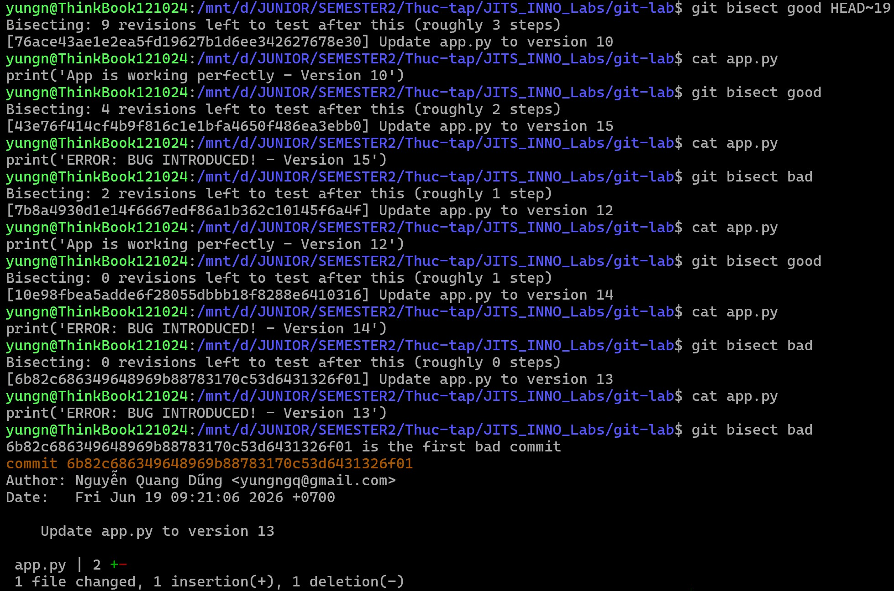
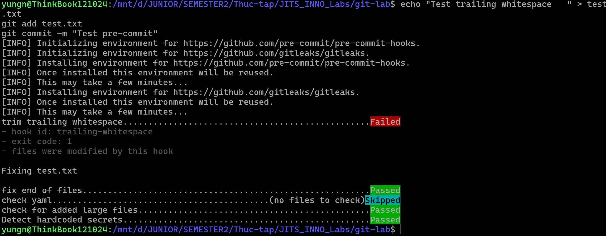

## Task: Day 3 - Git Advanced

- **Intern**: Nguyễn Quang Dũng
- **Phase / Week / Day**: Phase 1 / Week 1 / Day 3
- **Branch**: `phase-1/week-1/day-3-git`
- **Submitted at**: `2026-06-19 05:35` (timezone +07)
- **Time spent**: `<số giờ>`

## 1. Mục tiêu
Thực hành và làm chủ các thao tác Git nâng cao: rebase interactive, cherry-pick, resolve conflict, phục hồi commit bằng `reflog`, dò tìm commit lỗi tự động bằng `bisect`, cài đặt `pre-commit` hook. Ngoài ra, cần phân tích và so sánh các mô hình làm việc (workflow) phổ biến: Trunk-based, GitFlow, GitHub Flow.

## 2. Chi tiết thực hiện các yêu cầu (Hands-on)
- Toàn bộ thao tác thực hành (từ Part A đến E) được lưu lịch sử tại repository: **[git-lab](https://github.com/KwangZung/git-lab.git)**.

### Part A — Rebase + cherry-pick + conflict
Chi tiết các câu lệnh và ảnh chụp đồ thị git được ghi chép tại: 👉 **[history.md](./history.md)**.

### Part B — Tìm lại commit bị "mất"
Cách khôi phục commit bằng reflog được ghi chép tại: 👉 **[reflog-lab.md](./reflog-lab.md)**.

### Cách thực hiện Part C — git bisect
1. Tạo nhánh `bug-hunt` gồm 20 commit, trong đó file `app.py` từ commit thứ 13 trở đi sẽ bị in dòng lỗi "ERROR: BUG INTRODUCED!".
Sử dụng script Bash sau để tự động sinh 20 commit (chạy trong thư mục `git-lab`):
```bash
git checkout main
git checkout -b bug-hunt
for i in {1..20}; do
  if [ $i -lt 13 ]; then
    echo "print('App is working perfectly - Version $i')" > app.py
  else
    echo "print('ERROR: BUG INTRODUCED! - Version $i')" > app.py
  fi
  git add app.py
  git commit -m "Update app.py to version $i"
done
```



2. Dùng la bàn tìm kiếm nhị phân để dò:
```bash
git bisect start
git bisect bad          # Đánh dấu commit hiện tại (20) là lỗi
git bisect good HEAD~19 # Đánh dấu commit đầu tiên (1) là tốt

# Git nhảy đến version ở giữa
cat app.py # In ra để tìm bug
# - Nếu báo "App is working perfectly", nhập:
git bisect good
# - Nếu báo "ERROR: BUG INTRODUCED!", nhập:
git bisect bad
# Lặp lại quá trình trên cho đến khi Git thông báo "the first bad commit".
```



3. Xuất kết quả ra file `bisect.log` và dọn dẹp:
```bash
git bisect log > bisect.log
git bisect reset
```

### Cách thực hiện Part D — Pre-commit hook
1. Cài đặt phần mềm `pre-commit`:
```bash
sudo apt install pre-commit
```
2. Tạo file cấu hình `.pre-commit-config.yaml` ở thư mục gốc của repo `git-lab` bằng dòng lệnh:
```bash
touch .pre-commit-config.yaml
vim .pre-commit-config.yaml
```
Nội dung file:
```yaml
repos:
  - repo: https://github.com/pre-commit/pre-commit-hooks
    rev: v4.5.0
    hooks:
      - id: trailing-whitespace
      - id: end-of-file-fixer
      - id: check-yaml
      - id: check-added-large-files
  - repo: https://github.com/gitleaks/gitleaks
    rev: v8.18.0
    hooks:
      - id: gitleaks
```
3. Cài đặt hook vào Git để tự động chạy mỗi khi commit:
```bash
pre-commit install
```
4. Thử nghiệm:
```bash
# Tạo một file và cố tình để thừa vài khoảng trắng ở cuối
echo "Test trailing whitespace   " > test.txt
git add test.txt
git commit -m "Test pre-commit"
# Commit sẽ bị chặn lại
# Trong lần chạy đầu, phải đợi khoảng 1 phút để pre-commit tải các tool về
```


### Part E — So sánh workflow (Trunk-based, GitFlow, GitHub Flow)
Bảng phân tích, so sánh chi tiết và đánh giá cá nhân được viết tại: 👉 **[workflow-comparison.md](./workflow-comparison.md)**.

*(Transcript kết quả chạy lệnh của Part C nằm ở file: **[bisect.log](./bisect.log)**)*

## 3. Kết quả
- Thực hiện đầy đủ các nhánh yêu cầu trong `git-lab` với lịch sử (history) sạch.
- Resolve conflict thành công trong Part A.
- Phục hồi thành công commit bị xóa trong Part B bằng reflog.
- Dò ra commit bị lỗi chính xác bằng lệnh `git bisect` trong Part C.
- Pre-commit hook đã hoạt động chặn được trailing-whitespace trong Part D.
- Các bằng chứng ảnh chụp (screenshot) và log được đặt đầy đủ trong thư mục `./screenshots/`.

## 4. Khó khăn & cách giải quyết
- **Khó khăn:** Khi chạy lệnh `pip install pre-commit`, hệ điều hành (Ubuntu/Debian) báo lỗi `externally-managed-environment` và từ chối cài đặt. Khi cố dùng cờ `--break-system-packages`, hệ thống lại báo lỗi xung đột package mặc định `Cannot uninstall platformdirs... RECORD file not found`.
- **Cách giải quyết:** Không sử dụng `pip` để cài đặt trực tiếp lên hệ thống (system-wide) để tránh phá vỡ môi trường Python mặc định của OS. Thay vào đó, sử dụng trình quản lý gói của hệ điều hành (`apt`) để cài đặt an toàn:
  ```bash
  sudo apt update
  sudo apt install pre-commit
  ```

## 5. Reference
- [Pro Git book — Ch.3 Branching, Ch.7 Tools](https://git-scm.com/book/en/v2)
- [Learn Git Branching](https://learngitbranching.js.org/)
- [So you think you know Git - Scott Chacon](https://www.youtube.com/watch?v=aolI_Rz0ZqY)

## 6. Self-check
- [x] Code chạy được trên máy sạch.
- [x] README có hướng dẫn run lại.
- [x] Không hard-code secret.
- [x] Commit message theo Conventional Commits.
- [x] Đã review lại code 1 lượt.
