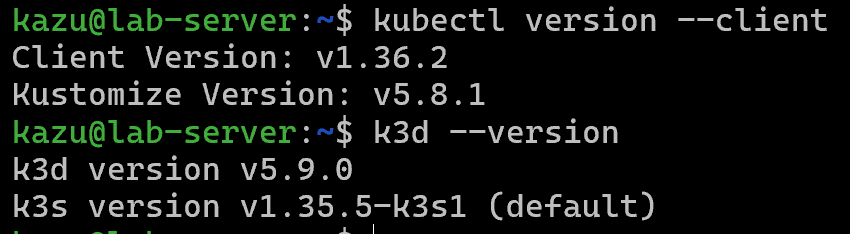
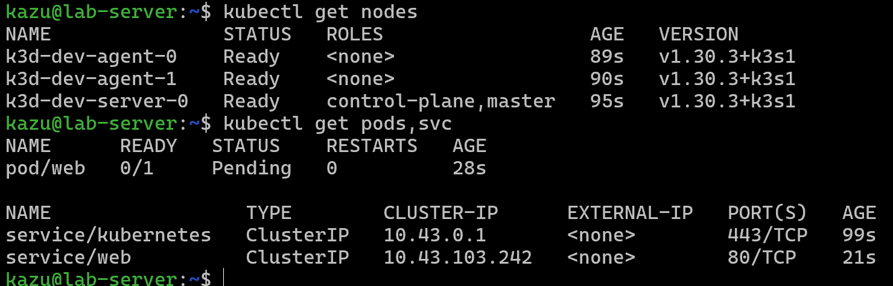
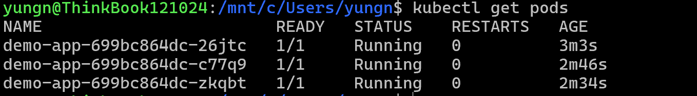
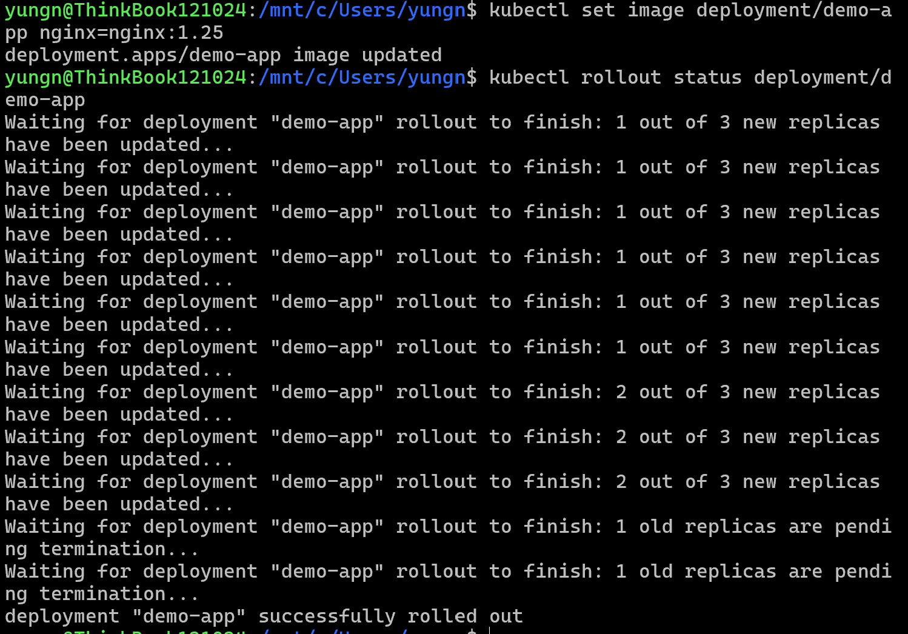
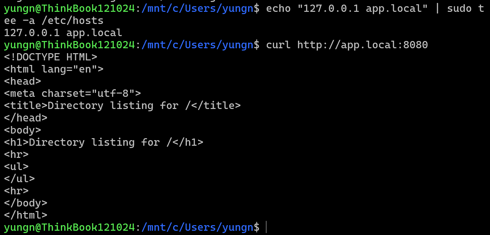
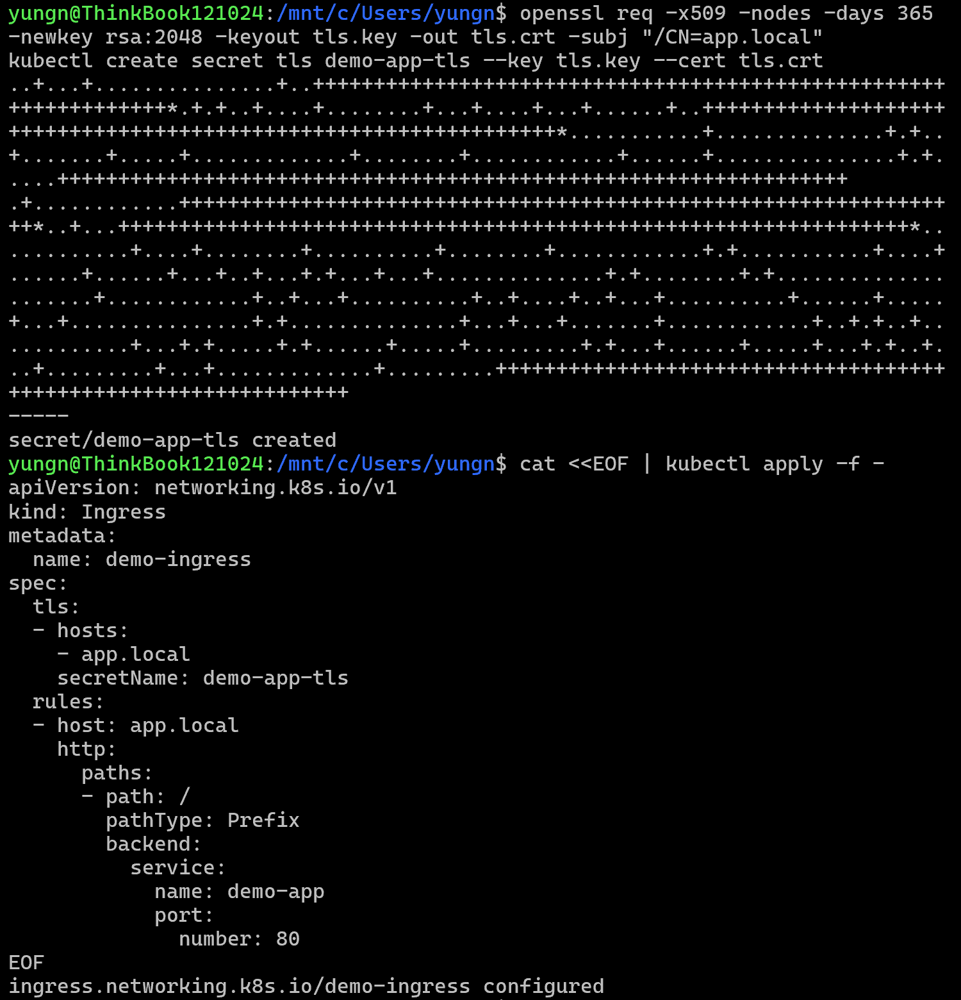
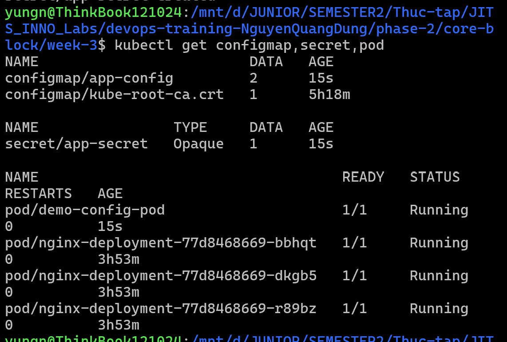
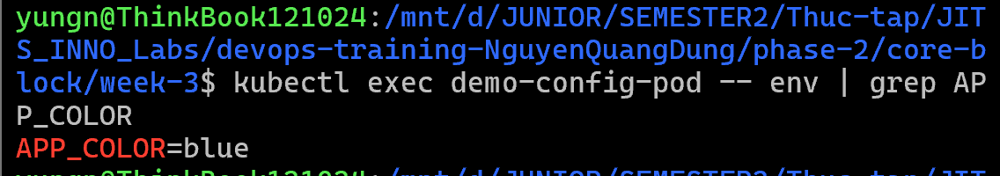
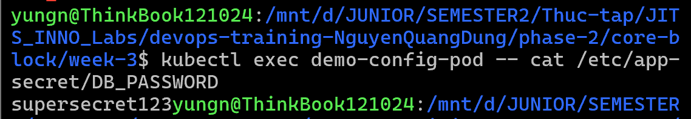

# Task Submission Template

> Mỗi task = 1 folder con + 1 PR/MR riêng. Copy template này vào `README.md` của task.

## Task: `Week 3: Kubernetes Deep Dive`

- **Intern**: `Nguyễn Quang Dũng`
- **Phase / Week / Day**: `Phase 2 / Week 3 / Day 3`
- **Branch**: `phase-2/week-3-kubernetes`
- **Submitted at**: `2026-07-07 22:09` (timezone +07)
- **Time spent**: `6h`

## 1. Mục tiêu
### Day 1 - k8s architecture, kubectl, install k3d, deploy first pod
- Cài đặt các công cụ quản trị (kubectl, k3d) trên Terminal.
- Khởi tạo Cluster cục bộ bằng k3d.
- Triển khai Pod đầu tiên và thiết lập mạng nội bộ qua Port thông qua Service.

### Day 2 - Deployment, Service, Ingress
- Triển khai ứng dụng nhiều bản sao và cấu hình nâng cấp tự động không gián đoạn bằng Deployment.
- Điều hướng và phân giải tên miền ảo nội bộ thông qua Ingress và Service.

### Day 3 - ConfigMap, Secret, env injection, projected volume
- Tách biệt cấu hình ứng dụng khỏi Image bằng cách sử dụng ConfigMap.
- Quản lý và nạp dữ liệu nhạy cảm an toàn thông qua Secret.
- Thực hành inject cấu hình (Biến môi trường và Projected Volume) bằng phương pháp Declarative YAML.

## 2. Cách chạy
### Day 1 - k8s architecture, kubectl, install k3d, deploy first pod
```bash
# 1. Cài đặt kubectl
curl -LO "https://dl.k8s.io/release/$(curl -L -s https://dl.k8s.io/release/stable.txt)/bin/linux/amd64/kubectl"
sudo install -o root -g root -m 0755 kubectl /usr/local/bin/kubectl
kubectl version --client

# 2. Cài đặt k3d
curl -s https://raw.githubusercontent.com/k3d-io/k3d/main/install.sh | bash
k3d --version

# 3. Khởi tạo Cluster
k3d cluster create dev --agents 2 -p "8080:80@loadbalancer" --image rancher/k3s:v1.30.3-k3s1
kubectl get nodes

# 4. Triển khai Pod và Service
kubectl run web --image=nginx --port=80
kubectl expose pod web --type=ClusterIP
kubectl get pods,svc
```

### Day 2: Deployment, Service, Ingress
#### Lab 2: Deployment + Rolling Update
```bash
# - Deploy `demo-app:v1` (3 replica).
kubectl create deployment demo-app --image=nginx:1.24 --replicas=3
kubectl get pods
# - Rolling update lên `v2`.
kubectl set image deployment/demo-app nginx=nginx:1.25
# - Theo dõi `kubectl rollout status`.
kubectl rollout status deployment/demo-app
# - Rollback.
kubectl rollout undo deployment/demo-app
```

#### Lab 3: Ingress
```bash
# Bọc Service cho Deployment để Ingress có thể trỏ vào
kubectl expose deployment demo-app --port=80 --target-port=80

# - Tạo Ingress route `app.local → demo-app:80`.
cat <<EOF | kubectl apply -f -
apiVersion: networking.k8s.io/v1
kind: Ingress
metadata:
  name: demo-ingress
spec:
  rules:
  - host: app.local
    http:
      paths:
      - path: /
        pathType: Prefix
        backend:
          service:
            name: demo-app
            port:
              number: 80
EOF

# Phân giải tên miền ảo trên máy Host
echo "127.0.0.1 app.local" | sudo tee -a /etc/hosts
curl http://app.local:8080

# - TLS termination với cert tự sinh hoặc cert-manager + selfsigned ClusterIssuer.
# Tạo chứng chỉ SSL tự sinh (Self-signed) cho tên miền app.local và lưu vào Secret
openssl req -x509 -nodes -days 365 -newkey rsa:2048 -keyout tls.key -out tls.crt -subj "/CN=app.local"
kubectl create secret tls demo-app-tls --key tls.key --cert tls.crt

# Cập nhật Ingress để áp dụng chứng chỉ bảo mật (TLS Termination)
cat <<EOF | kubectl apply -f -
apiVersion: networking.k8s.io/v1
kind: Ingress
metadata:
  name: demo-ingress
spec:
  tls:
  - hosts:
    - app.local
    secretName: demo-app-tls
  rules:
  - host: app.local
    http:
      paths:
      - path: /
        pathType: Prefix
        backend:
          service:
            name: demo-app
            port:
              number: 80
EOF
```

### Day 3: ConfigMap, Secret, env injection, projected volume
#### Các file declarative YAML trong folder [day-3](./day-3)
- **`configmap.yaml`**: Khởi tạo tài nguyên `ConfigMap` để lưu trữ các cấu hình không nhạy cảm dưới dạng key-value (cụ thể là biến `APP_COLOR`).
- **`secret.yaml`**: Khởi tạo tài nguyên `Secret`. Việc sử dụng khóa `stringData` (thay vì `data`) giúp kỹ sư có thể khai báo mật khẩu bằng văn bản thuần túy, Kubernetes sẽ đảm nhận việc tự động mã hóa nó sang định dạng Base64.
- **`pod.yaml`**: Định nghĩa một `Pod` đóng vai trò nhận cấu hình. Thuộc tính `env` sử dụng tham chiếu `configMapKeyRef` để kéo giá trị từ ConfigMap inject thành biến môi trường. Trong khi đó, thuộc tính `volumes` và `volumeMounts` kết hợp với nhau để giải mã Secret và gắn nó thành một file vật lý (Projected Volume) tại folder `/etc/app-secret` bên trong Container.

```bash
# - Áp dụng toàn bộ file declarative YAML trong folder day-3/
kubectl apply -f day-3/

# - Kiểm tra các tài nguyên vừa được tạo
kubectl get configmap,secret,pod

# - Kiểm tra biến môi trường được inject từ ConfigMap
kubectl exec demo-config-pod -- env | grep APP_COLOR

# - Kiểm tra file cấu hình vật lý được sinh ra từ Secret (Projected Volume)
kubectl exec demo-config-pod -- cat /etc/app-secret/DB_PASSWORD

# - Xóa các tài nguyên sau khi thực hành
kubectl delete -f day-3/
```

## 3. Kết quả
### Day 1 - k8s architecture, kubectl, install k3d, deploy first pod
- Đã cài đặt thành công kubectl và k3d trên hệ thống.
- Cluster `dev` đã hoạt động, tất cả các Node đều đạt trạng thái Ready.
- Pod `web` được kéo Image Nginx và đang chạy (Running).
- Service `web` đã cấp phát địa chỉ ClusterIP thành công để mở Port 80.

- **Cài đặt công cụ**: Ảnh chụp xác nhận phiên bản của `kubectl` và `k3d` đã được cài đặt thành công trên hệ thống.


- **Khởi tạo Cluster & Triển khai Pod**: Ảnh chụp hệ thống hiển thị danh sách các Node đang hoạt động (Ready), cùng với Pod `web` và Service tương ứng đang chạy.


### Day 2 - Deployment, Service, Ingress
- Chạy thành công quy trình Rolling Update và Rollback an toàn trên Deployment.
- Ingress đã kết nối thành công tên miền ảo `app.local` vào Service bên trong Cluster. Lệnh `curl` đã trả về thành công mã HTML mặc định của Nginx qua HTTP.
- Cấu hình thành công TLS Termination trên Ingress sử dụng chứng chỉ tự sinh (Self-signed), đảm bảo truy cập HTTPS an toàn.

- **Tạo Deployment**: Ảnh chụp khởi tạo thành công Deployment `demo-app` với 3 bản sao (replicas) đang chạy.


- **Quản lý Deployment**: Ảnh chụp quá trình Rolling Update đã hoàn tất và trạng thái Rollback đã hoạt động.


- **Kiểm tra Ingress**: Ảnh chụp lệnh kiểm tra phân giải tên miền ảo trên máy Host và phản hồi thành công từ Nginx khi truy cập qua giao thức HTTP.


- **Cấu hình TLS Termination**: Ảnh chụp Ingress đã sử dụng chứng chỉ tự sinh để bảo mật kết nối HTTPS thành công.


### Day 3 - ConfigMap, Secret, env injection, projected volume
- Áp dụng thành công toàn bộ tài nguyên (ConfigMap, Secret, Pod) thông qua folder khai báo Declarative YAML.
- Biến môi trường (APP_COLOR) từ ConfigMap đã được truyền thành công vào bên trong Container.
- Dữ liệu Secret đã được ánh xạ thành công thành một file vật lý an toàn thông qua Projected Volume.

- **Khởi tạo tài nguyên**: Ảnh chụp lệnh kiểm tra `kubectl get` sau khi áp dụng cấu hình. Hệ thống đã ghi nhận đầy đủ ConfigMap, Secret và Pod mục tiêu đang ở trạng thái Running.


- **Kiểm tra biến môi trường**: Ảnh chụp lệnh kiểm tra `env` bên trong Container. Giá trị cấu hình từ ConfigMap đã thực sự được nạp thành công.


- **Kiểm tra Projected Volume**: Ảnh chụp lệnh kiểm tra khi đọc file vật lý được gắn vào bên trong Container. Dữ liệu từ Secret đã được ánh xạ chính xác vào folder được yêu cầu.


## 4. Khó khăn & cách giải quyết
### Day 1 - k8s architecture, kubectl, install k3d, deploy first pod
- **Lỗi sập Server node (Closing database connections)**: Lệnh tạo Cluster bị kẹt ở `Starting agents...` và `kubectl` liên tục báo lỗi `connection refused`.
  - *Cách fix*: Nguyên nhân do bản image tự kéo mặc định (`v1.35.5-k3s1`) gặp trục trặc nội bộ. Khắc phục bằng cách xóa Cluster hỏng (`k3d cluster delete dev`) và ép k3d dùng bản ổn định bằng cờ `--image rancher/k3s:v1.30.3-k3s1`.
- **Lỗi đụng độ Port (port is already allocated)**: Docker không thể khởi tạo loadbalancer vì port 8080 trên máy đã bị chiếm dụng.
  - *Cách fix*: Dùng lệnh `docker ps` để dò tìm mã ID của Container rác đang chạy ngầm trên port 8080, sau đó tiêu diệt nó bằng `docker rm -f <Container-ID>` để giải phóng hoàn toàn port này.

### Day 2 - Deployment, Service, Ingress
- **Lỗi Pending toàn bộ Pod (Disk Pressure)**: Kubelet từ chối lên lịch cho Pod do ổ cứng máy ảo (Ubuntu LVM) chỉ được cấp mặc định 20GB và đã bị đầy (Use% > 85%). Kubelet áp dụng taint cấm `disk-pressure`.
  - *Cách fix*: Mở rộng phân vùng LVM trên Ubuntu để chiếm trọn phần dung lượng ảo chưa được dùng bằng các lệnh `sudo lvextend -l +100%FREE /dev/mapper/ubuntu--vg-ubuntu--lv` và `sudo resize2fs /dev/mapper/ubuntu--vg-ubuntu--lv`. Đồng thời kết hợp dọn rác bằng `docker system prune -a --volumes -f`.

## 5. Reference
- Kubernetes Components Architecture: https://kubernetes.io/docs/concepts/overview/components/
- K3d Official Documentation: https://k3d.io/
- Kubectl Cheat Sheet: https://kubernetes.io/docs/reference/kubectl/cheatsheet/
- Bài giảng và tài liệu nội bộ khóa DevSecOps Training.

## 6. Self-check
- [ ] Code chạy được trên máy sạch.
- [x] README có hướng dẫn run lại.
- [ ] Không hard-code secret.
- [x] Commit message theo Conventional Commits.
- [ ] Đã review lại code 1 lượt.