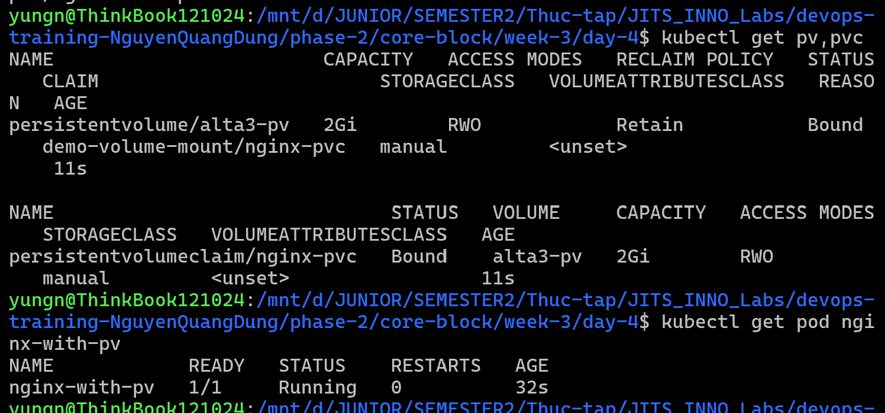
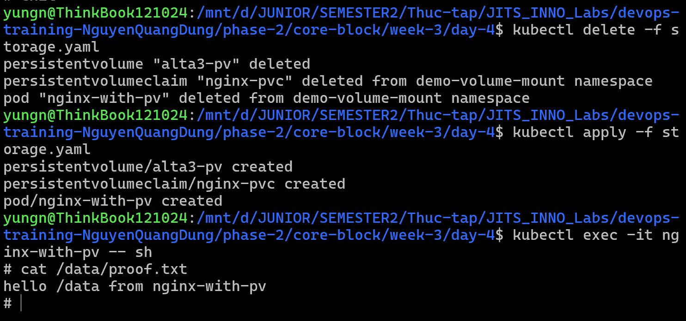
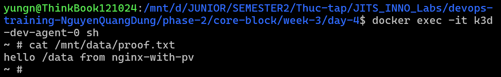
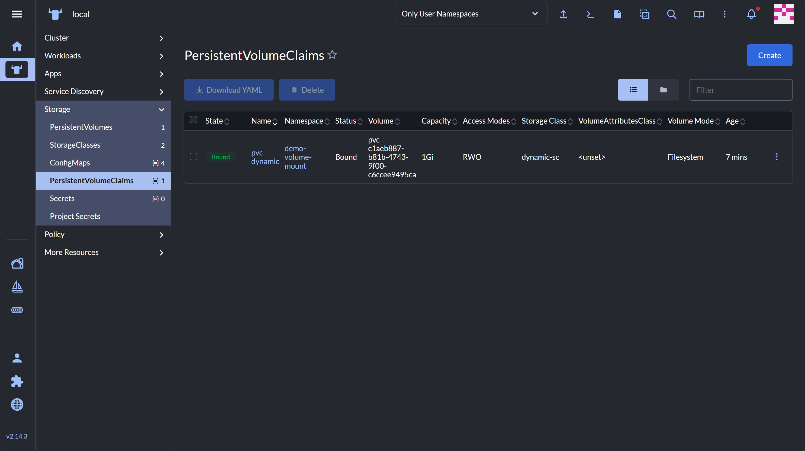
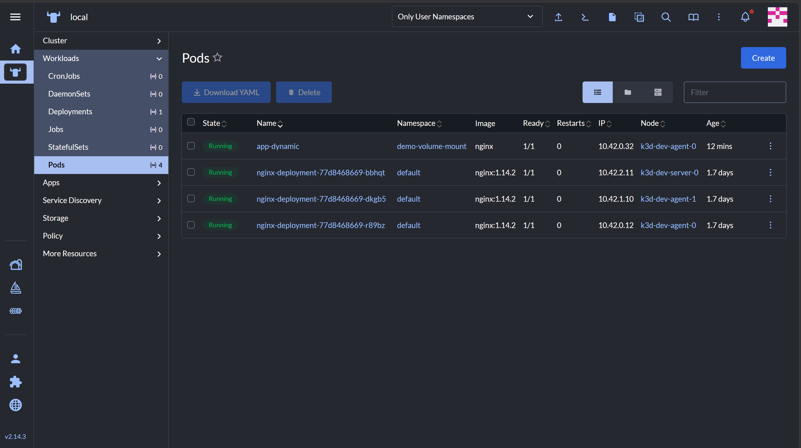
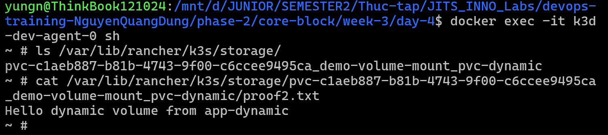

# Task Submission Template

> Mỗi task = 1 folder con + 1 PR/MR riêng. Copy template này vào `README.md` của task.

## Task: `Week 3: Kubernetes Deep Dive - Day 4: Storage: PV, PVC, StorageClass`

- **Intern**: `Nguyễn Quang Dũng`
- **Phase / Week / Day**: `Phase 2 / Week 3 / Day 4`
- **Branch**: `phase-2/week-3/day-4`
- **Submitted at**: `2026-07-08 22:24` (timezone +07)
- **Time spent**: `6h`

## 1. Mục tiêu

- Hiểu và phân biệt hai phương pháp cấp phát lưu trữ: Static Provisioning và Dynamic Provisioning.
- Thực hành tạo PersistentVolume (PV), PersistentVolumeClaim (PVC) và StorageClass trên Cluster k3d.
- Cài đặt Rancher để monitor Cluster một cách trực quan qua giao diện web.

## 2. Cách chạy

### 2.1 Static Provisioning — PV và PVC thủ công

```bash
kubectl apply -f storage.yaml
```

File [storage.yaml](./storage.yaml) khai báo một PersistentVolume sử dụng `hostPath`, một PersistentVolumeClaim bind với PV đó, và một Pod mount PVC vào `/data`.

```bash
kubectl get pv,pvc  # kiểm tra trạng thái PV và PVC
kubectl get pod nginx-with-pv  # kiểm tra Pod
```


```bash
# thử viết dữ liệu vào pv trong pod
kubectl exec -it nginx-with-pv -- sh
cd data
echo "hello /data from nginx-with-pv" > proof.txt

# thử delete pod rồi apply lại để kiểm tra dữ liệu còn không
kubectl delete -f storage.yaml
kubectl apply -f storage.yaml
kubectl exec -it nginx-with-pv -- sh
cat /data/proof.txt
```


```bash
# truy cập vào Node đang chứa hostPath /mnt/data để kiểm tra dữ liệu vật lý
docker exec -it k3d-dev-agent-0 sh
cat /mnt/data/proof.txt
```


```bash
kubectl delete -f storage.yaml # gỡ PV và PVC, và pod đang được bind với PVC
```

### 2.2 Dynamic Provisioning — StorageClass + PVC tự động

```bash
# tạo StorageClass với Provisioner rancher.io/local-path
kubectl apply -f storageClass.yaml

# tạo PVC — hệ thống sẽ tự động sinh PV tương ứng
kubectl apply -f persistentVolumeClaim.yaml

# deploy Pod sử dụng PVC vừa tạo
kubectl apply -f dynamicPod.yaml
```

```bash
kubectl get pvc pvc-dynamic  # kiểm tra STATUS phải là Bound
kubectl get pod app-dynamic -o wide  # xác nhận Node đang chạy Pod
```



PVC `pvc-dynamic` [khai báo trong `persistentVolumeClaim.yaml`](./persistentVolumeClaim.yaml) được mount vào đường dẫn `/var/data` bên trong Pod `app-dynamic` (khai báo trong [`dynamicPod.yaml`](./dynamicPod.yaml)). Dữ liệu vật lý được Provisioner `rancher.io/local-path` lưu tại 1 folder nào đó trong `/var/lib/rancher/k3s/storage/` trên Node `k3d-dev-agent-0` đang chạy Pod.

Để kiểm tra dữ liệu được ghi thực sự xuống Node:

```bash
# ghi dữ liệu vào /var/data bên trong Pod, đây là mountPath của PVC
kubectl exec -it app-dynamic -- sh -c 'echo "Hello dynamic volume" > /var/data/proof2.txt'

# truy cập vào Node
docker exec -it k3d-dev-agent-0 sh

ls /var/lib/rancher/k3s/storage/ # kiểm tra chính xác folder mà dữ liệu được lưu
cat /var/lib/rancher/k3s/storage/pvc-c1aeb887-b81b-4743-9f00-c6ccee9495ca_demo-volume-mount_pvc-dynamic/proof2.txt
```


### 2.3 Cài đặt Rancher

**Bước 1 — Cài cert-manager (Rancher phụ thuộc vào cert-manager để quản lý chứng chỉ TLS):**

```bash
kubectl apply -f https://github.com/cert-manager/cert-manager/releases/download/v1.14.4/cert-manager.yaml

# chờ tất cả Pod của cert-manager sẵn sàng
kubectl wait --namespace cert-manager \
  --for=condition=ready pod \
  --selector=app.kubernetes.io/instance=cert-manager \
  --timeout=120s
```

**Bước 2 — Thêm Helm repo và cài Rancher:**

```bash
helm repo add rancher-stable https://releases.rancher.com/server-charts/stable
helm repo update

kubectl create namespace cattle-system

helm install rancher rancher-stable/rancher \
  --namespace cattle-system \
  --set hostname=rancher.localhost \
  --set bootstrapPassword=admin \
  --set replicas=1
```

**Bước 3 — Chờ Rancher sẵn sàng:**

```bash
kubectl -n cattle-system rollout status deploy/rancher
```

**Bước 4 — Thêm hostname vào file hosts của Windows** (mở Notepad với quyền Administrator):

```
# thêm dòng này vào C:\Windows\System32\drivers\etc\hosts
127.0.0.1  rancher.localhost
```

**Bước 5 — Port-forward để truy cập từ trình duyệt:**

```bash
kubectl -n cattle-system port-forward svc/rancher 8443:443
```

Truy cập `https://localhost:8443`, đăng nhập bằng tài khoản `admin`.

## 3. Kết quả

- PV và PVC static bind thành công, Pod mount volume và ghi dữ liệu vào `/data`.
- Dynamic Provisioning hoạt động: StorageClass tự động tạo PV khi PVC được tạo ra, dữ liệu xuất hiện tại `/var/lib/rancher/k3s/storage/` trên Node.
- Rancher chạy thành công, giao diện web hiển thị toàn bộ tài nguyên Cluster tại `https://localhost:8443`.

## 4. Khó khăn & cách giải quyết

| Vấn đề | Nguyên nhân | Cách giải quyết |
|---|---|---|
| Pod ở trạng thái `Pending` kéo dài | `nodeSelector` trỏ đến node không tồn tại trong Cluster do gõ tên sai | Sửa lại thành tên Node đúng trong Cluster (`k3d-dev-agent-0`) |
| StorageClass dynamic không hoạt động | `provisioner` khai báo sai tên, không khớp với Provisioner đang chạy | Sửa thành `rancher.io/local-path` là Provisioner mặc định của k3d |
| Rancher trả về lỗi 403 | Truy cập qua HTTP trong khi Rancher yêu cầu HTTPS | Dùng `port-forward` ra port 8443 và truy cập qua `https://` |

## 5. Reference

- Kubernetes Volumes: https://kubernetes.io/docs/concepts/storage/volumes/
- Persistent Volumes: https://kubernetes.io/docs/concepts/storage/persistent-volumes/
- Storage Classes: https://kubernetes.io/docs/concepts/storage/storage-classes/
- Rancher Documentation: https://ranchermanager.docs.rancher.com/
- K3d Official Documentation: https://k3d.io/
- Bài giảng và tài liệu nội bộ khóa DevSecOps Training.

## 6. Self-check

- [x] Code chạy được trên máy sạch.
- [x] README có hướng dẫn run lại.
- [x] Không hard-code secret.
- [x] Commit message theo Conventional Commits.
- [x] Đã review lại code 1 lượt.