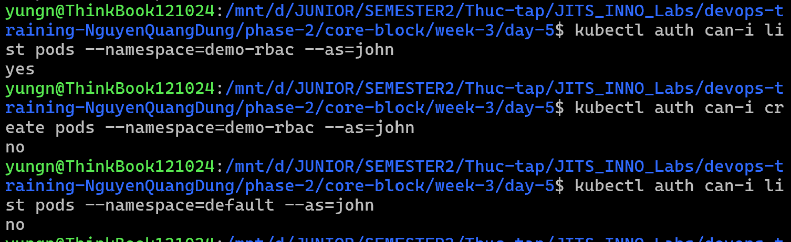
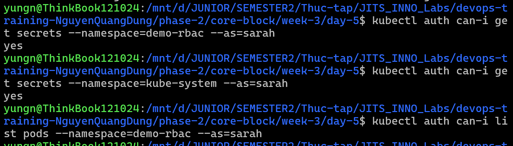
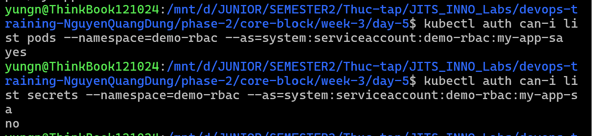
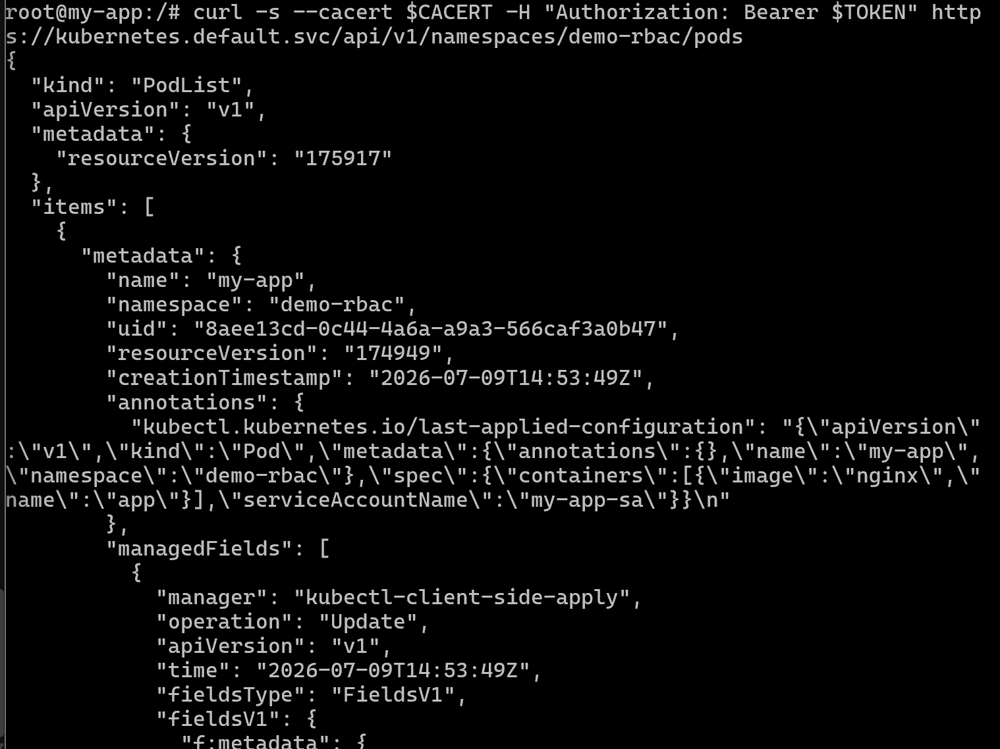
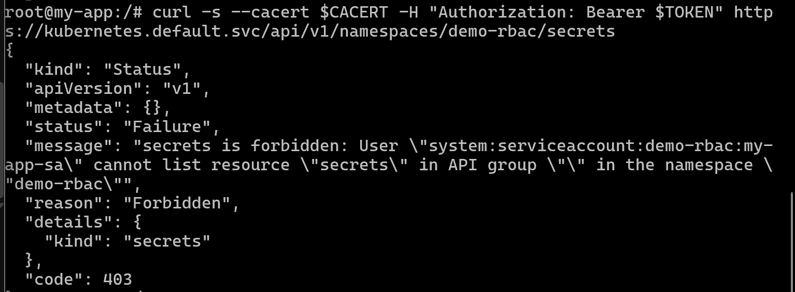

# Task Submission Template

> Mỗi task = 1 folder con + 1 PR/MR riêng. Copy template này vào `README.md` của task.

## Task: `Week 3: Kubernetes Deep Dive - Day 5: RBAC, ServiceAccount, NetworkPolicy`

- **Intern**: `Nguyễn Quang Dũng`
- **Phase / Week / Day**: `Phase 2 / Week 3 / Day 5`
- **Branch**: `phase-2/week-3/day-5`
- **Submitted at**: `2026-07-09 23:57` (timezone +07)
- **Time spent**: `6h`

## 1. Mục tiêu

- Hiểu và cấu hình được quyền truy cập thông qua Role, RoleBinding, ClusterRole và ClusterRoleBinding.
- Thực hành: Lab phân quyền user ro/rw + deny-all.

## 2. Cách chạy

### Thực hành RBAC: gắn role và cluster role cho 2 user rồi kiểm tra quyền
**Tạo Namespace và áp dụng cấu hình RBAC**

Các file cấu hình được sử dụng bao gồm:
- [role_pod-reader.yaml](role_pod-reader.yaml): Định nghĩa Role `pod-reader` trong Namespace `demo-rbac`, cấp quyền `get`, `list`, và `watch` đối với Pod.
- [roleBinding_read-pods-binding.yaml](roleBinding_read-pods-binding.yaml): Định nghĩa RoleBinding `read-pods-binding` để gán Role `pod-reader` cho User `john` trong Namespace `demo-rbac`.
- [clusterRole_secret-reader.yaml](clusterRole_secret-reader.yaml): Định nghĩa ClusterRole `secret-reader` ở phạm vi toàn Cluster, cấp quyền `get` và `list` đối với Secret.
- [clusterRoleBinding_secret-reader-binding.yaml](clusterRoleBinding_secret-reader-binding.yaml): Định nghĩa ClusterRoleBinding `secret-reader-binding` để gán ClusterRole `secret-reader` cho User `sarah`.

Thực thi các lệnh sau để tạo Namespace và apply cấu hình:

```bash
kubectl create namespace demo-rbac
kubectl apply -f role_pod-reader.yaml
kubectl apply -f roleBinding_read-pods-binding.yaml
kubectl apply -f clusterRole_secret-reader.yaml
kubectl apply -f clusterRoleBinding_secret-reader-binding.yaml
```

**Kiểm tra quyền của User john**

```bash
kubectl auth can-i list pods --namespace=demo-rbac --as=john
kubectl auth can-i create pods --namespace=demo-rbac --as=john
kubectl auth can-i list pods --namespace=default --as=john
```



**Kiểm tra quyền của User sarah**

```bash
kubectl auth can-i get secrets --namespace=demo-rbac --as=sarah
kubectl auth can-i get secrets --namespace=kube-system --as=sarah
kubectl auth can-i list pods --namespace=demo-rbac --as=sarah
```



### Thực hành ServiceAccount: cấp quyền cho Pod và kiểm tra bằng Token

**Khởi tạo ServiceAccount và cấp quyền**

Các file cấu hình được sử dụng bao gồm:
- [serviceAccount_my-app-sa.yaml](serviceAccount_my-app-sa.yaml): Khởi tạo ServiceAccount `my-app-sa` trong Namespace `demo-rbac`.
- [roleBinding_my-app-binding.yaml](roleBinding_my-app-binding.yaml): Liên kết ServiceAccount `my-app-sa` với Role `pod-reader`, giúp ServiceAccount có quyền đọc Pod.
- [pod_my-app.yaml](pod_my-app.yaml): Tạo Pod `my-app` chạy Nginx và tự động inject Token của `my-app-sa` thông qua thuộc tính `serviceAccountName`.

Thực thi các lệnh sau để khởi tạo:

```bash
kubectl apply -f serviceAccount_my-app-sa.yaml
kubectl apply -f roleBinding_my-app-binding.yaml
kubectl apply -f pod_my-app.yaml
```

**Kiểm tra quyền từ bên ngoài (Impersonation)**

```bash
kubectl auth can-i list pods --namespace=demo-rbac --as=system:serviceaccount:demo-rbac:my-app-sa
kubectl auth can-i list secrets --namespace=demo-rbac --as=system:serviceaccount:demo-rbac:my-app-sa
```



**Kiểm tra từ bên trong Pod (Gọi API trực tiếp)**

Truy cập vào shell của Pod và gọi Kubernetes API:

```bash
kubectl exec -it my-app --namespace=demo-rbac -- /bin/bash

TOKEN=$(cat /var/run/secrets/kubernetes.io/serviceaccount/token)
CACERT=/var/run/secrets/kubernetes.io/serviceaccount/ca.crt

# lấy danh sách Pod trong Namespace demo-rbac
curl -s --cacert $CACERT -H "Authorization: Bearer $TOKEN" https://kubernetes.default.svc/api/v1/namespaces/demo-rbac/pods
```


Kết quả: thành công
```bash
# lấy danh sách Secret trong Namespace demo-rbac
curl -s --cacert $CACERT -H "Authorization: Bearer $TOKEN" https://kubernetes.default.svc/api/v1/namespaces/demo-rbac/secrets
```


Kết quả: thất bại

## 3. Kết quả

- Đã thiết lập và kiểm tra thành công quyền của các User.
- Phân quyền giới hạn Namespace hoạt động chính xác với Role và RoleBinding.
- Phân quyền toàn Cluster hoạt động chính xác với ClusterRole và ClusterRoleBinding.
- Đã cấu hình và kiểm tra thành công cơ chế phân quyền cho Pod thông qua ServiceAccount và tự động inject Token.

## 4. Khó khăn & cách giải quyết

Không có.

## 5. Reference

- [TechWorld with Sahana - Kubernetes Role Based Access Control (RBAC) | RBAC – Roles, Bindings & Service Accounts](https://www.youtube.com/watch?v=AnTmz4m_fpE)

## 6. Self-check

- [x] Code chạy được trên máy sạch.
- [x] README có hướng dẫn run lại.
- [x] Không hard-code secret.
- [x] Commit message theo Conventional Commits.
- [x] Đã review lại code 1 lượt.