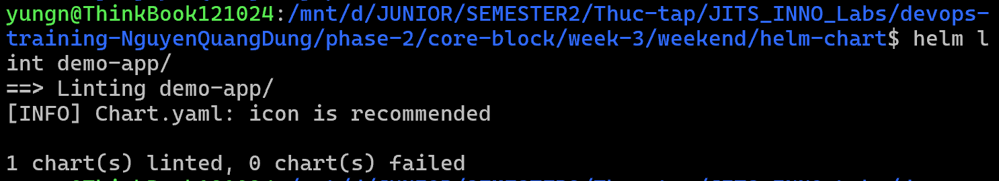
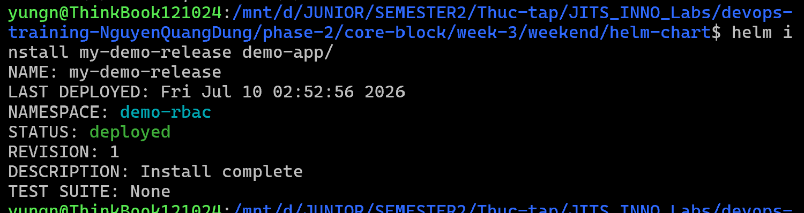
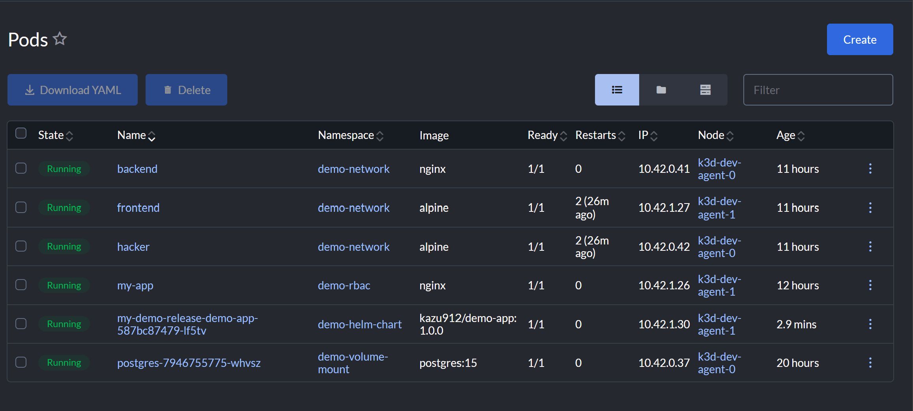
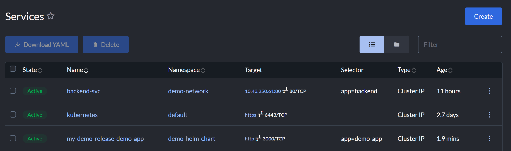
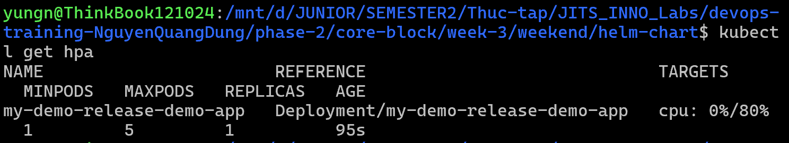
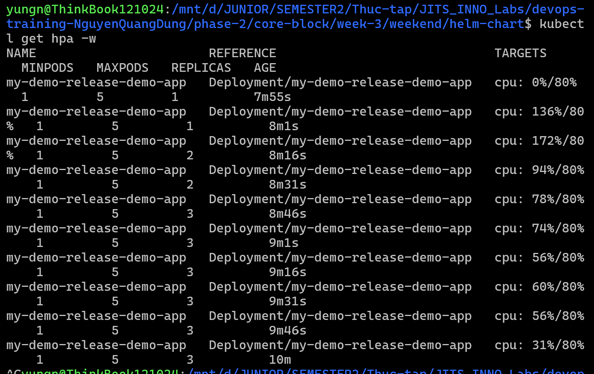

# Task Submission Template

> Mỗi task = 1 folder con + 1 PR/MR riêng. Copy template này vào `README.md` của task.

## Task: `Week 3: Kubernetes Deep Dive - Weekend: Helm Chart, HPA, VPA`

- **Intern**: `Nguyễn Quang Dũng`
- **Phase / Week / Day**: `Phase 2 / Week 3 / Weekend`
- **Branch**: `phase-2/week-3/weekend`
- **Submitted at**: `2026-07-10 23:32` (timezone +07)
- **Time spent**: `6h`

## 1. Mục tiêu


## 2. Cách chạy
### Helm Chart cho [`demo-app`](https://hub.docker.com/repository/docker/kazu912/demo-app/general)

**Cấu trúc folder và ý nghĩa các file YAML:**

- **[Chart.yaml](./helm-chart/demo-app/Chart.yaml)**: Khai báo thông tin metadata của chart như tên, phiên bản và loại ứng dụng.
- **[values.yaml](./helm-chart/demo-app/values.yaml)**: Khai báo các biến cấu hình mặc định (ví dụ: image, replicaCount, tài nguyên phần cứng) sẽ được inject vào các file template.Có thể override các giá trị này trước khi cài đặt.
- **[templates/deployment.yaml](./helm-chart/demo-app/templates/deployment.yaml)**: Khai báo file mẫu cấu hình Deployment. Các biến cấu hình từ `values.yaml` (như `{{ .Values.replicaCount }}` hay `{{ .Values.image.repository }}`) sẽ được hệ thống tự động thay thế vào file này để khởi tạo Pod.
- **[templates/service.yaml](./helm-chart/demo-app/templates/service.yaml)**: Khai báo file mẫu cấu hình Service để định tuyến mạng đến Pod. File này cũng nhận các tham số tự động như `{{ .Values.service.port }}` từ cấu hình gốc.

**Bước 1: Cài đặt Helm**
```bash
curl -fsSL -o get_helm.sh https://raw.githubusercontent.com/helm/helm/main/scripts/get-helm-3
chmod 700 get_helm.sh
./get_helm.sh
```

**Bước 2: Di chuyển vào folder chứa chart**
```bash
cd helm-chart
```

**Bước 3: Kiểm tra cú pháp của chart**
```bash
helm lint demo-app/
```


**Bước 4: Deploy ứng dụng lên Kubernetes Cluster**
```bash
helm install my-demo-release demo-app/
```

**Bước 5: Kiểm tra trạng thái**
```bash
kubectl get pods
kubectl get service
```



### Cấu hình Horizontal Pod Autoscaler (HPA) cho demo-app

**Các định nghĩa HPA:**
- Khối `autoscaling` trong file **[values.yaml](./helm-chart/demo-app/values.yaml)**: Khai báo các biến thiết lập ngưỡng cho HPA (như bật tính năng, số lượng Pod tối thiểu là 1, tối đa là 5, và mức phần trăm CPU kỳ vọng là 80%).
- File **[templates/hpa.yaml](./helm-chart/demo-app/templates/hpa.yaml)**: File cấu hình mẫu tạo ra tài nguyên HorizontalPodAutoscaler. Nó nhận các biến từ `values.yaml` và tự động gắn kết (scaleTargetRef) với Deployment của `demo-app`. Khi mức độ sử dụng CPU của Pod vượt ngưỡng 80%, hệ thống sẽ tự động sinh thêm Pod mới.

**Bước 1: Bật tính năng HPA**
Kích hoạt HPA trong `values.yaml` (đặt `enabled: true` trong khối hpa) và cập nhật cấu hình lên Cluster:
```bash
helm upgrade my-demo-release demo-app/
```

**Bước 2: Kiểm tra trạng thái HPA**
```bash
kubectl get hpa
```


**Bước 3: Tạo tải ảo để kiểm tra tự động mở rộng**
```bash
kubectl run -i --tty load-generator --rm --image=busybox:1.28 --restart=Never -- /bin/sh -c "while sleep 0.01; do wget -q -O- http://my-demo-release-demo-app; done"
```
Mở một Terminal khác để theo dõi số lượng Pod tự động tăng lên khi CPU quá tải:
```bash
kubectl get hpa -w
```


## 3. Kết quả

## 4. Khó khăn & cách giải quyết

Không có.

## 5. Reference

- [TechWorld with Sahana - Kubernetes HPA & VPA Explained](https://www.youtube.com/watch?v=negy0ON6nAg)
- [TechWorld with Nana - What is Helm in Kubernetes? Helm and Helm Charts explained](https://www.youtube.com/watch?v=-ykwb1d0DXU)

## 6. Self-check

- [x] Code chạy được trên máy sạch.
- [x] README có hướng dẫn run lại.
- [x] Không hard-code secret.
- [x] Commit message theo Conventional Commits.
- [x] Đã review lại code 1 lượt.