# Task Submission Template

> Mỗi task = 1 folder con + 1 PR/MR riêng. Copy template này vào `README.md` của task.

## Task: `Week 4: IaC nâng cao + Monitoring + Security basics: Day 1&2 - Terraform`

- **Intern**: `Nguyễn Quang Dũng`
- **Phase / Week / Day**: `Phase 2 / Week 4 / Day 1 & 2`
- **Branch**: `phase-2/week-4/day-1`
- **Submitted at**: `2026-07-11 08:40` (timezone +07)
- **Time spent**: `6h`

## 1. Mục tiêu


## 2. Cách chạy
### Terraform modules
#### Tạo 1 module có tên `k8s-app`

Module `k8s-app` được cấu trúc để đóng gói và tái sử dụng các tài nguyên Kubernetes chính, bao gồm các file sau:
- [variables.tf](modules/k8s-app/variables.tf): Khai báo các Input Variables đầu vào của Module như tên ứng dụng (`app_name`), địa chỉ image (`image`), số lượng bản sao (`replicas`), môi trường triển khai (`env`) và tên miền cấu hình (`ingress_host`).
- [main.tf](modules/k8s-app/main.tf): Cấu hình định nghĩa chi tiết các tài nguyên Kubernetes bao gồm Deployment (quản lý Pod), Service (dịch vụ phân phối traffic nội bộ) và Ingress (định tuyến traffic từ tên miền bên ngoài vào).
- [outputs.tf](modules/k8s-app/outputs.tf): Định nghĩa các giá trị trả về (Output Values) của Module bao gồm tên Service (`service_name`), đường dẫn DNS nội bộ Cluster (`service_endpoint`) và tên miền Ingress (`ingress_hostname`).

#### Triển khai module đó trên môi trường dev
Các file cấu hình:
- [main.tf](envs/dev/main.tf): Cấu hình gọi Module `k8s-app` với nguồn tương đối và truyền các giá trị biến cấu hình cụ thể cho môi trường Dev (như `app_name = "demo-app-dev"`, `replicas = 1`, `ingress_host = "dev.demo.local"`).
- [outputs.tf](envs/dev/outputs.tf): Cấu hình hiển thị các giá trị Output Values nhận về từ Module `k8s-app` sau khi triển khai môi trường Dev.

Các bước:
```bash
cd envs/dev
terraform init
terraform plan
terraform apply -auto-approve=true
```
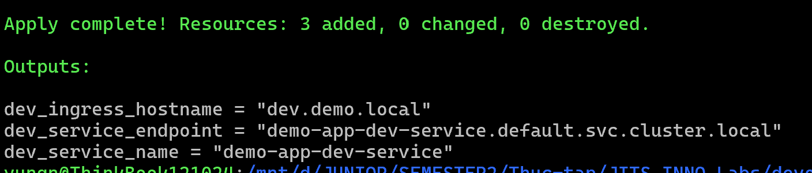
```bash
kubectl get pods,svc,ingress -n default | grep "demo-app-dev"
```
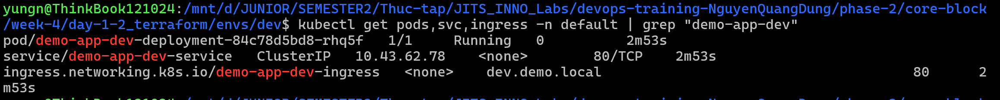
```bash
kubectl port-forward service/traefik 8080:80 -n kube-system
curl -H "Host: dev.demo.local" http://localhost:8080
```
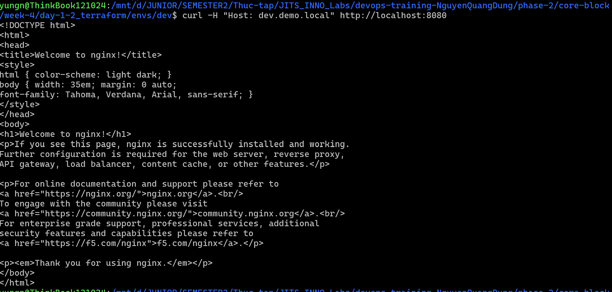
```bash
terraform destroy -auto-approve=true
```


#### Triển khai module đó trên môi trường stg
Các file cấu hình:
- [main.tf](envs/stg/main.tf): Cấu hình gọi Module `k8s-app` tương tự như Dev nhưng truyền các giá trị biến cấu hình đặc trưng cho môi trường Staging (như `app_name = "demo-app-stg"`, `replicas = 3`, `ingress_host = "stg.demo.local"`).
- [outputs.tf](envs/stg/outputs.tf): Cấu hình hiển thị các giá trị Output Values nhận về từ Module `k8s-app` sau khi triển khai môi trường Staging.

Các bước:
```bash
cd envs/stg
terraform init
terraform plan
terraform apply -auto-approve=true
```
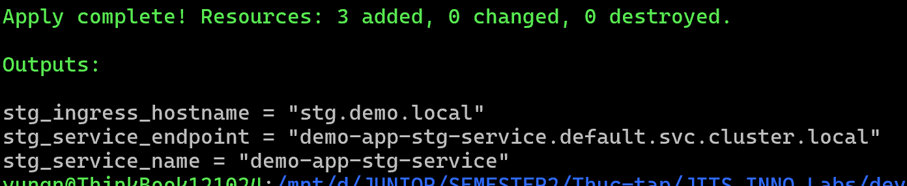
```bash
kubectl get pods,svc,ingress -n default | grep "demo-app-stg"
```
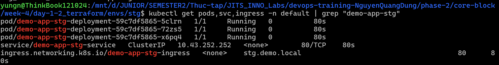
```bash
kubectl port-forward service/traefik 8080:80 -n kube-system
curl -H "Host: stg.demo.local" http://localhost:8080
```
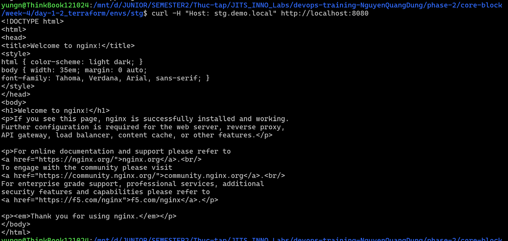
```bash
terraform destroy -auto-approve=true
```


### Remote Backend (S3 + DynamoDB)
#### Cấu hình lưu trữ State từ xa và kiểm tra cơ chế Lock State

1. Cấu hình block `backend "s3"` trong file [envs/dev/main.tf](envs/dev/main.tf):
   ```hcl
   terraform {
     backend "s3" {
       bucket       = "xxxxx-terraform-states" # tên giả
       key          = "dev/terraform.tfstate"
       region       = "ap-southeast-2"
       use_lockfile = true
       encrypt      = true
     }
   }
   ```
Các bước:
```bash
terraform init -migrate-state
```
Để kiểm tra cơ chế Lock, tại Terminal 1 ta chạy:
```bash
terraform apply
```
Tại Terminal 2 ta chạy lệnh plan sẽ báo lỗi do file State bị khóa:
```bash
terraform plan
```
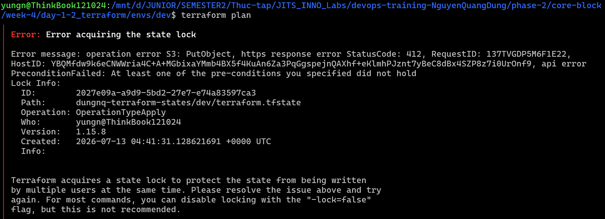


### Module network, compute reuse cho 2 env
#### Tạo các module có tên `network` và `compute`
- **Module network**:
  - [variables.tf](modules/network/variables.tf): Khai báo các Input Variables đầu vào như dải CIDR cho VPC (`vpc_cidr`), Subnet (`subnet_cidr`), và nhãn môi trường (`env`).
  - [main.tf](modules/network/main.tf): Cấu hình định nghĩa tài nguyên mạng bao gồm `aws_vpc`, `aws_subnet`, `aws_internet_gateway` (IGW), `aws_route_table` (RT) và liên kết bảng định tuyến (`aws_route_table_association`) để thông suốt kết nối Internet.
  - [outputs.tf](modules/network/outputs.tf): Định nghĩa các giá trị trả về bao gồm `vpc_id` và `subnet_id`.
- **Module compute**:
  - [variables.tf](modules/compute/variables.tf): Khai báo các Input Variables đầu vào như ID của VPC (`vpc_id`), Subnet (`subnet_id`), cấu hình dòng máy EC2 (`instance_type`), hệ điều hành (`ami_id`), và nhãn môi trường (`env`).
  - [main.tf](modules/compute/main.tf): Cấu hình định nghĩa tài nguyên tường lửa `aws_security_group` và máy chủ `aws_instance` (sử dụng thuộc tính `user_data` để tự động cài đặt và chạy dịch vụ Nginx khi khởi tạo).
  - [outputs.tf](modules/compute/outputs.tf): Định nghĩa các giá trị trả về bao gồm ID máy chủ (`instance_id`) và IP công cộng (`instance_public_ip`).

#### Triển khai trên môi trường dev
Các file cấu hình:
- [main.tf](envs_2/dev/main.tf): Gọi hai Module `network` và `compute`, truyền thông số dải IP mạng dev, cấu hình máy chủ nhỏ (`t3.micro`) và liên kết output của module mạng vào module compute.
- [outputs.tf](envs_2/dev/outputs.tf): Hiển thị thông số VPC ID và địa chỉ IP công cộng của máy chủ Dev sau khi khởi tạo thành công.

Các bước:
```bash
cd envs_2/dev
terraform init
terraform plan
terraform apply -auto-approve=true
curl -I http://18.138.254.36
```
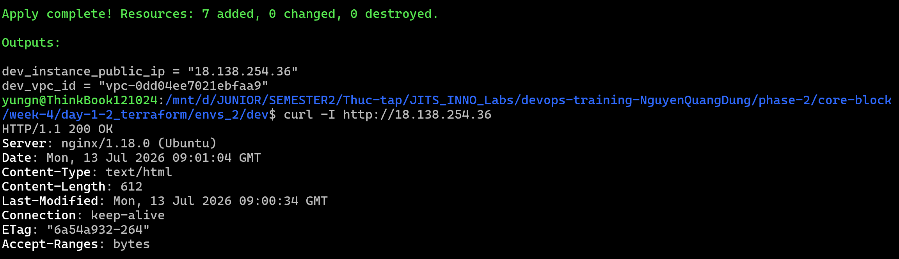
```bash
terraform destroy -auto-approve=true
```


#### Triển khai trên môi trường stg
Các file cấu hình:
- [main.tf](envs_2/stg/main.tf): Gọi hai Module `network` và `compute`, truyền thông số dải IP mạng staging, cấu hình máy chủ mạnh hơn (`t3.medium`) và liên kết output tương ứng.
- [outputs.tf](envs_2/stg/outputs.tf): Hiển thị thông số VPC ID và địa chỉ IP công cộng của máy chủ Staging sau khi khởi tạo thành công.

Các bước:
```bash
cd envs_2/stg
terraform init
terraform plan
terraform apply -auto-approve=true
curl -I http://13.212.203.7
```
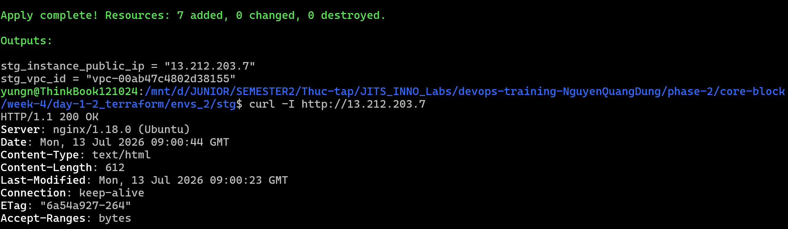
```bash
terraform destroy -auto-approve=true
```


### Terraform Workspaces
#### Sử dụng Workspace quản lý môi trường Dev và Staging
- [main.tf](workspaces_demo/main.tf): Cấu hình định nghĩa provider, sử dụng biến môi trường động `terraform.workspace` kết hợp với đối tượng `locals` để tự động điều chỉnh cấu hình theo môi trường được chọn.
- [outputs.tf](workspaces_demo/outputs.tf): Cấu hình hiển thị thông tin workspace hiện tại và các giá trị đầu ra (như tên Service, tên miền Ingress) tương ứng với môi trường đang chạy.

Các bước:
```bash
cd workspaces_demo
terraform init
terraform workspace show # chỉ có workspace default
terraform workspace new dev
terraform apply -auto-approve=true
kubectl get pods,svc,ingress | grep "workspace-app-dev"
```
Chạy trên terminal 2
```bash
kubectl port-forward service/traefik 8080:80 -n kube-system
```

Quay về terminal 1
```bash
curl -H "Host: dev.demo.local" http://localhost:8080
```
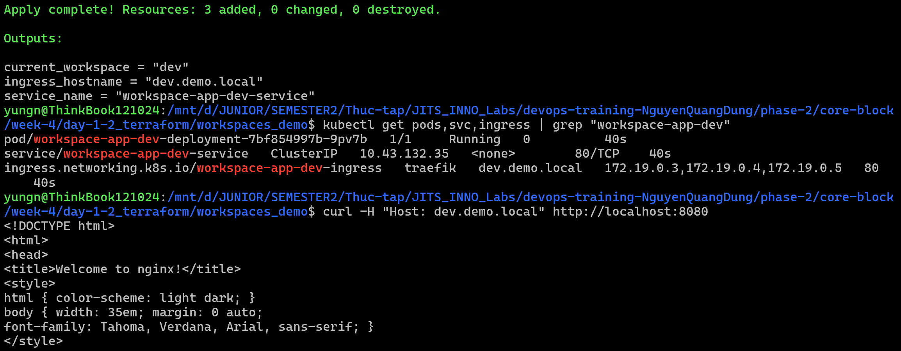
```bash
terraform workspace new stg
terraform apply -auto-approve=true
curl -H "Host: stg.demo.local" -I http://localhost:8080
```
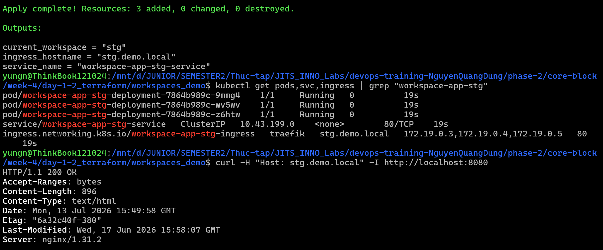
```bash
# xóa resources
terraform destroy -auto-approve=true
terraform workspace select dev
terraform destroy -auto-approve=true
```


### Terraform Dependency Graph

#### Implicit dependency
- [main.tf](implicit-dependency_demo/main.tf): Chuỗi resource `vpc` → `subnet` → `instance`. `subnet` tham chiếu `null_resource.vpc.id` và `instance` tham chiếu `null_resource.subnet.id` nên Terraform tự suy ra cạnh phụ thuộc (không cần `depends_on`).

Các bước:
```bash
cd implicit-dependency_demo
terraform init
terraform graph
```
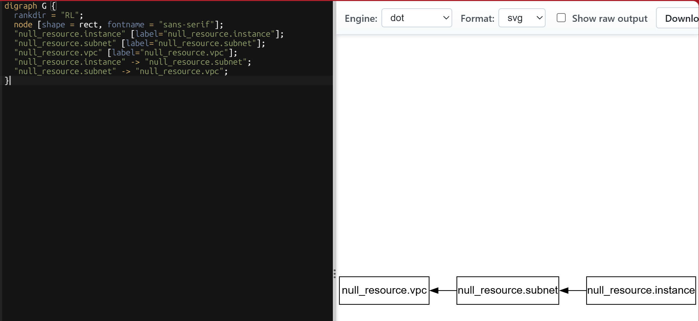
```bash
terraform apply -auto-approve=true
```
Thứ tự create kết quả: `vpc` → `subnet` → `instance`.
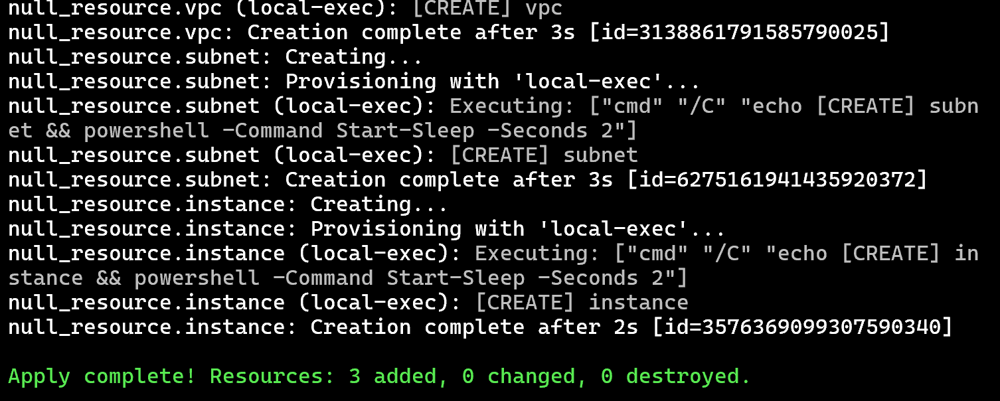
```bash
terraform destroy -auto-approve=true
```
Thứ tự destroy kết quả (ngược create): `instance` → `subnet` → `vpc`.
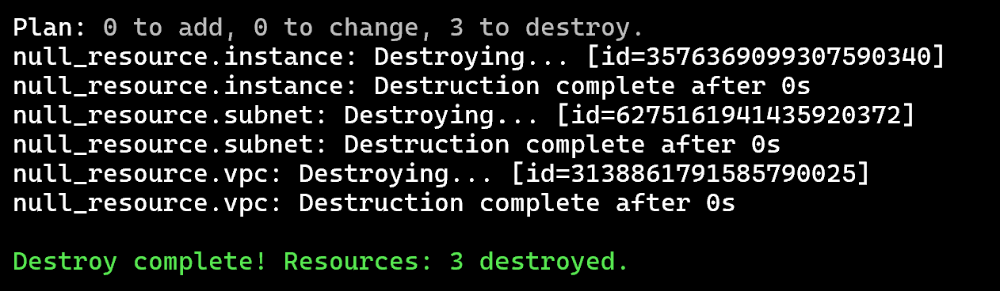


#### Explicit dependency
- [main.tf](explicit-dependency_demo/main.tf): Giữ chuỗi implicit `vpc` → `subnet` → `instance`, thêm `sg` độc lập (không tham chiếu resource khác) và khai báo `depends_on = [null_resource.sg]` trên `instance` để instance chỉ chạy sau khi cả `subnet` và `sg` xong.

Các bước:
```bash
cd explicit-dependency_demo
terraform init
terraform graph
```
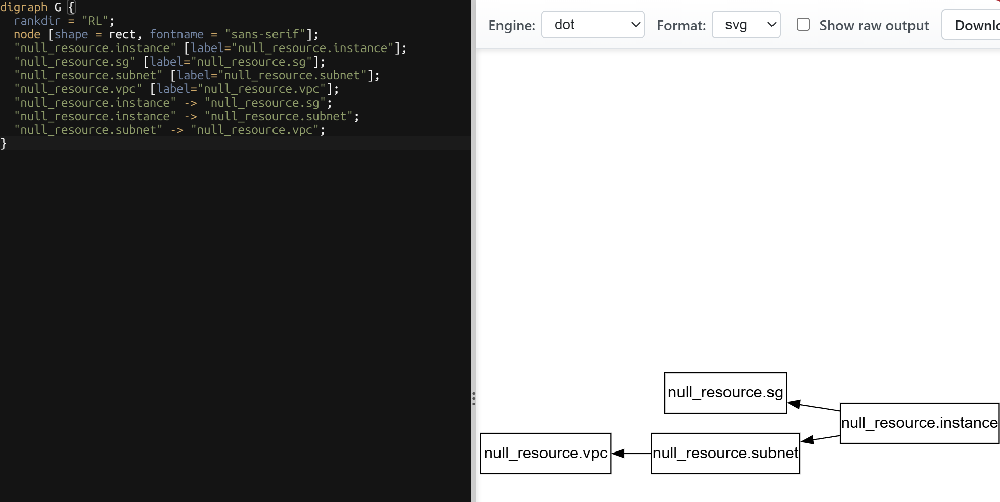
```bash
terraform apply -auto-approve=true
```
kết quả: `vpc` và `sg` có thể tạo gần như song song; `subnet` sau `vpc`; `instance` sau cả `subnet` và `sg`.
```bash
terraform destroy -auto-approve=true
```


#### Parallelism
- [main.tf](parralelism_demo/main.tf): Ba resource `a`, `b`, `c` độc lập (không tham chiếu lẫn nhau) để so sánh apply với parallelism mặc định và `-parallelism=1`.

Các bước:
```bash
cd parralelism_demo
terraform init
terraform apply -auto-approve=true
```
Với parallelism mặc định (tối đa 10), A/B/C thường start gần như cùng lúc (tổng thời gian ~5s).
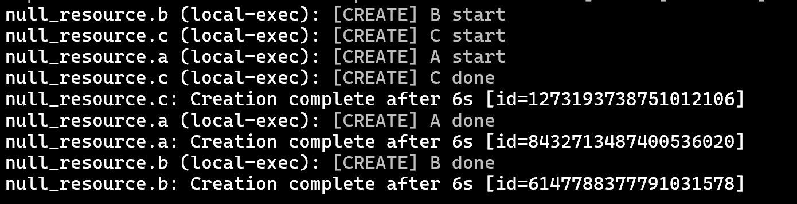
```bash
terraform destroy -auto-approve=true
terraform apply -auto-approve=true -parallelism=1
```
Với `-parallelism=1`, A/B/C chạy tuần tự (tổng thời gian ~15s).
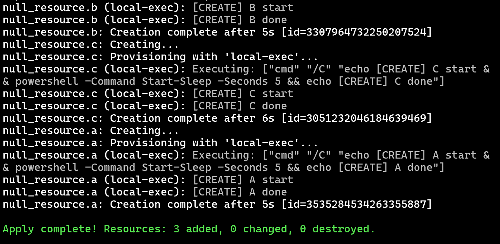
```bash
terraform destroy -auto-approve=true
```


### terraform_remote_state
#### App đọc giá trị Output từ file State của network
- [network/main.tf](remote-state_demo/network/main.tf): Cấu hình khởi tạo VPC và Subnet, lưu file State trên S3 ở key `network/terraform.tfstate`.
- [network/outputs.tf](remote-state_demo/network/outputs.tf): Khai báo xuất các giá trị đầu ra gồm VPC ID và Subnet ID để dự án khác có thể tham chiếu.
- [app/main.tf](remote-state_demo/app/main.tf): Cấu hình triển khai máy chủ EC2, sử dụng Data Source `terraform_remote_state` để đọc thông tin Subnet ID trực tiếp từ S3 của dự án Network.
- [app/outputs.tf](remote-state_demo/app/outputs.tf): Hiển thị ID của máy chủ EC2 sau khi khởi tạo thành công.

Các bước:
```bash
cd remote-state_demo/network
terraform init
terraform apply -auto-approve=true
```
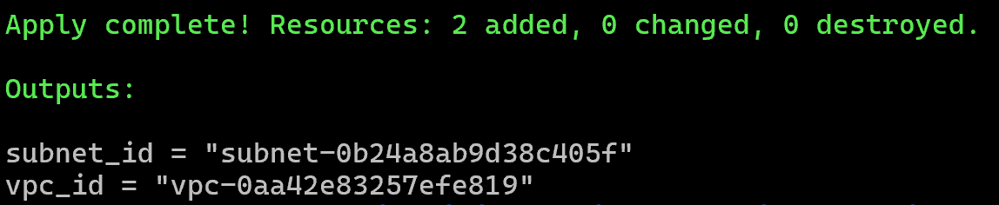
```bash
cd ../app
terraform init
terraform apply -auto-approve=true
```
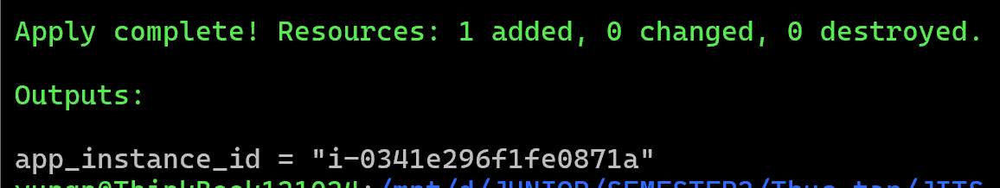
- Hai file State được lưu trữ riêng biệt trên S3 tương ứng với hai key `network/terraform.tfstate` và `app/terraform.tfstate`:
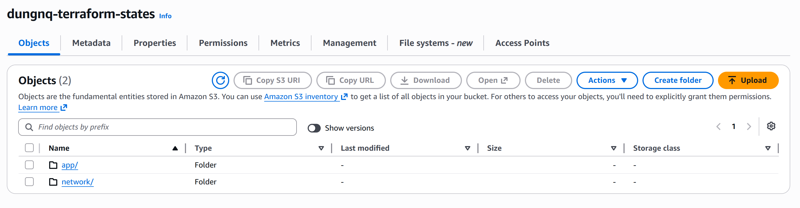
- Kiểm tra chi tiết máy chủ EC2 đã được tạo thành công trong đúng VPC và Subnet của dự án Network:
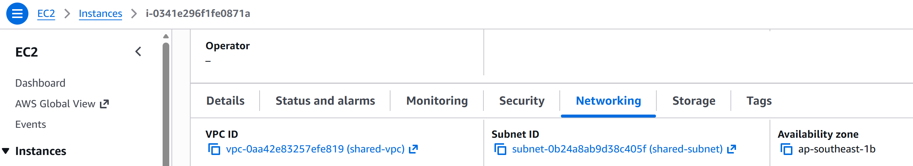
```bash
terraform destroy -auto-approve=true
cd ../network
terraform destroy -auto-approve=true
```


## 3. Kết quả

## 4. Khó khăn & cách giải quyết
- Cảnh báo tham số `dynamodb_table` deprecated khi chạy lệnh khởi tạo trên phiên bản Terraform 1.15.8: Hệ thống khuyến nghị sử dụng tham số `use_lockfile` để thực hiện khóa trạng thái trực tiếp trên S3. Hướng giải quyết là xóa tham số `dynamodb_table` và thêm cấu hình `use_lockfile = true` để tuân thủ theo chuẩn tối ưu mới.
- Gặp lỗi 404 khi dùng `curl` kiểm tra kết nối qua Ingress: Do cấu hình Module `k8s-app` chỉ định class là `nginx`, trong khi Cluster k3d sử dụng Traefik làm Ingress Controller mặc định. Hướng giải quyết là lược bỏ hoàn toàn annotation `ingress.class = "nginx"` để Traefik tự động nhận diện và xử lý tài nguyên Ingress.


## 5. Reference
- [SpaceLift - Terraform Modules Tutorial: Why Use Them, Best Practices, and Scaling](https://www.youtube.com/watch?v=Te4ijEaUGyU)


## 6. Self-check

- [x] Code chạy được trên máy sạch.
- [x] README có hướng dẫn run lại.
- [x] Không hard-code secret.
- [x] Commit message theo Conventional Commits.
- [x] Đã review lại code 1 lượt.