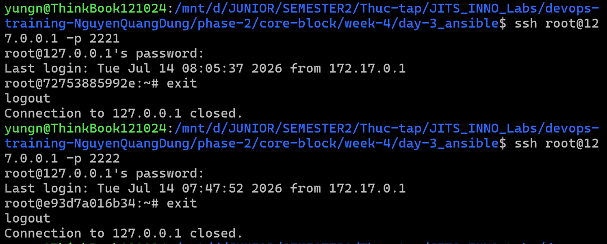
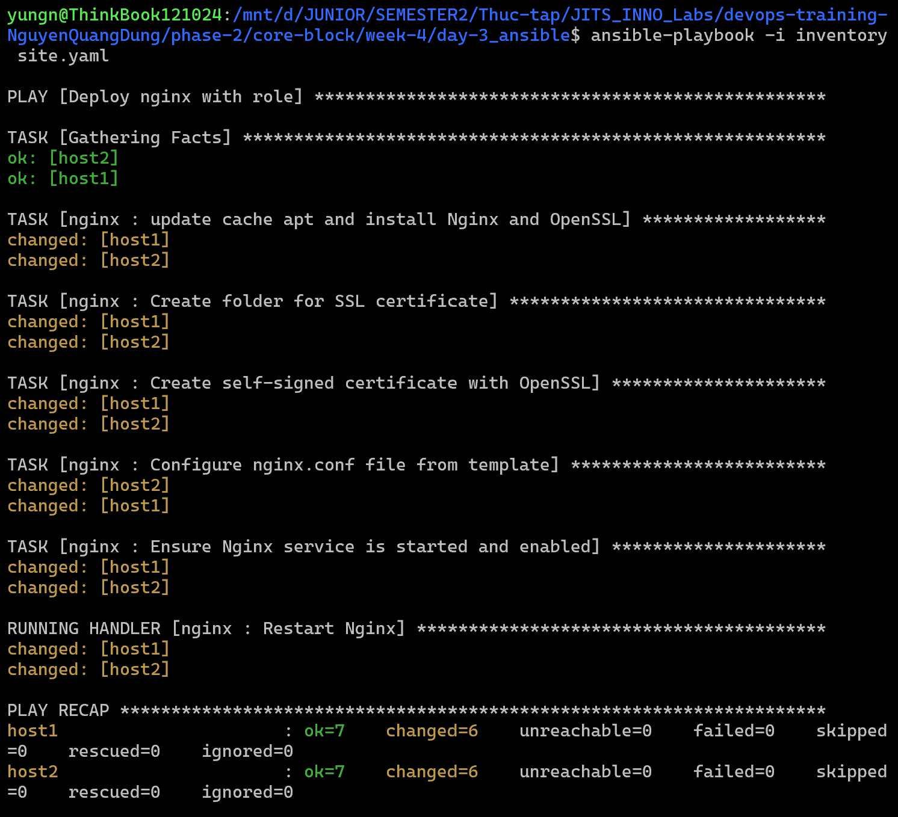
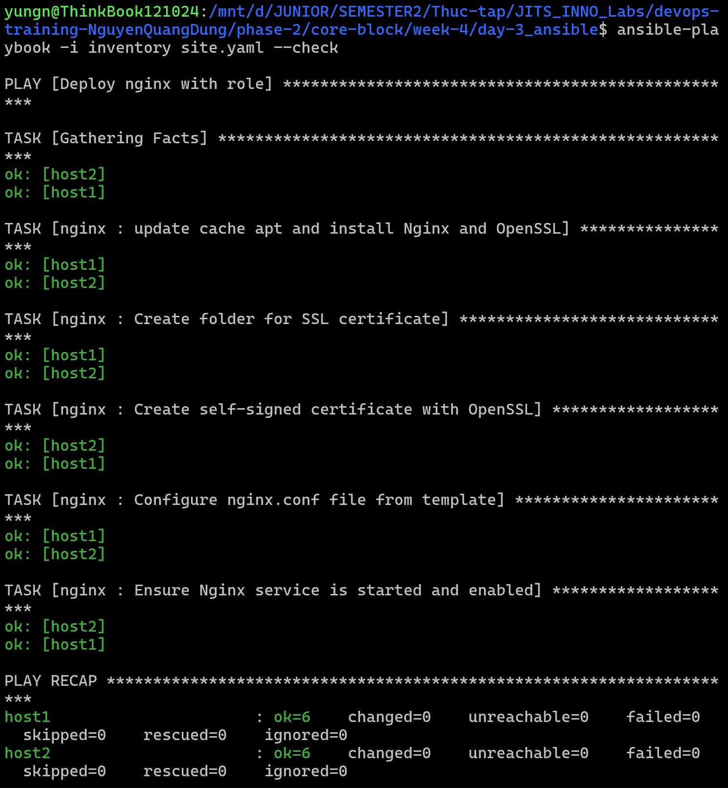

# Task Submission Template

> Mỗi task = 1 folder con + 1 PR/MR riêng. Copy template này vào `README.md` của task.

## Task: `Week 4: IaC nâng cao + Monitoring + Security basics: Day 3 - Ansible`

- **Intern**: `Nguyễn Quang Dũng`
- **Phase / Week / Day**: `Phase 2 / Week 4 / Day 3`
- **Branch**: `phase-2/week-4/day-3`
- **Submitted at**: `2026-07-15 08:40` (timezone +07)
- **Time spent**: `6h`

## 1. Mục tiêu
- Tự động hóa quá trình cài đặt dịch vụ Nginx và sinh self-signed SSL certificate trên các target host bằng cấu trúc Ansible Role.
- Đảm bảo kịch bản chạy an toàn, đáng tin cậy và đạt tính chất idempotent.

## 2. Cách chạy
### Chuẩn bị môi trường (Docker SSH)
Cài đặt sshpass trên WSL để cho phép Ansible kết nối bằng mật khẩu:
```bash
sudo apt update && sudo apt install -y sshpass
```

Khởi chạy 2 container giả lập các target host chạy Ubuntu tích hợp sẵn Python và SSH Server:
```bash
docker run -d --name host1 -p 2221:22 rastasheep/ubuntu-sshd
docker run -d --name host2 -p 2222:22 rastasheep/ubuntu-sshd
```

Kiểm tra bằng cách ssh vào 2 vm (pass: root):
```bash
ssh root@127.0.0.1 -p 2221
ssh root@127.0.0.1 -p 2222
```


### Cấu hình các file
- [inventory](inventory): Khai báo thông tin kết nối tới 2 host (sử dụng tài khoản root, mật khẩu root, cổng 2221 và 2222).
- [ansible.cfg](ansible.cfg): Cấu hình bỏ qua việc kiểm tra host key.
- [site.yaml](site.yaml): Playbook chính gọi Role nginx.
- [roles/nginx/defaults/main.yaml](roles/nginx/defaults/main.yaml): Khai báo cổng Nginx mặc định và server name.
- [roles/nginx/tasks/main.yml](roles/nginx/tasks/main.yml): Các task cài đặt nginx, openssl, sinh self-signed cert, áp dụng cấu hình từ template và đảm bảo dịch vụ Nginx được bật.
- [roles/nginx/handlers/main.yaml](roles/nginx/handlers/main.yaml): Handler quản lý việc reload/restart Nginx khi có thay đổi file cấu hình.
- [roles/nginx/templates/nginx.conf.j2](roles/nginx/templates/nginx.conf.j2): Template Jinja2 cấu hình virtual host Nginx.

### Execute Ansible
Do WSL gán quyền mặc định cho các folder trên Windows là world-writable (777) dẫn đến Ansible bỏ qua file cấu hình tại chỗ, chạy lệnh sau để thiết lập biến môi trường tắt kiểm tra host key:
```bash
export ANSIBLE_HOST_KEY_CHECKING=False
```

Thực hiện chạy Playbook thực tế ở lần đầu tiên để tự động cài đặt Nginx và gói bổ trợ python3-apt:
```bash
ansible-playbook -i inventory site.yaml
```


Sau khi cài đặt thành công, ta có thể kiểm tra tính idempotent bằng tham số check mode:
```bash
ansible-playbook -i inventory site.yaml --check
```


## 3. Kết quả

## 4. Khó khăn & cách giải quyết
- **Lỗi thiếu sshpass**: Khi cấu hình dùng mật khẩu để kết nối SSH, Ansible báo lỗi thiếu sshpass trên máy điều khiển. Khắc phục bằng cách chạy cài đặt sshpass trên WSL: `sudo apt update && sudo apt install -y sshpass`.
- **Lỗi phân quyền world-writable trên WSL**: Ansible từ chối đọc file cấu hình tại folder hiện tại do phân quyền 777. Giải pháp là export trực tiếp biến môi trường `export ANSIBLE_HOST_KEY_CHECKING=False` hoặc `export ANSIBLE_CONFIG=./ansible.cfg` để ép buộc Ansible áp dụng cấu hình.
- **Lỗi kiểm tra check mode với apt**: Sử dụng module apt của Ansible ở chế độ check mode khi chưa có thư viện python3-apt sẽ gây lỗi. Giải pháp là thực hiện chạy Playbook thật ở lần đầu tiên để tự động cài đặt thư viện này, các lần chạy thử sau đó sẽ diễn ra bình thường.

## 5. Reference
- https://docs.ansible.com/

## 6. Self-check
- [x] Code chạy được trên máy sạch.
- [x] README có hướng dẫn run lại.
- [x] Không hard-code secret.
- [x] Commit message theo Conventional Commits.
- [x] Đã review lại code 1 lượt.