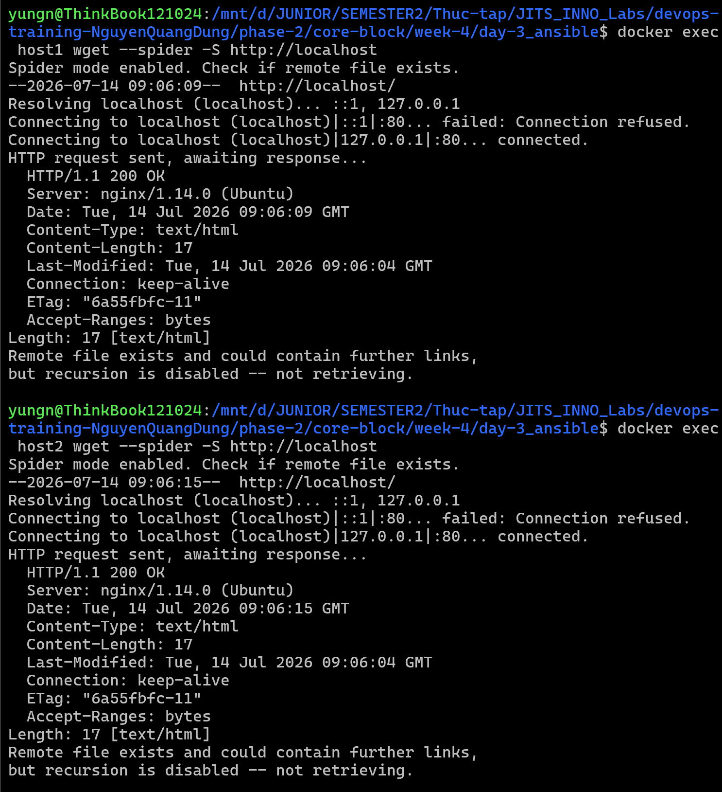
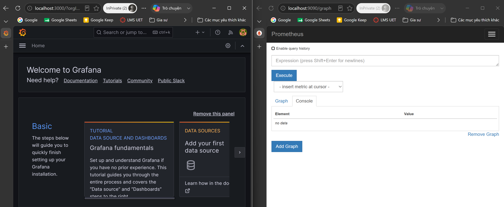
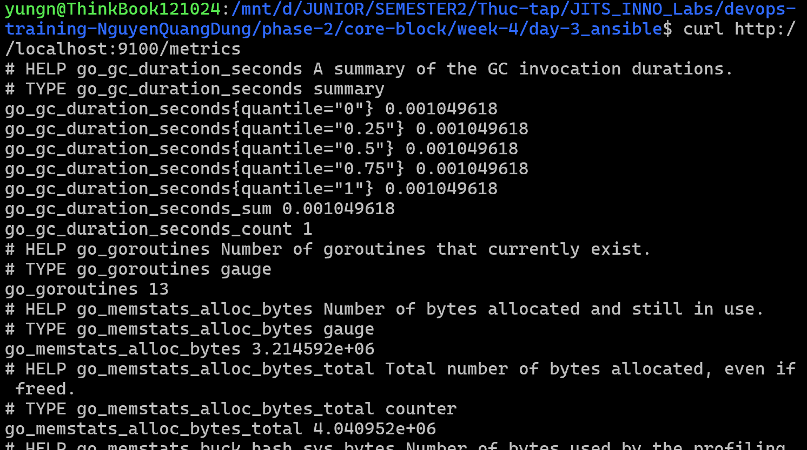

# Task Submission Template

> Mỗi task = 1 folder con + 1 PR/MR riêng. Copy template này vào `README.md` của task.

## Task: `Week 4: IaC nâng cao + Monitoring + Security basics: Day 3 - Ansible`

- **Intern**: `Nguyễn Quang Dũng`
- **Phase / Week / Day**: `Phase 2 / Week 4 / Day 3`
- **Branch**: `phase-2/week-4/day-3`
- **Submitted at**: `2026-07-14 17:00` (timezone +07)
- **Time spent**: `6h`

## 1. Mục tiêu
- Tự động hóa quá trình cài đặt dịch vụ Nginx và sinh self-signed SSL certificate trên các target host bằng cấu trúc Ansible Role.
- Triển khai stack monitoring gồm Prometheus, Grafana và Node Exporter lên một VM riêng biệt sử dụng Ansible Role.
- Đảm bảo kịch bản chạy an toàn, đáng tin cậy và đạt tính chất idempotent.

## 2. Cách chạy
### Chuẩn bị môi trường chung (WSL)
Cài đặt công cụ sshpass trên máy điều khiển (WSL) để cho phép Ansible kết nối bằng mật khẩu:
```bash
sudo apt update && sudo apt install -y sshpass
```

Tắt cơ chế kiểm tra host key cho session Terminal hiện tại để tránh xung đột do WSL mount phân quyền 777:
```bash
export ANSIBLE_HOST_KEY_CHECKING=False
```

---

### Triển khai Nginx (trên host1 và host2)

#### Bước A: Khởi chạy các container giả lập
```bash
docker run -d --name host1 -p 2221:22 rastasheep/ubuntu-sshd
docker run -d --name host2 -p 2222:22 rastasheep/ubuntu-sshd
```

#### Bước B: Cấu hình các file liên quan
- [inventory](inventory): Khai báo kết nối cho host1 (port 2221) và host2 (port 2222) sử dụng tài khoản root/root.
- [ansible.cfg](ansible.cfg): Cấu hình bỏ qua việc kiểm tra host key.
- [site.yaml](site.yaml): Playbook chính gọi Role nginx.
- [roles/nginx/defaults/main.yaml](roles/nginx/defaults/main.yaml): Khai báo cổng Nginx mặc định và server name.
- [roles/nginx/tasks/main.yml](roles/nginx/tasks/main.yml): Các task cài đặt nginx, openssl, sinh self-signed cert, áp dụng cấu hình từ template và đảm bảo dịch vụ Nginx được bật.
- [roles/nginx/handlers/main.yaml](roles/nginx/handlers/main.yaml): Handler quản lý việc reload/restart Nginx khi có thay đổi file cấu hình.
- [roles/nginx/templates/nginx.conf.j2](roles/nginx/templates/nginx.conf.j2): Template Jinja2 cấu hình virtual host Nginx.

#### Bước C: Execute
```bash
ansible-playbook -i inventory site.yaml
```

#### Bước D: Check
Do host1 và host2 không map cổng 80 ra ngoài máy Windows, ta thực hiện tạo trang chủ mẫu và check:

- **Tạo trang chủ mẫu index.html**:
  ```bash
  docker exec host1 sh -c 'echo "Hello from Host1" > /var/www/html/index.html'
  docker exec host2 sh -c 'echo "Hello from Host2" > /var/www/html/index.html'
  ```

- **Sử dụng wget từ bên trong container (do curl không được cài sẵn)**:
  ```bash
  docker exec host1 wget --spider -S http://localhost
  docker exec host2 wget --spider -S http://localhost
  ```



---

### Triển khai Stack Monitoring (trên host3)

#### Bước A: Khởi chạy container có map cổng dịch vụ
```bash
docker run -d --name host3 -p 2223:22 -p 9090:9090 -p 3000:3000 -p 9100:9100 rastasheep/ubuntu-sshd
```

#### Bước B: Cấu hình các file liên quan
- [inventory](inventory): Khai báo kết nối cho host3 (port 2223).
- [site_monitoring.yaml](site_monitoring.yaml): Playbook chính gọi Role monitoring.
- [roles/monitoring/defaults/main.yaml](roles/monitoring/defaults/main.yaml): Khai báo URL tải Grafana deb.
- [roles/monitoring/tasks/main.yaml](roles/monitoring/tasks/main.yaml): Các task cài đặt prometheus, prometheus-node-exporter, daemon, cài đặt Grafana và đảm bảo các service được bật.

#### Bước C: Thực thi kịch bản
```bash
ansible-playbook -i inventory site_monitoring.yaml
```

#### Bước D: Lệnh kiểm tra trực quan
Vì host3 đã được map đầy đủ cổng ra ngoài máy Windows, ta kiểm tra trực tiếp từ trình duyệt web Windows hoặc qua curl từ WSL:
- **Kiểm tra Grafana**: Truy cập `http://localhost:3000` trên trình duyệt (tài khoản admin/admin).
- **Kiểm tra Prometheus**: Truy cập `http://localhost:9090` trên trình duyệt.


- **Kiểm tra Node Exporter**:
  ```bash
  curl http://localhost:9100/metrics
  ```
  

---

## 3. Kết quả

## 4. Khó khăn & cách giải quyết
- **Lỗi thiếu sshpass**: Khi cấu hình dùng mật khẩu để kết nối SSH, Ansible báo lỗi thiếu sshpass trên máy điều khiển. Khắc phục bằng cách chạy cài đặt sshpass trên WSL: `sudo apt update && sudo apt install -y sshpass`.
- **Lỗi phân quyền world-writable trên WSL**: Ansible từ chối đọc file cấu hình tại folder hiện tại do phân quyền 777. Giải pháp là export trực tiếp biến môi trường `export ANSIBLE_HOST_KEY_CHECKING=False` hoặc `export ANSIBLE_CONFIG=./ansible.cfg` để ép buộc Ansible áp dụng cấu hình.
- **Lỗi kiểm tra check mode với apt**: Sử dụng module apt của Ansible ở chế độ check mode khi chưa có thư viện python3-apt sẽ gây lỗi. Giải pháp là thực hiện chạy Playbook thật ở lần đầu tiên để tự động cài đặt thư viện này, các lần chạy thử sau đó sẽ diễn ra bình thường.
- **Lỗi thiếu gói daemon cho Node Exporter**: Trên container Ubuntu tối giản, script khởi động của Node Exporter bị lỗi do thiếu chương trình daemon. Khắc phục bằng cách bổ sung gói daemon vào danh sách cài đặt apt của Role.
- **Lỗi Grafana timeout khi chạy đầu tiên**: Trong lần đầu tiên chạy, Grafana cần thực thi 523 tiến trình chuyển đổi cơ sở dữ liệu (SQLite migrations) khiến thời gian khởi động lâu hơn 1 giây, làm script init trả về lỗi giả. Khắc phục bằng cách tách task khởi chạy Grafana độc lập và thêm cấu hình `ignore_errors: yes` cho task này.

## 5. Reference
- https://docs.ansible.com/

## 6. Self-check
- [x] Code chạy được trên máy sạch.
- [x] README có hướng dẫn run lại.
- [x] Không hard-code secret.
- [x] Commit message theo Conventional Commits.
- [x] Đã review lại code 1 lượt.