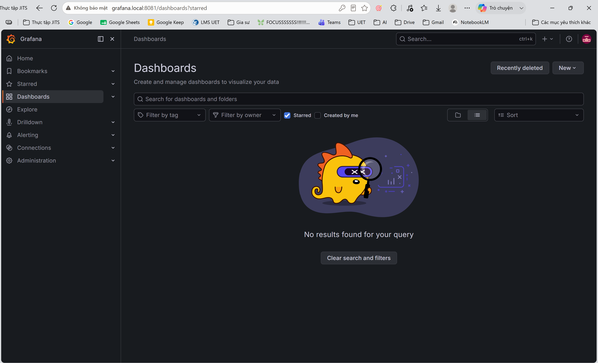
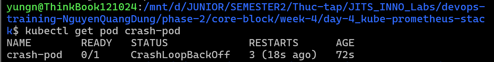
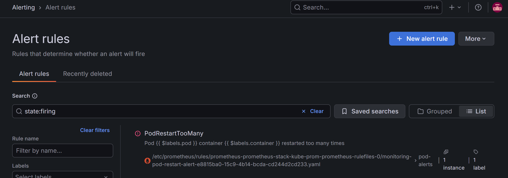

# Hướng dẫn Triển khai và Báo cáo Thực hành Day 4: kube-prometheus-stack trên K3d (WSL2)

Tài liệu này hướng dẫn chi tiết các bước triển khai hệ thống giám sát và quản lý log tập trung sử dụng K3d trên môi trường WSL2, bao gồm các bước cấu hình tối ưu hóa hệ thống để xử lý lỗi inotify và lỗi nghẽn mạng tải image.

## Thông tin nộp bài

- **Intern**: Nguyễn Quang Dũng
- **Phase / Week / Day**: Phase 2 / Week 4 / Day 4
- **Branch**: `phase-2/week-4/day-4_kube-prometheus-stack`
- **Submitted at**: [Điền ngày giờ nộp bài]
- **Time spent**: [Điền thời gian thực hiện]

---

## 1. Mục tiêu

- Cài đặt thành công kube-prometheus-stack và Loki trên cụm K3d bằng Helm.
- Khắc phục các lỗi inotify trên WSL2 và lỗi nghẽn mạng kéo image từ registry ngoại.
- Cấu hình expose giao diện Grafana ra ngoài thông qua Traefik Ingress tích hợp sẵn của K3s/K3d trên cổng 8081.
- Import thành công Dashboard giám sát tài nguyên Node.
- Thiết lập luật cảnh báo PrometheusRule phát hiện Pod restart nhiều lần.
- Kiểm tra tính đúng đắn của cảnh báo bằng cách giả lập sự cố.

---

## 2. Cách chạy

### Bước 1: Dọn dẹp tài nguyên cũ và cấu hình hệ thống host WSL2

1. Dừng stack Docker Compose của Phase 1 để giải phóng tài nguyên:
   ```bash
   cd ~/devops-training-NguyenQuangDung/Week2/Day10-Observability
   docker compose down
   ```
2. Khắc phục lỗi inotify (lỗi `failed to make file target manager: too many open files` của Promtail và Loki) bằng cách tăng giới hạn theo dõi file của nhân Linux trên WSL2.
   - Mở file cấu hình sysctl:
     ```bash
     sudo nano /etc/sysctl.conf
     ```
   - Thêm các cấu hình sau vào cuối file:
     ```text
     fs.inotify.max_user_instances=512
     fs.inotify.max_user_watches=524288
     fs.inotify.max_queued_events=16384
     ```
   - Nạp lại cấu hình:
     ```bash
     sudo sysctl -p
     ```

### Bước 2: Thiết lập Kubeconfig và xử lý cache Image cho cụm K3d


1. Thiết lập Kubeconfig để kubectl và Helm kết nối tới cụm K3d tên `dev`:
   ```bash
   mkdir -p ~/.kube
   k3d kubeconfig get dev > ~/.kube/config
   chmod 600 ~/.kube/config
   ```
2. Kiểm tra kết nối cụm:
   ```bash
   kubectl get nodes
   ```
3. Kéo các image bị nghẽn mạng về máy host:
   ```bash
   docker pull quay.io/prometheus-operator/prometheus-config-reloader:v0.92.1
   docker pull quay.io/prometheus/prometheus:v3.13.1-distroless
   ```
4. Nạp trực tiếp các image này vào cụm K3d `dev` để tránh tải qua mạng:
   ```bash
   k3d image import quay.io/prometheus-operator/prometheus-config-reloader:v0.92.1 -c dev
   k3d image import quay.io/prometheus/prometheus:v3.13.1-distroless -c dev
   ```

### Bước 3: Cấu hình và cài đặt stack giám sát bằng Helm

1. Thêm các Helm repositories cần thiết:
   ```bash
   helm repo add prometheus-community https://prometheus-community.github.io/helm-charts
   helm repo add grafana https://grafana.github.io/helm-charts
   helm repo update
   ```
2. Tạo file cấu hình [`values.yaml`](values.yaml) cho kube-prometheus-stack để định nghĩa mật khẩu admin của Grafana và cấu hình Traefik Ingress:
   ```yaml
   grafana:
     adminPassword: "admin"
     ingress:
       enabled: true
       ingressClassName: traefik
       hosts:
         - grafana.local
   ```
3. Tạo Namespace riêng cho việc monitoring và cài đặt kube-prometheus-stack:
   ```bash
   kubectl create namespace monitoring
   helm install prometheus-stack prometheus-community/kube-prometheus-stack -n monitoring -f values.yaml
   ```
4. Triển khai Loki và Promtail để thu thập log:
   - Cài đặt Loki:
     ```bash
     helm install loki grafana/loki-simple-scalable -n monitoring
     ```
   - Cài đặt Promtail và cấu hình endpoint gửi log về Loki Gateway:
     ```bash
     helm install promtail grafana/promtail --set config.clients[0].url=http://loki-gateway.monitoring.svc.cluster.local/loki/api/v1/push -n monitoring
     ```

### Bước 4: Cấu hình DNS và truy cập Grafana

1. Ánh xạ tên miền `grafana.local` về IP localhost của host trên Windows bằng cách Mở file `C:\Windows\System32\drivers\etc\hosts` bằng quyền Administrator và thêm dòng sau:
   ```text
   127.0.0.1 grafana.local
   ```
2. Do cụm K3d map cổng 80 của Ingress Traefik ra cổng 8081 của host, ta truy cập Grafana qua địa chỉ:
   ```text
   http://grafana.local:8081
   ```
   Đăng nhập bằng tài khoản `admin` và mật khẩu `admin`.
   

### Bước 5: Cấu hình Dashboard và Kiểm tra log

1. Truy cập Dashboards -> New -> Import trên Grafana.
2. Nhập ID `11074` (hoặc sử dụng các dashboard mặc định của stack) để import giao diện giám sát Node. Chọn data source là **Prometheus**.
3. Vào mục Explore, chọn data source là **Loki** để kiểm tra log hệ thống đã được thu thập đầy đủ.

### Bước 6: Tạo PrometheusRule cảnh báo Pod restart

Ta định nghĩa một cảnh báo tự động kích hoạt nếu một container trong Pod bị restart quá 3 lần trong vòng 10 phút.

1. Tạo file [`alert-rules.yaml`](alert-rules.yaml):
   ```yaml
   apiVersion: monitoring.coreos.com/v1
   kind: PrometheusRule
   metadata:
     name: pod-restart-alert
     namespace: monitoring
     labels:
       release: prometheus-stack
   spec:
     groups:
     - name: pod-alerts
       rules:
       - alert: PodRestartTooMany
         expr: increase(kube_pod_container_status_restarts_total[10m]) > 3
         for: 1m
         labels:
           severity: warning
         annotations:
           summary: "Pod {{ $labels.pod }} container {{ $labels.container }} restarted too many times"
           description: "Container has restarted {{ $value }} times within the last 10 minutes."
   ```
2. Áp dụng rule cấu hình vào cụm:
   ```bash
   kubectl apply -f alert-rules.yaml
   ```

### Bước 7: Giả lập sự cố kiểm tra cảnh báo

1. Tạo file [`crash-pod.yaml`](crash-pod.yaml) chạy một container liên tục exit để giả lập lỗi:
   ```yaml
   apiVersion: v1
   kind: Pod
   metadata:
     name: crash-pod
     namespace: default
   spec:
     containers:
     - name: crash-container
       image: busybox
       command: ["/bin/sh", "-c", "exit 1"]
   ```
2. Triển khai Pod:
   ```bash
   kubectl apply -f crash-pod.yaml
   ```
   
3. Chờ container bị restart nhiều hơn 3 lần, sau đó kiểm tra trên giao diện Alerts của Prometheus hoặc Alertmanager để xác nhận cảnh báo `PodRestartTooMany` chuyển sang trạng thái firing.
   

