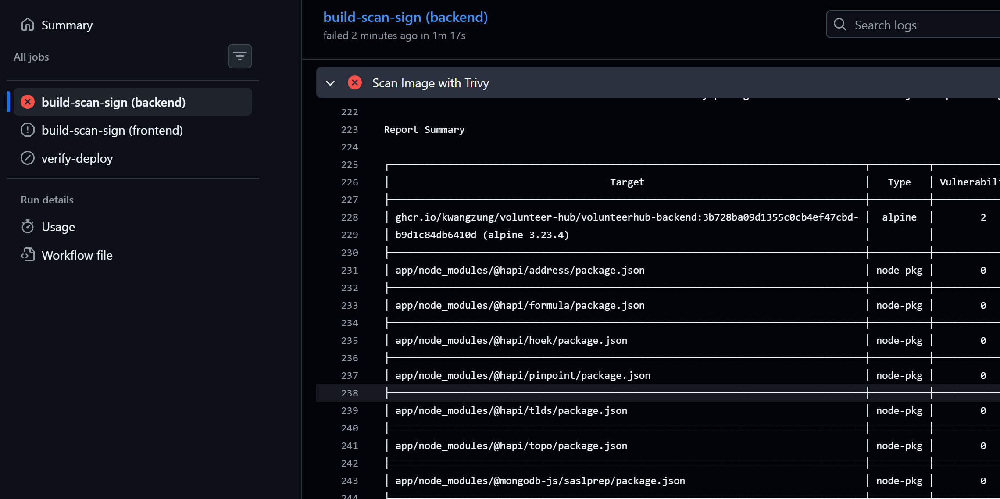
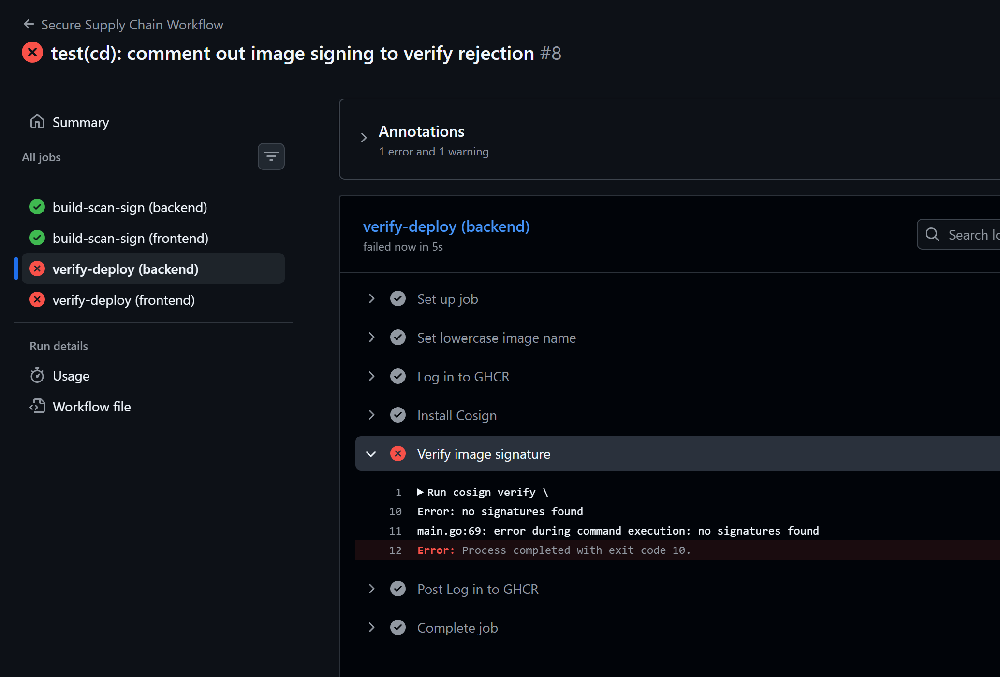

# Hướng dẫn Triển khai và Báo cáo Thực hành Day 5: Trivy + cosign + SBOM

## Thông tin nộp bài

- **Intern**: Nguyễn Quang Dũng
- **Phase / Week / Day**: Phase 2 / Week 4 / Day 5
- **Branch**: `phase-2/week-4/day-5`
- **Submitted at**: 2026-07-23 22:30
- **Time spent**: 8h

---

## 1. Mục tiêu

- Cấu hình pipeline quét các lỗ hổng của container image bằng Trivy.
- Tự động sinh ra SBOM cho image bằng Syft và tải file kết quả lên làm artifact.
- Tự động ký (sign) image an toàn bằng cơ chế keyless của Cosign thông qua GitHub OIDC.
- Thực hiện kiểm tra tính hợp lệ của chữ ký trong quá trình CD, đảm bảo hệ thống từ chối (reject) ngay lập tức nếu image không có signature hợp lệ.
- Dự án áp dụng: [VolunteerHub](https://github.com/KwangZung/volunteer-hub)

---

## 2. Cách chạy (Tự động hóa qua GitHub Actions)

Các file cấu hình:
- [frontend/Dockerfile](https://github.com/KwangZung/volunteer-hub/blob/main/frontend/Dockerfile): Ở Stage 1, ta sử dụng `node:20` để cài đặt dependencies và chạy lệnh `vite build`. Sang Stage 2, ta dùng image `nginx:alpine` siêu nhẹ và chỉ copy duy nhất thư mục `dist/` vào phục vụ file tĩnh. Việc này giúp image cuối cùng cực kỳ nhẹ và bảo mật (hoàn toàn che giấu mã nguồn React nguyên thủy).
- [backend/Dockerfile](https://github.com/KwangZung/volunteer-hub/blob/main/backend/Dockerfile): Ở Stage 1, ta cũng sử dụng `node:20-alpine` để biên dịch mã nguồn TypeScript ra JavaScript (thư mục `dist`). Sang Stage 2, ta chỉ cài đặt các package cần thiết cho môi trường thực tế (`npm ci --only=production`) và copy thư mục `dist/` sang, tránh để lọt các package dev không cần thiết vào Image cuối.
- [docker-compose.yaml](https://github.com/KwangZung/volunteer-hub/blob/main/docker-compose.yaml): Chịu trách nhiệm cấu hình chạy 2 container cùng lúc, ánh xạ cổng 80 cho frontend và cổng 3000 cho backend để có thể dễ dàng khởi động hệ thống dưới local chỉ bằng một lệnh `docker compose up -d`.

Ta cấu hình file workflow ([`.github/workflows/supply-chain.yml`](https://github.com/KwangZung/volunteer-hub/blob/main/.github/workflows/supply-chain.yml)) sử dụng `matrix` để chạy đồng thời các job với cả 2 service backend và frontend:

**Khai báo quyền OIDC cho Cosign:**
```yaml
permissions:
  contents: read
  packages: write
  id-token: write # Yêu cầu bắt buộc để dùng cosign keyless
```

**Cấu hình Job Build, Scan và Sign:**
```yaml
jobs:
  build-scan-sign:
    runs-on: ubuntu-latest
    strategy:
      matrix:
        service: [backend, frontend] # Chạy lặp lại cho cả 2 service
    env:
      IMAGE_NAME: ghcr.io/${{ github.repository }}/volunteerhub-${{ matrix.service }}
      IMAGE_TAG: ${{ github.sha }}
      
    steps:
      - name: Checkout Code
        uses: actions/checkout@v4

      - name: Log in to GHCR
        uses: docker/login-action@v3
        with:
          registry: ghcr.io
          username: ${{ github.actor }}
          password: ${{ secrets.GITHUB_TOKEN }}

      # 1. Build Image tương ứng với service
      - name: Build Image
        working-directory: ./${{ matrix.service }}
        run: docker build -t ${{ env.IMAGE_NAME }}:${{ env.IMAGE_TAG }} .

      - name: Download Trivy HTML Template
        run: curl -sL -o html.tpl https://raw.githubusercontent.com/aquasecurity/trivy/main/contrib/html.tpl

      # 2. Chạy Trivy để quét lỗ hổng và xuất báo cáo HTML
      - name: Scan Image with Trivy
        uses: aquasecurity/trivy-action@master
        with:
          image-ref: '${{ env.IMAGE_NAME }}:${{ env.IMAGE_TAG }}'
          format: 'template'
          template: '@html.tpl'
          output: 'trivy-results-${{ matrix.service }}.html'
          exit-code: '0' # Báo lỗi pipeline nếu có lỗ hổng CRITICAL
          ignore-unfixed: true
          vuln-type: 'os,library'
          severity: 'CRITICAL,HIGH'

      - name: Upload Trivy Report
        uses: actions/upload-artifact@v4
        with:
          name: Trivy-Report-${{ matrix.service }}
          path: trivy-results-${{ matrix.service }}.html

      # 3. Sinh SBOM bằng Syft
      - name: Generate SBOM with Syft
        uses: anchore/sbom-action@v0
        with:
          image: '${{ env.IMAGE_NAME }}:${{ env.IMAGE_TAG }}'
          output-file: 'sbom-${{ matrix.service }}.spdx.json'
          format: 'spdx-json'

      - name: Upload SBOM
        uses: actions/upload-artifact@v4
        with:
          name: SBOM-${{ matrix.service }}
          path: sbom-${{ matrix.service }}.spdx.json

      # 4. Push Image lên Registry
      - name: Push Image
        run: docker push ${{ env.IMAGE_NAME }}:${{ env.IMAGE_TAG }}

      # 5. Cài đặt Cosign và Ký Image
      - name: Install Cosign
        uses: sigstore/cosign-installer@v3.5.0

      - name: Sign Image
        run: cosign sign --yes ${{ env.IMAGE_NAME }}:${{ env.IMAGE_TAG }}
```

**Cấu hình Job Verify ở môi trường CD:**
```yaml
  verify-deploy:
    needs: build-scan-sign
    runs-on: ubuntu-latest
    strategy:
      matrix:
        service: [backend, frontend]
    env:
      IMAGE_NAME: ghcr.io/${{ github.repository }}/volunteerhub-${{ matrix.service }}
      IMAGE_TAG: ${{ github.sha }}
      
    steps:
      - name: Install Cosign
        uses: sigstore/cosign-installer@v3.5.0

      - name: Verify image signature
        run: |
          cosign verify \
            --certificate-identity-regexp="https://github.com/.*" \
            --certificate-oidc-issuer="https://token.actions.githubusercontent.com" \
            ${{ env.IMAGE_NAME }}:${{ env.IMAGE_TAG }}
```

---

## 3. Kết quả

- Pipeline chạy hoàn toàn tự động khi có code mới đẩy lên nhánh chính.
- Trivy phát hiện lỗ hổng và xuất báo cáo kết quả quét dưới dạng file HTML: 
  - **Backend Trivy Report**: [Backend Artifact](./backend-trivy-scan.mhtml)
  - **Frontend Trivy Report**: [Frontend Artifact](./frontend-trivy-scan.mhtml)
  
  *Ảnh chụp luồng CI bị chặn khi Trivy phát hiện lỗ hổng bảo mật:*
  

- Tạo SBOM chi tiết riêng biệt cho cả Frontend và Backend, tự động lưu trữ trên thẻ Artifacts của GitHub.
  - **Backend SBOM Artifact**: [Backend Artifact](https://github.com/KwangZung/volunteer-hub/actions/runs/30061850140/artifacts/8584819687)
  - **Frontend SBOM Artifact**: [Frontend Artifact](https://github.com/KwangZung/volunteer-hub/actions/runs/30061850140/artifacts/8584821937)
- Quá trình Verify bằng Cosign ở Job sau cùng giúp đảm bảo không ai có thể can thiệp vào Image trước lúc triển khai.

  *Ảnh chụp quá trình Deploy từ chối image vì không có chữ ký:*
  

## 4. Khó khăn & cách giải quyết

- **Khó khăn**: Code chia làm 2 thư mục `frontend` và `backend` khiến việc viết workflow lặp lại nhiều lần.
- **Cách giải quyết**: Áp dụng tính năng `matrix` của GitHub Actions để viết 1 workflow nhưng tự động lặp lại cho cả 2 thư mục, giúp code CI/CD ngắn gọn và dễ bảo trì.

## 5. Reference

- [Trivy Documentation](https://aquasecurity.github.io/trivy/)
- [Syft Documentation](https://github.com/anchore/syft)
- [Cosign Keyless Signing](https://docs.sigstore.dev/cosign/signing/keyless/)

## 6. Self-check
- [x] Code chạy được trên máy sạch.
- [x] README có hướng dẫn run lại.
- [x] Không hard-code secret.
- [x] Commit message theo Conventional Commits.
- [x] Đã review lại code 1 lượt.
