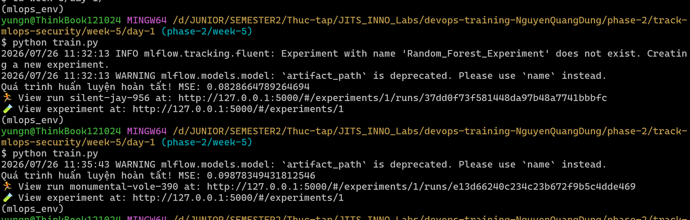
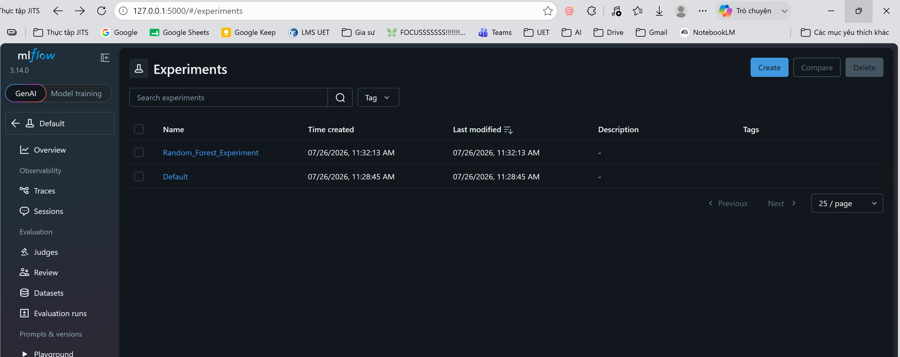
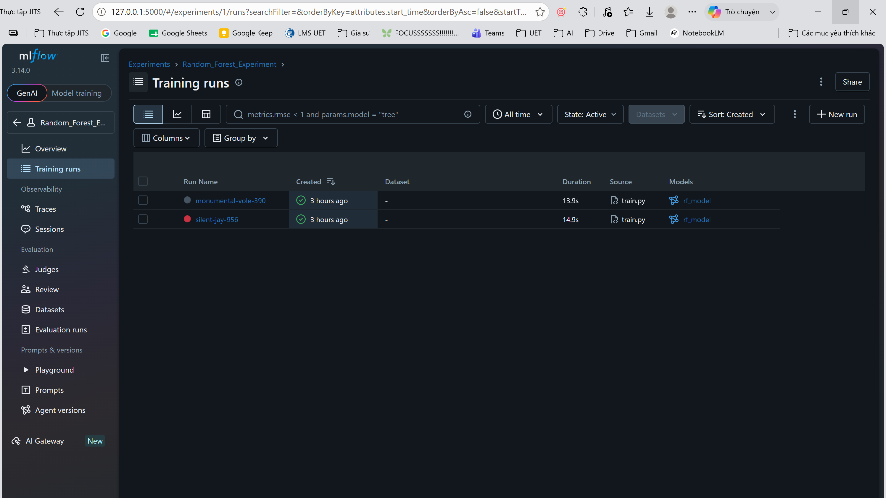
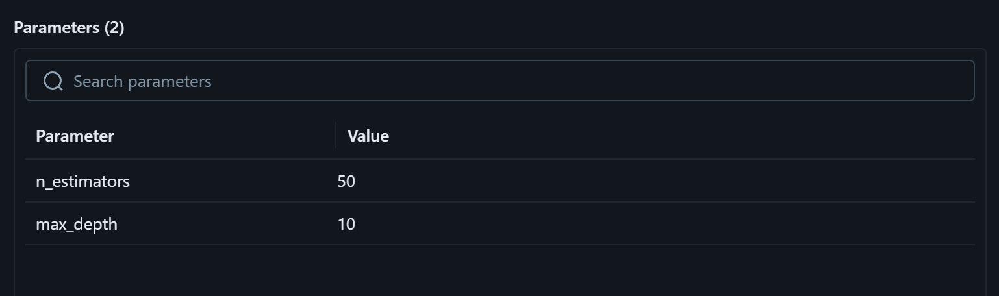
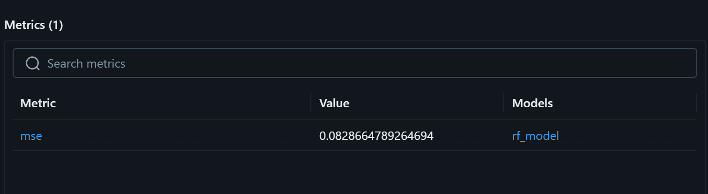
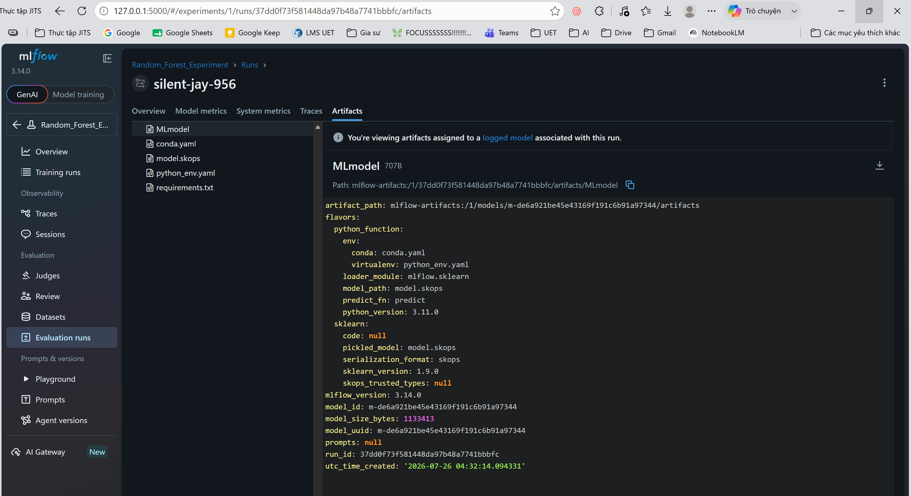

# Task Submission Template

## Task: `MLOps`

- **Intern**: `Nguyễn Quang Dũng`
- **Phase / Week / Day**: `Phase 2 / Week 5 / Day`
- **Branch**: `phase-2/week-5`
- **Submitted at**: `2026-07-26 23:35` (timezone +07)
- **Time spent**: `5h`

## 1. Mục tiêu

## 2. Cách chạy

**1. Kích hoạt môi trường ảo**
- Mở Terminal tại thư mục gốc của dự án.
- Kích hoạt bằng lệnh: `source mlops_env/Scripts/activate` (Git Bash) hoặc `.\mlops_env\Scripts\activate` (PowerShell/CMD).

**2. Khởi chạy MLflow Tracking Server**
- Chạy lệnh sau để bật Server cục bộ nhằm lưu trữ log tập trung:
  ```bash
  mlflow server --host 127.0.0.1 --port 5000
  ```
- *Lưu ý: Bắt buộc giữ Terminal này hoạt động liên tục.*

**3. Thực thi mã nguồn huấn luyện**
- Mở Terminal mới, kích hoạt môi trường ảo tương tự Bước 1.
- Điều hướng và chạy file mã nguồn:
  ```bash
  cd phase-2/track-mlops-security/week-5/day-1
  python train.py
  ```
- **Giải thích mã nguồn (`train.py`)**:

  ```python
  import mlflow
  import mlflow.sklearn
  import numpy as np
  from sklearn.ensemble import RandomForestRegressor
  from sklearn.metrics import mean_squared_error
  from sklearn.model_selection import train_test_split
  
  # 1. Trỏ kết nối về phía Tracking Server vừa khởi tạo
  mlflow.set_tracking_uri("http://127.0.0.1:5000")
  ```
  - `mlflow.set_tracking_uri(...)`: Kết nối mã nguồn với Tracking Server nội bộ đang chạy ở cổng 5000.

  ```python
  # 2. Khởi tạo một Experiment mới để nhóm các lần chạy lại với nhau
  mlflow.set_experiment("Random_Forest_Experiment")
  ```
  - `mlflow.set_experiment(...)`: Nhóm các lượt chạy vào một không gian dự án cụ thể để dễ quản lý.

  ```python
  # Tạo dữ liệu giả lập để kiểm tra (Mock data)
  X = np.random.rand(100, 5)
  y = np.random.rand(100)
  X_train, X_test, y_train, y_test = train_test_split(X, y, test_size=0.2)
  
  # 3. Mở một Run session mới
  with mlflow.start_run():
  ```
  - `with mlflow.start_run():`: Mở một phiên theo dõi (run) mới.

  ```python
      # Định nghĩa các siêu tham số
      n_estimators = 50
      max_depth = 10
      
      # Ghi nhận các tham số (Parameters)
      mlflow.log_param("n_estimators", n_estimators)
      mlflow.log_param("max_depth", max_depth)
  ```
  - `mlflow.log_param(...)`: Ghi nhận các siêu tham số (hyperparameters) của mô hình (ví dụ: `n_estimators`, `max_depth`).

  ```python
      # Khởi tạo và huấn luyện
      rf = RandomForestRegressor(n_estimators=n_estimators, max_depth=max_depth)
      rf.fit(X_train, y_train)
      
      # Đánh giá và ghi nhận kết quả (Metrics)
      predictions = rf.predict(X_test)
      mse = mean_squared_error(y_test, predictions)
      mlflow.log_metric("mse", mse)
  ```
  - `mlflow.log_metric(...)`: Ghi nhận các chỉ số hiệu suất sau khi đánh giá (ví dụ: `mse`).

  ```python
      # Lưu mô hình hoàn thiện dưới dạng Artifact
      mlflow.sklearn.log_model(rf, "rf_model")
      
      print(f"Quá trình huấn luyện hoàn tất! MSE: {mse}")
  ```
  - `mlflow.sklearn.log_model(...)`: Đóng gói và lưu trữ toàn bộ mô hình thành dạng Artifact để có thể tải lại hoặc triển khai (deploy) sau này.

Kết quả chạy 2 lần:


**4. Đánh giá và ghi nhận kết quả trên Web UI**
- Mở trình duyệt và truy cập địa chỉ: `http://127.0.0.1:5000`.
- Tại thanh điều hướng bên trái, tìm và nhấn chọn Experiment mang tên **`Random_Forest_Experiment`**.


- Ở phần màn hình chính (Training runs), hệ thống sẽ liệt kê các lượt huấn luyện. Nhấn trực tiếp vào tên của lượt chạy (chuỗi ký tự màu xanh dương, ví dụ: `silent-jay-956`).


- Màn hình sẽ chuyển sang giao diện chi tiết. Cuộn trang để kiểm tra:
  - **Parameters**: Kiểm tra tham số đầu vào (`n_estimators`, `max_depth`).
  
  - **Metrics**: Đối chiếu sai số (`mse`).
  
  - **Artifacts**: Xác nhận thư mục model (`rf_model`) đã lưu trữ thành công.
  
## 3. Kết quả

## 4. Khó khăn & cách giải quyết

## 5. Reference

## 6. Self-check
- [x] Code chạy được trên máy sạch.
- [x] README có hướng dẫn run lại.
- [x] Không hard-code secret.
- [x] Commit message theo Conventional Commits.
- [x] Đã review lại code 1 lượt.
