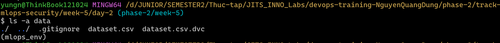
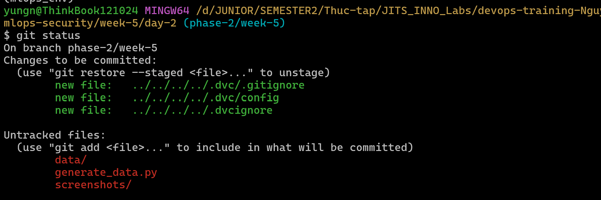

# Task Submission Template

## Task: ``

- **Intern**: `Nguyễn Quang Dũng`
- **Phase / Week / Day**: `Phase  / Week  / `
- **Branch**: `phase-/week-/`
- **Submitted at**: `2026-06-17 23:35` (timezone +07)
- **Time spent**: `5h`

## 1. Mục tiêu

## 2. Cách chạy

**1. Khởi tạo môi trường DVC**
- Mở Terminal và di chuyển vào thư mục dự án gốc. Đảm bảo môi trường ảo `mlops_env` đã được kích hoạt.
- Tiến hành cài đặt thư viện DVC (nếu chưa có):
  ```bash
  pip install dvc
  ```
- Khởi tạo hệ thống DVC tại thư mục gốc:
  ```bash
  dvc init
  ```

**2. Sinh dữ liệu mẫu (Mock Data)**
- Mở một Terminal, di chuyển vào thư mục bài tập của Day 2:
  ```bash
  cd phase-2/track-mlops-security/week-5/day-2
  ```
- Chạy script mã nguồn để tự động tạo một file CSV giả lập với số lượng bản ghi lớn:
  ```bash
  python generate_data.py
  ```
- Sau khi chạy xong, thư mục [`data`](./data/) sẽ được tạo ra, bên trong chứa file `dataset.csv`.

**3. Theo dõi dữ liệu với DVC**
- Dùng DVC để theo dõi file dữ liệu lớn thay vì dùng Git:
  ```bash
  dvc add data/dataset.csv
  ```
- Quá trình này sẽ sinh ra file `data/dataset.csv.dvc` chứa cấu hình theo dõi và cập nhật file `data/.gitignore` để ẩn file dữ liệu thật khỏi Git.

Xem các file đang có trong thư mục ['data'](./data/)
```bash
ls -a data
```


**4. Xác nhận theo dõi cấu hình bằng Git**
- Theo dõi các file chưa được Git quản lý: 
  ```bash
  git status
  ```
  
- Thực hiện đưa các file cấu hình và file theo dõi (`.dvc`) vào Git (tuyệt đối không add file CSV thật):
  ```bash
  git add . # vì dvc đã tự sinh file .gitignore chặn Git track file data csv thật
  ```

## 3. Kết quả

## 4. Khó khăn & cách giải quyết

## 5. Reference

## 6. Self-check
- [x] Code chạy được trên máy sạch.
- [x] README có hướng dẫn run lại.
- [x] Không hard-code secret.
- [x] Commit message theo Conventional Commits.
- [x] Đã review lại code 1 lượt.
