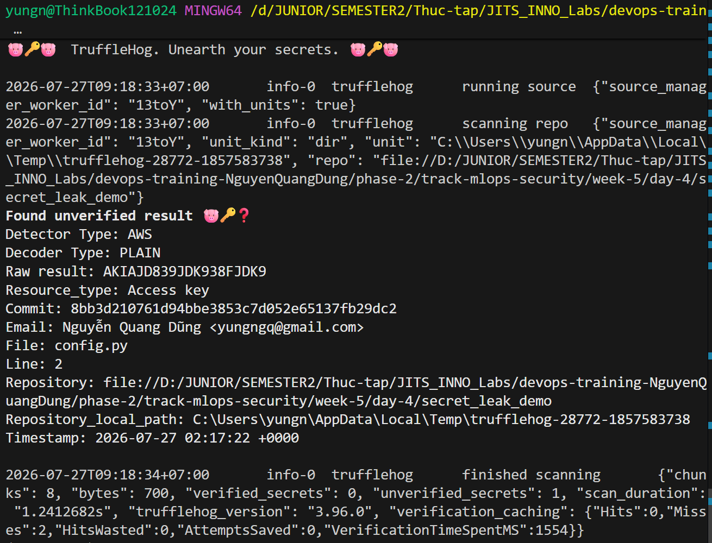
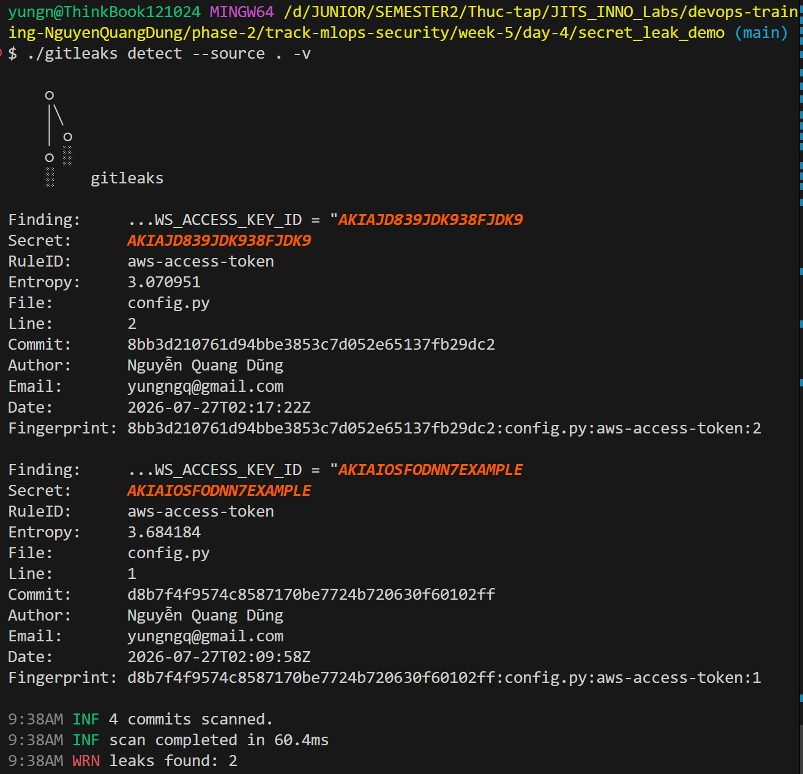

# Task Submission Template

## Task: `Secret Scanning`

- **Intern**: `Nguyễn Quang Dũng`
- **Phase / Week / Day**: `Phase 2 / Week 5 / Day 4`
- **Branch**: `phase-2/week-5`
- **Submitted at**: `2026-07-27` (timezone +07)
- **Time spent**: `3h`

## 1. Mục tiêu

## 2. Cách chạy

**1. Khởi tạo kho lưu trữ Git và giả lập sự cố rò rỉ (Git History Leak)**
- Mở Terminal tại thư mục gốc của dự án và kích hoạt môi trường ảo:
  ```bash
  source mlops_env/Scripts/activate
  ```
  *(Đối với PowerShell/CMD trên Windows, sử dụng lệnh: `.\mlops_env\Scripts\activate`)*
- Di chuyển vào thư mục Day 4 và tạo một không gian thực hành nhỏ:
  ```bash
  cd phase-2/track-mlops-security/week-5/day-4
  mkdir secret_leak_demo
  cd secret_leak_demo
  git init
  ```
- Tạo file `config.py` và cố tình lưu (hardcode) một cặp khóa AWS vào đó:
  ```python
  # Khởi tạo cấu hình hệ thống
  AWS_ACCESS_KEY_ID = "AKIAJD839JDK938FJDK9"
  AWS_SECRET_ACCESS_KEY = "Xz9Qk1L/Jd92mKp01LqA2Zw93Nc82K1LxO93Mz21"
  ```
- Thực hiện commit mang rủi ro bảo mật này vào lịch sử Git:
  ```bash
  git add config.py
  git commit -m "Add AWS config"
  ```
- Giả lập việc lập trình viên phát hiện lỗi và "chữa cháy" bằng cách mở file `config.py`, xóa đi 2 dòng chứa Secret, sau đó commit đè lên một lần nữa:
  ```bash
  git add config.py
  git commit -m "Remove hardcoded AWS secrets"
  ```
- Lúc này, nếu kiểm tra không gian làm việc (workspace) hiện tại sẽ không còn thấy dấu vết của Secret.

**2. Cài đặt và sử dụng TruffleHog để truy vết Git History**
- Tiến hành cài đặt file binary của công cụ quét TruffleHog bằng lệnh:
  ```bash
  curl -sSfL https://raw.githubusercontent.com/trufflesecurity/trufflehog/main/scripts/install.sh | sh -s -- -b .
  ```
- Chạy TruffleHog để cày xới và quét toàn bộ lịch sử Git của thư mục hiện tại:
  ```bash
  ./trufflehog git file://. --no-update
  ```
  
  **Giải thích chi tiết cấu trúc lệnh TruffleHog:**
  - `git`: Chỉ định chế độ hoạt động là quét kho lưu trữ Git (TruffleHog còn hỗ trợ quét AWS S3, Docker images, GitHub repo, v.v.).
  - `file://.`: Định dạng URI trỏ tới kho lưu trữ. Dấu `.` đại diện cho thư mục hiện tại, và tiền tố `file://` báo cho công cụ biết đây là ổ đĩa cục bộ (local).
  - `--no-update`: Chặn tính năng tự động tải phiên bản mới. (Đặc biệt quan trọng trên Windows để tránh lỗi crash do cơ chế khóa file thực thi đang chạy).


**3. Thực thi quét Secret bằng Gitleaks**
- Gitleaks là một giải pháp thay thế vô cùng phổ biến khác, nổi bật với tốc độ quét thần tốc nhờ sử dụng thuần túy biểu thức chính quy (Regex) và Entropy (không có Auto-verification như TruffleHog).
- Cài đặt file binary của Gitleaks trực tiếp qua môi trường Git Bash:
  ```bash
  curl -sSfL https://github.com/gitleaks/gitleaks/releases/download/v8.18.2/gitleaks_8.18.2_windows_x64.zip -o gitleaks.zip
  unzip gitleaks.zip gitleaks.exe
  rm gitleaks.zip
  ```
- Chạy lệnh Gitleaks để quét toàn bộ lịch sử Git trong thư mục hiện tại:
  ```bash
  ./gitleaks detect --source . -v
  ```
  
  **Giải thích chi tiết lệnh Gitleaks:**
  - `detect`: Chế độ quét dò tìm toàn bộ lịch sử (Git history) của kho lưu trữ. (Khác với chế độ `protect` thường dùng trong Pre-commit để quét các thay đổi mới nhất chưa kịp commit).
  - `--source .`: Chỉ định đường dẫn tới kho lưu trữ cần quét là thư mục hiện tại.
  - `-v` (hoặc `--verbose`): Kích hoạt chế độ hiển thị chi tiết (chỉ điểm rõ ràng tên file, dòng code, mã băm commit và cả tên tác giả gây ra lỗi để tiện truy cứu trách nhiệm).


**4. Khắc phục sự cố và Dọn dẹp môi trường (Remediation & Cleanup)**
- Việc xóa bỏ triệt để Secret khỏi Git history yêu cầu dùng các công cụ chuyên sâu như `git filter-repo` hoặc `BFG Repo-Cleaner` (không nằm trong phạm vi bài thực hành này, ta chỉ dừng ở mức phát hiện).
- **Dọn dẹp để nộp bài:** 
  Do ở Bước 1 ta đã gõ `git init` tạo ra một kho Git con nằm lồng bên trong kho Git tổng của dự án, nếu tiến hành `git add .` ở thư mục ngoài cùng sẽ bị dính cảnh báo `embedded git repository`. Để hóa giải, ta cần xóa thư mục ẩn `.git` của kho con này đi:
  ```bash
  # Xóa bỏ kho Git con giả lập
  rm -rf .git
  
  # Di chuyển về thư mục gốc của dự án và add bình thường
  cd ../../../..
  git add .
  ```

## 3. Kết quả

## 4. Khó khăn & cách giải quyết

## 5. Reference

## 6. Self-check
- [x] Code chạy được trên máy sạch.
- [x] README có hướng dẫn run lại.
- [x] Không hard-code secret.
- [x] Commit message theo Conventional Commits.
- [x] Đã review lại code 1 lượt.
