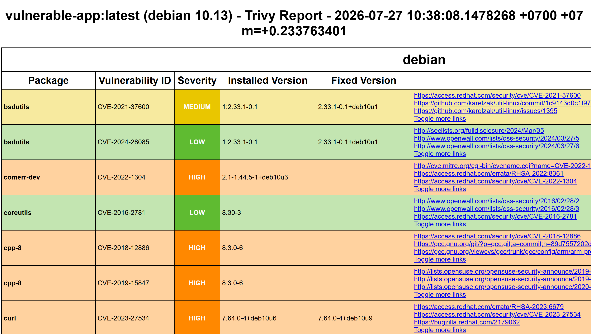
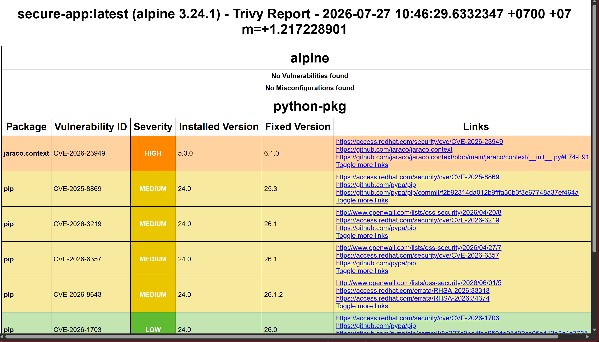

# Task Submission Template

## Task: `Week 5 - Day 5`

- **Intern**: `Nguyễn Quang Dũng`
- **Phase / Week / Day**: `Phase 2 / Week 5 / Day 5`
- **Branch**: `phase-2/week-5`
- **Submitted at**: `2026-07-27 21:43` (timezone +07)
- **Time spent**: `5h`

## 1. Mục tiêu

## 2. Cách chạy
**Bước 1: Khởi tạo ứng dụng dính lỗ hổng (Vulnerable Application)**
- Khởi tạo thư mục thực hành và tạo một `Dockerfile` sử dụng base image lỗi thời và chạy bằng quyền Root (cấu hình sai điển hình):
  ```bash
  mkdir trivy_lab && cd trivy_lab
  ```
- Tạo file `Dockerfile` với nội dung như sau:
  ```dockerfile
  # Cố tình sử dụng bản phân phối cũ (Buster) chứa rất nhiều lỗ hổng chưa vá
  FROM python:3.7-buster

  WORKDIR /app
  
  # Cố tình chạy ứng dụng bằng quyền Root mặc định (Misconfiguration nguy hiểm)
  CMD ["python", "-m", "http.server", "8000"]
  ```

**Bước 2: Đóng gói (Build) Image và quét bằng Trivy**
- Khởi động Docker Desktop. Sau đó tiến hành build ứng dụng thành Docker Image:
  ```bash
  docker build -t vulnerable-app:latest .
  ```
- Tải file nhị phân (binary) của Trivy phiên bản dành cho Windows trực tiếp qua Git Bash:
  ```bash
  curl -sSfL https://github.com/aquasecurity/trivy/releases/download/v0.72.0/trivy_0.72.0_windows-64bit.zip -o trivy.zip
  unzip trivy.zip trivy.exe
  rm trivy.zip
  ```
- Kích hoạt Trivy để rà quét toàn bộ thư viện hệ thống và cấu hình bên trong Docker Image vừa build, đồng thời xuất báo cáo ra định dạng HTML:
  ```bash
  # Tải file template HTML chính thức của Trivy về máy
  curl -sSfL https://raw.githubusercontent.com/aquasecurity/trivy/main/contrib/html.tpl -o html.tpl
  
  # Chạy lệnh quét và định dạng kết quả đầu ra thành file báo cáo
  ./trivy image --format template --template "@html.tpl" -o vulnerable-report.html vulnerable-app:latest
  ```
- Mở file [`vulnerable-report.html`](trivy_lab/vulnerable-report.html) bằng trình duyệt web (Chrome/Edge)


**Bước 3: Khắc phục sự cố (Remediation)**
- Xóa bỏ nội dung cũ và sửa đổi file `Dockerfile` để sử dụng base image `alpine`, kèm theo việc khởi tạo một tài khoản người dùng cấp thấp (non-root user):
  ```dockerfile
  # Nâng cấp lên base image alpine cực nhẹ, an toàn và ít lỗ hổng
  FROM python:3.11-alpine

  # Tạo một non-root user (appuser) để hạn chế quyền lực nếu container bị hack
  RUN addgroup -S appgroup && adduser -S appuser -G appgroup
  
  WORKDIR /app
  
  # Chuyển quyền sở hữu thư mục làm việc hiện hành cho user mới
  RUN chown -R appuser:appgroup /app
  
  # Ra lệnh chuyển sang chạy bằng user cấp thấp kể từ dòng này trở đi
  USER appuser

  CMD ["python", "-m", "http.server", "8000"]
  ```
- Tiến hành build lại thành một Image an toàn hơn và sử dụng Trivy quét kiểm chứng lần cuối (lưu ý tái sử dụng file template HTML):
  ```bash
  docker build -t secure-app:latest .
  ./trivy image --format template --template "@html.tpl" -o secure-report.html secure-app:latest
  ```
- Mở file [`secure-report.html`](./trivy_lab/secure-report.html) bằng trình duyệt để xem thành quả bảo mật.

## 3. Kết quả

## 4. Khó khăn & cách giải quyết

## 5. Reference

## 6. Self-check
- [x] Code chạy được trên máy sạch.
- [x] README có hướng dẫn run lại.
- [x] Không hard-code secret.
- [x] Commit message theo Conventional Commits.
- [x] Đã review lại code 1 lượt.
