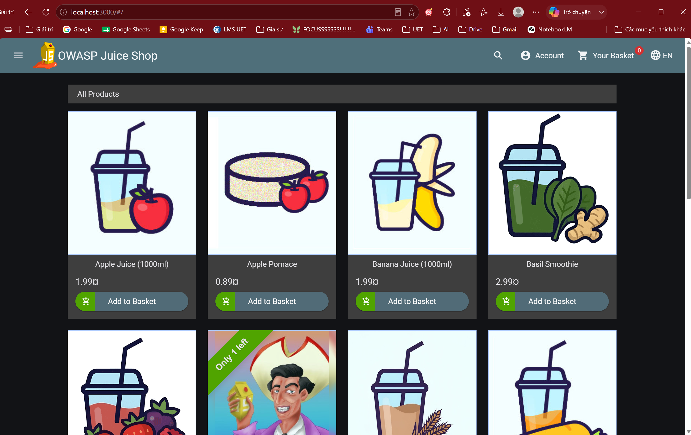

# Task Submission Template

## Task: `Week 5 - Day 6 (DAST & Gate Fail)`

- **Intern**: `Nguyễn Quang Dũng`
- **Phase / Week / Day**: `Phase 2 / Week 5 / Day 6`
- **Branch**: `phase-2/week-5`
- **Submitted at**: `2026-07-27 10:58` (timezone +07)
- **Time spent**: `5h`

## 1. Mục tiêu

## 2. Cách chạy
**Bước 1: Khởi chạy ứng dụng mục tiêu (OWASP Juice Shop)**
- Juice Shop là một ứng dụng web nổi tiếng do tổ chức OWASP tạo ra, cố tình chứa hàng tá lỗ hổng bảo mật (XSS, SQLi, Broken Auth...) để làm bia tập bắn cho các công cụ bảo mật.
- Khởi chạy Juice Shop dưới background bằng Docker:
  ```bash
  docker run -d --name juice-shop -p 3000:3000 bkimminich/juice-shop
  ```
- Mở trình duyệt và truy cập [`http://localhost:3000`](http://localhost:3000) để đảm bảo ứng dụng đã hoạt động.


**Bước 2: Tấn công DAST bằng OWASP ZAP (Baseline Scan)**
- OWASP ZAP cung cấp một Docker Image đóng gói sẵn CLI, cực kỳ thuận tiện để nhúng vào pipeline CI/CD mà không cần cài đặt rườm rà.
- Chạy lệnh sau để ZAP bắt đầu cào (spider) và tấn công vào Juice Shop. Lệnh này sẽ mất khoảng 1-2 phút:
  ```bash
  docker run -t ghcr.io/zaproxy/zaproxy:stable zap-baseline.py -t http://host.docker.internal:3000 > warning.txt
  ```
  *(Lưu ý: Do sử dụng Docker trên Windows, ta phải dùng địa chỉ `http://host.docker.internal:3000` để Container chứa ZAP có thể kết nối tới Container chứa Juice Shop thông qua mạng nội bộ của Host).*
  Kết quả: [`warning.txt`](./warning.txt)

**Bước 3: Hiểu cơ chế Gate Fail chặn Pipeline**
- Sau khi quá trình quét kết thúc, Terminal sẽ hiển thị hàng loạt các cảnh báo (WARN) hoặc lỗi (FAIL). 
- Một tính năng quan trọng của ZAP CLI là nó sẽ tự động trả về **Exit Code 1** (nếu phát hiện ra lỗ hổng). Trong môi trường CI/CD như GitHub Actions, bất kỳ lệnh nào trả về Exit Code 1 đều sẽ lập tức đánh đỏ (Fail) toàn bộ Pipeline, cấm không cho code được Deploy đi tiếp. Đó chính là khái niệm **Gate Fail**.
- *(Chèn ảnh chụp màn hình Terminal hiển thị kết quả quét của ZAP với danh sách lỗi tại đây)*.

**Bước 4: Dọn dẹp môi trường**
- Sau khi có ảnh báo cáo, ta tiến hành xóa bỏ ứng dụng mục tiêu:
  ```bash
  docker rm -f juice-shop
  ```

## 3. Kết quả
Dựa vào báo cáo log (chi tiết tại [warning.txt](./warning.txt)), quá trình quét DAST bằng OWASP ZAP đã đi qua 158 URLs và phát hiện 8 loại cảnh báo bảo mật (WARN). Dưới đây là phân tích kỹ thuật về các rủi ro cấu hình tiêu biểu:

1. **Content Security Policy (CSP) Header Not Set (10038):** Ứng dụng thiếu vắng Header cấu hình CSP. Điều này tạo điều kiện thuận lợi cho các cuộc tấn công chèn mã độc XSS (Cross-Site Scripting), vì trình duyệt không có cơ chế chặn các script độc hại đến từ tên miền lạ.
2. **Dangerous JS Functions (10110):** Công cụ phát hiện việc sử dụng các hàm JavaScript được đánh giá là nguy hiểm (có thể là `eval()`, `setTimeout(string)`) bên trong file mã nguồn. Điều này tiềm ẩn nguy cơ thực thi mã độc tùy ý (RCE) ngay trên trình duyệt của người dùng.
3. **Cross-Origin-Embedder-Policy Header Missing (90004):** Thiếu cơ chế kiểm soát chia sẻ tài nguyên đa nguồn gốc (COEP), khiến hệ thống dễ bị tổn thương trước các kiểu tấn công khai thác bộ nhớ (ví dụ: Spectre).
4. **Cross-Domain Misconfiguration (10098) & Deprecated Feature Policy (10063):** Việc cấu hình sai chính sách chia sẻ tài nguyên (CORS) hoặc sử dụng các Header đã lỗi thời có thể dẫn tới các lỗ hổng giả mạo yêu cầu (CSRF).
5. **Timestamp Disclosure & Cacheable Content:** Ứng dụng để lộ thông tin thời gian hệ thống và cho phép trình duyệt lưu bộ đệm (cache) các nội dung tĩnh. Hacker có thể lợi dụng những thông tin rò rỉ này để vẽ nên sơ đồ cấu trúc của Server.

**Kết luận về Gate Fail:** 
Mặc dù ở mức Baseline Scan mặc định, các lỗi này chỉ bị đánh giá ở mức WARN (Exit Code 2 hoặc 0). Tuy nhiên, trong thực tiễn CI/CD, DevSecOps hoàn toàn có quyền viết đè file cấu hình (Rules) của ZAP để thăng cấp các lỗi như **Thiếu Header CSP** hay **Hàm JS Nguy hiểm** lên mức **FAIL**. Khi đó, Gate Fail sẽ lập tức nhả Exit Code 1 và đánh gục Pipeline.

## 4. Khó khăn & cách giải quyết

## 5. Reference

## 6. Self-check
- [x] Code chạy được trên máy sạch.
- [x] README có hướng dẫn run lại.
- [x] Không hard-code secret.
- [x] Commit message theo Conventional Commits.
- [x] Đã review lại code 1 lượt.
