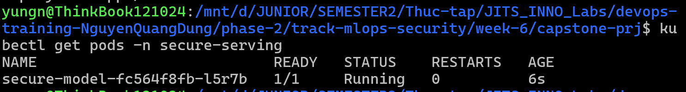
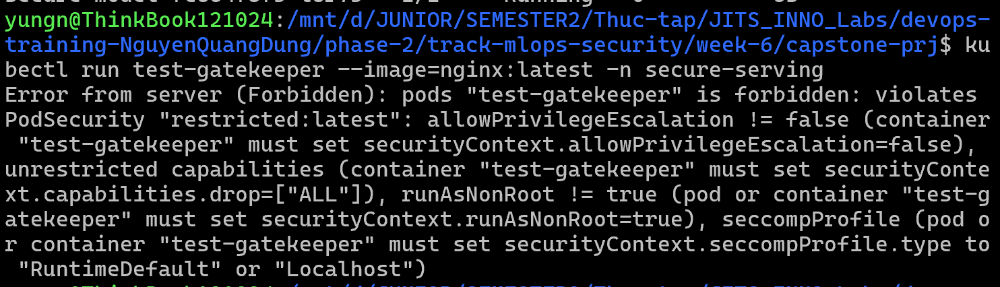
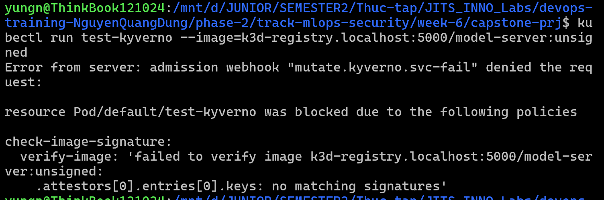
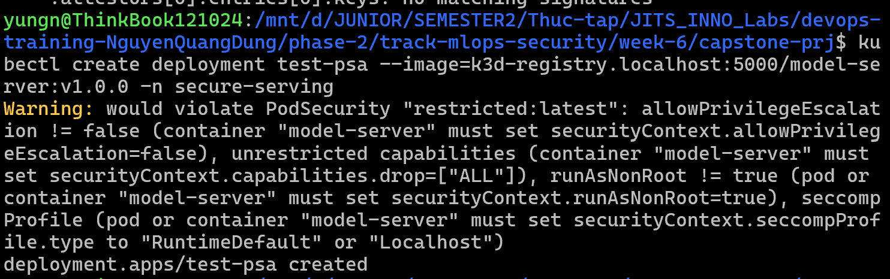
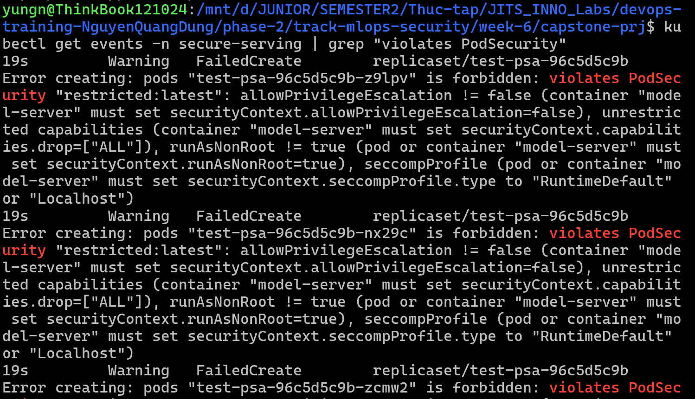
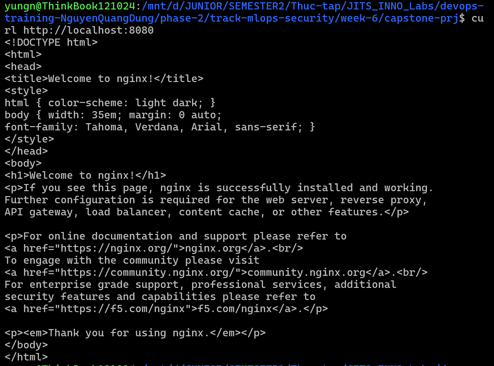

# Task Submission Template

## Task: `End-of-Week Mini Project: Secure MLOps Serving Pipeline`

- **Intern**: `Nguyễn Quang Dũng`
- **Phase / Week / Day**: `Phase 2 / Week 6 / Capstone`
- **Branch**: `phase-2/week-6`
- **Submitted at**: `2026-07-26 23:59` (timezone +07)
- **Time spent**: `6h`

## 1. Mục tiêu
Bài kiểm tra tổng hợp tuần 6 yêu cầu xây dựng một luồng triển khai mô hình học máy (MLOps) đi kèm với các tiêu chuẩn bảo mật khắt khe (DevSecOps).
- Triển khai mô hình AI sử dụng kiến trúc Kubernetes chuẩn.
- Áp dụng Zero-Trust cho chuỗi cung ứng thông qua Cosign (ký số) và Kyverno (xác minh chữ ký).
- Bảo vệ cụm Kubernetes ở mức độ Runtime bằng Pod Security Admission (PSA) và OPA Gatekeeper.

## 2. Kiến trúc hệ thống và luồng hoạt động
1. **Build & Sign**: Đóng gói mô hình thành Docker Image, đẩy lên Registry và ký số bằng Cosign.
2. **Admission Control**:
   - **Kyverno**: Chặn Image không có chữ ký hợp lệ.
   - **OPA Gatekeeper**: Từ chối mọi Image sử dụng tag `:latest`.
   - **PSA (Restricted)**: Ép buộc Pod phải chạy quyền Non-Root và xóa bỏ toàn bộ Capabilities.
3. **Serving**: Khởi tạo Deployment để phục vụ mô hình một cách an toàn.

## 3. Các bước thực hiện

**Bước 1: Khởi tạo Cơ sở hạ tầng**
- Khởi tạo Local Registry và Cluster k3d:
  ```bash
  k3d registry create registry.localhost --port 5000
  k3d cluster create secure-mlops --registry-use k3d-registry.localhost:5000
  ```
- Cài đặt Kyverno:
  ```bash
  kubectl create -f https://github.com/kyverno/kyverno/releases/download/v1.11.4/install.yaml
  kubectl wait --for=condition=ready pod --all -n kyverno --timeout=300s
  ```
- Cài đặt OPA Gatekeeper:
  ```bash
  kubectl apply -f https://raw.githubusercontent.com/open-policy-agent/gatekeeper/v3.16.0/deploy/gatekeeper.yaml
  kubectl wait --for=condition=ready pod --all -n gatekeeper-system --timeout=300s
  ```

**Bước 2: Cấu hình chính sách bảo mật (Security Policies)**
- Tạo namespace `secure-serving` và áp dụng chuẩn **PSA Restricted**:
  ```bash
  kubectl create namespace secure-serving
  kubectl label --overwrite ns secure-serving pod-security.kubernetes.io/enforce=restricted
  ```
- Cấu hình **Kyverno** kiểm tra chữ ký (Tạo file [`kyverno-policy.yaml`](./kyverno-policy.yaml)):
  ```bash
  cosign generate-key-pair
  ```
  Tạo file [`kyverno-policy.yaml`](./kyverno-policy.yaml), thay thế nội dung Public Key vào:
  ```yaml
  apiVersion: kyverno.io/v1
  kind: ClusterPolicy
  metadata:
    name: check-image-signature
  spec:
    validationFailureAction: Enforce
    background: false
    rules:
      - name: verify-image
        match:
          any:
          - resources:
              kinds:
                - Pod
        verifyImages:
        - imageReferences:
          - "k3d-registry.localhost:5000/*"
          attestors:
          - entries:
            - keys:
                publicKeys: |-
                  -----BEGIN PUBLIC KEY-----
                  
                  -----END PUBLIC KEY-----
                rekor:
                  url: https://rekor.sigstore.dev
                  ignoreTlog: true
  ```
  ```bash
  kubectl apply -f kyverno-policy.yaml
  ```
- Cấu hình **Gatekeeper** cấm tag `:latest` (bằng file [`gatekeeper-policy.yaml`](./gatekeeper-policy.yaml)):
  ```yaml
  apiVersion: templates.gatekeeper.sh/v1beta1
  kind: ConstraintTemplate
  metadata:
    name: k8sblocklatesttag
  spec:
    crd:
      spec:
        names:
          kind: K8sBlockLatestTag
    targets:
      - target: admission.k8s.gatekeeper.sh
        rego: |
          package k8sblocklatesttag
          violation[{"msg": msg}] {
            container := input.review.object.spec.containers[_]
            endswith(container.image, ":latest")
            msg := sprintf("Container <%v> uses a forbidden :latest tag", [container.name])
          }
  ---
  apiVersion: constraints.gatekeeper.sh/v1beta1
  kind: K8sBlockLatestTag
  metadata:
    name: block-latest-tag
  spec:
    match:
      kinds:
        - apiGroups: [""]
          kinds: ["Pod"]
  ```
  ```bash
  kubectl apply -f gatekeeper-policy.yaml
  ```

**Bước 3: Chuẩn bị mô hình và Ký số (Image Signing)**
- Lấy một base image chuyên dụng chạy quyền Non-Root (Nginx Unprivileged), gắn tag version cụ thể `v1.0.0` (không dùng `:latest`) và đẩy lên Registry:
  ```bash
  docker pull nginxinc/nginx-unprivileged:alpine
  docker tag nginxinc/nginx-unprivileged:alpine localhost:5000/model-server:v1.0.0
  docker push localhost:5000/model-server:v1.0.0
  ```
- Ký số lên Image bằng Private Key:
  ```bash
  cosign sign --key cosign.key localhost:5000/model-server:v1.0.0 --tlog-upload=false
  ```

**Bước 4: Triển khai Mô hình An toàn**
- Tạo file [`model-deployment.yaml`](./model-deployment.yaml). Cấu hình đã được thiết lập `securityContext` cực kỳ nghiêm ngặt để thỏa mãn PSA Restricted:
  ```yaml
  apiVersion: apps/v1
  kind: Deployment
  metadata:
    name: secure-model
    namespace: secure-serving
  spec:
    replicas: 1
    selector:
      matchLabels:
        app: model
    template:
      metadata:
        labels:
          app: model
      spec:
        securityContext:
          runAsNonRoot: true
          runAsUser: 101
          runAsGroup: 101
          fsGroup: 101
          seccompProfile:
            type: RuntimeDefault
        containers:
        - name: server
          image: k3d-registry.localhost:5000/model-server:v1.0.0
          securityContext:
            allowPrivilegeEscalation: false
            capabilities:
              drop:
                - ALL
  ```
- Tiến hành triển khai:
  ```bash
  kubectl apply -f model-deployment.yaml
  ```
- Quá trình kiểm tra Pod vượt qua 3 lớp bảo vệ và khởi tạo thành công:
  ```bash
  kubectl get pods -n secure-serving
  ```
  

**Bước 5: Kiểm tra các lớp bảo mật (Negative Testing)**
Quá trình kiểm tra hệ thống DevSecOps được thực hiện bằng cách cố tình vi phạm các quy tắc:
1. **Kiểm tra Gatekeeper (Chặn tag `:latest`)**:
   - Quá trình kiểm tra được thực hiện ở namespace `default` (chưa bật PSA) để vượt qua lớp khiên PSA và kiểm chứng trực tiếp khiên Gatekeeper:
   ```bash
   kubectl run test-gatekeeper --image=nginx:latest
   ```
   - Kết quả: Bị từ chối (denied) do vi phạm lỗi "forbidden :latest tag" từ Gatekeeper.
   
2. **Kiểm tra Kyverno (Chặn Image chưa ký số)**:
   ```bash
   # Tải và đẩy một image hoàn toàn khác (để có mã Digest khác) và KHÔNG ký số
   docker pull httpd:alpine
   docker tag httpd:alpine localhost:5000/model-server:unsigned
   docker push localhost:5000/model-server:unsigned
   
   # Khởi tạo Pod bằng image này (ở namespace default để tránh bị PSA chặn trước)
   kubectl run test-kyverno --image=k3d-registry.localhost:5000/model-server:unsigned
   ```
    - Kết quả: Bị denied do Kyverno báo lỗi "signature not found".
    
3. **Kiểm tra PSA Restricted (Chặn Pod chạy dưới quyền Root)**:
   - Tiến hành tạo một Deployment không cấu hình SecurityContext (mặc định sẽ chạy quyền root):
   ```bash
   kubectl create deployment test-psa --image=k3d-registry.localhost:5000/model-server:v1.0.0 -n secure-serving
   ```
   - Khi chạy lệnh trên, hệ thống sẽ lập tức trả về một cảnh báo (`Warning: would violate PodSecurity...`). Mặc dù kết quả hiển thị `deployment.apps/test-psa created` (vì PSA cho phép tạo đối tượng Deployment), nhưng các Pod thực tế sinh ra bởi ReplicaSet sẽ bị chặn lại hoàn toàn.
   
   - Quá trình kiểm tra sự kiện của ReplicaSet xác nhận các Pod không thể khởi tạo:
   ```bash
   kubectl get events -n secure-serving | grep "violates PodSecurity"
   ```
    - Kết quả: Các Pod bị denied do PSA báo lỗi "violates PodSecurity".
    

**Bước 6: Gửi request sử dụng model**
- Port-forward Port của mô hình an toàn (`secure-model`) ra máy Host để truy cập:
  ```bash
  kubectl port-forward deploy/secure-model -n secure-serving 8080:8080
  ```
- Mở một Terminal khác và gửi request tới mô hình giả lập (Nginx API):
  ```bash
  curl http://localhost:8080.
  ```
  - Kết quả: Trả về trang HTML / JSON thành công (Welcome to nginx!), chứng minh luồng Serving MLOps an toàn đã hoạt động trơn tru
  

**Bước 7: Dọn dẹp hệ thống**

  ```bash
  k3d cluster delete secure-mlops
  k3d registry delete k3d-registry.localhost
  ```

## 4. Kết quả

## 5. Khó khăn & cách giải quyết
- **Khó khăn**: Việc tích hợp đồng thời 3 hệ thống Admission Controller (PSA, Kyverno, Gatekeeper) đòi hỏi Image và cấu hình YAML của Deployment phải tuân thủ nghiêm ngặt mọi quy tắc bảo mật từ giai đoạn Build đến Deploy.
- **Cách giải quyết**: Đảm bảo quy trình tuần tự: Đóng gói với phiên bản cụ thể (tránh `:latest`), cấu hình `securityContext` kỹ lưỡng trong file Deployment, và hoàn thành thủ tục ký số Image trước khi thực hiện gửi request lên API Server.

## 6. Self-check
- [x] Code chạy được trên máy sạch.
- [x] README có hướng dẫn run lại.
- [x] Không hard-code secret.
- [x] Commit message theo Conventional Commits.
- [x] Review lại code 1 lượt.
