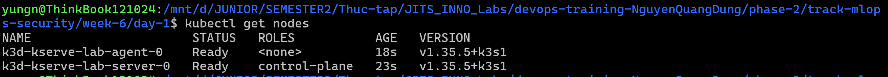
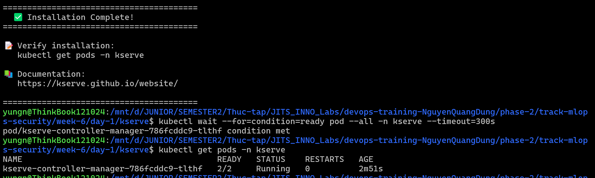
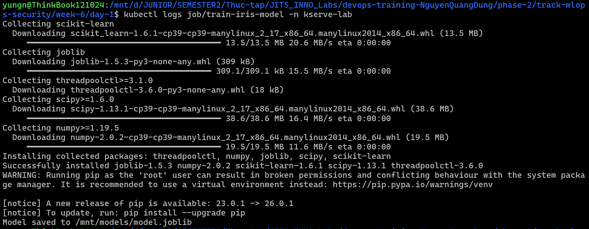
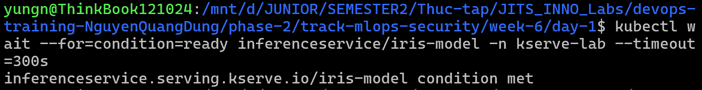
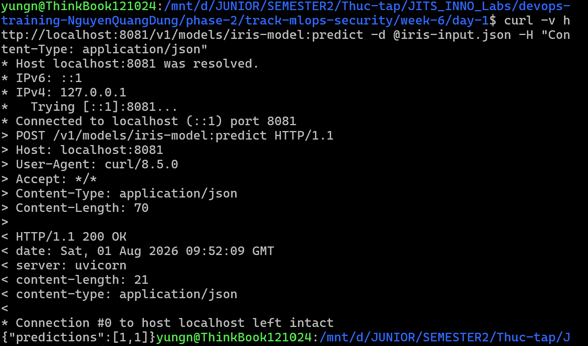

# Task Submission Template

## Task: `MLOps - Model Serving với KServe`

- **Intern**: `Nguyễn Quang Dũng`
- **Phase / Week / Day**: `Phase 2 / Week 6 / Day 1`
- **Branch**: `phase-2/week-6`
- **Submitted at**: `2026-08-02 01:31` (timezone +07)
- **Time spent**: `9h`

## 1. Mục tiêu
- Cài đặt KServe lên Kubernetes Cluster (k3d) ở chế độ RawDeployment.
- Huấn luyện một mô hình Scikit-Learn đơn giản (Iris Classification), lưu file model lên PVC.
- Tạo InferenceService để phục vụ mô hình đó thông qua KServe.
- Gửi request suy luận và nhận kết quả dự đoán thành công.

## 2. Cách chạy

**Bước 1: Khởi tạo Kubernetes Cluster bằng k3d**
- Tạo một Cluster k3d có tên `kserve-lab`:
  ```bash
  k3d cluster create kserve-lab --agents 1 -p "8082:80@loadbalancer"
  ```
- Kiểm tra Cluster đã sẵn sàng:
  ```bash
  kubectl get nodes
  ```
  

**Bước 2: Cài đặt KServe (chế độ RawDeployment)**
- Ta sử dụng chế độ RawDeployment để tránh phải cài Knative và Istio (nặng và phức tạp cho môi trường Lab). Chế độ này dùng Kubernetes Deployment + Service + HPA thuần túy.
- Cài đặt công cụ `kustomize` và `jq` (bắt buộc cho script cài đặt của KServe):
  ```bash
  sudo apt-get update && sudo apt-get install jq -y
  curl -s "https://raw.githubusercontent.com/kubernetes-sigs/kustomize/master/hack/install_kustomize.sh" | bash
  sudo mv kustomize /usr/local/bin/
  ```
- Clone repository KServe và chạy script cài đặt:
  ```bash
  git clone https://github.com/kserve/kserve.git
  cd kserve
  ./hack/kserve-install.sh -r --kustomize
  ```
- Đợi KServe Controller sẵn sàng:
  ```bash
  kubectl wait --for=condition=ready pod --all -n kserve --timeout=300s
  ```
- Cài đặt các ClusterServingRuntime mặc định (bắt buộc để chạy được mô hình sklearn, xgboost...):
  ```bash
  kubectl apply -k config/runtimes
  ```
- Quay trở lại thư mục gốc của ngày 1:
  ```bash
  cd ..
  ```
- Kiểm tra KServe đã cài thành công:
  ```bash
  kubectl get pods -n kserve
  ```
  

**Bước 4: Huấn luyện mô hình và lưu lên PVC**
- Tạo Namespace riêng cho bài Lab:
  ```bash
  kubectl create namespace kserve-lab
  ```
- Tạo PersistentVolumeClaim để lưu trữ file model. Tạo file [`pvc.yaml`](./pvc.yaml):
  ```yaml
  apiVersion: v1
  kind: PersistentVolumeClaim
  metadata:
    name: model-storage
    namespace: kserve-lab
  spec:
    accessModes:
      - ReadWriteOnce
    resources:
      requests:
        storage: 1Gi
  ```
  ```bash
  kubectl apply -f pvc.yaml
  ```
- Tạo file [`train.py`](./train.py) để huấn luyện mô hình Iris Classification và lưu ra file `model.joblib`:
  ```python
  from sklearn.datasets import load_iris
  from sklearn.ensemble import RandomForestClassifier
  import joblib
  import os

  # Tải dataset Iris
  iris = load_iris()
  X, y = iris.data, iris.target

  # Huấn luyện mô hình
  model = RandomForestClassifier(n_estimators=100, random_state=42)
  model.fit(X, y)

  # Lưu file model
  output_dir = "/mnt/models"
  os.makedirs(output_dir, exist_ok=True)
  model_path = os.path.join(output_dir, "model.joblib")
  joblib.dump(model, model_path)
  print(f"Model saved to {model_path}")
  ```
- Tạo file [`train-job.yaml`](./train-job.yaml) để chạy huấn luyện dưới dạng Kubernetes Job, mount PVC vào `/mnt/models`:
  ```yaml
  apiVersion: batch/v1
  kind: Job
  metadata:
    name: train-iris-model
    namespace: kserve-lab
  spec:
    template:
      spec:
        containers:
          - name: trainer
            image: python:3.9-slim
            command: ["bash", "-c"]
            args:
              - |
                pip install scikit-learn joblib && python /scripts/train.py
            volumeMounts:
              - name: model-volume
                mountPath: /mnt/models
              - name: script-volume
                mountPath: /scripts
        volumes:
          - name: model-volume
            persistentVolumeClaim:
              claimName: model-storage
          - name: script-volume
            configMap:
              name: train-script
        restartPolicy: Never
    backoffLimit: 1
  ```
- Tạo ConfigMap chứa nội dung file `train.py` và chạy Job:
  ```bash
  kubectl create configmap train-script --from-file=train.py -n kserve-lab
  kubectl apply -f train-job.yaml
  ```
- Đợi Job hoàn tất:
  ```bash
  kubectl wait --for=condition=complete job/train-iris-model -n kserve-lab --timeout=300s
  kubectl logs job/train-iris-model -n kserve-lab
  ```
    

**Bước 5: Tạo InferenceService triển khai mô hình**
- Tạo file [`inference-service.yaml`](./inference-service.yaml). InferenceService sẽ đọc file model từ PVC và phục vụ suy luận qua giao thức V2:
  ```yaml
  apiVersion: "serving.kserve.io/v1beta1"
  kind: "InferenceService"
  metadata:
    name: "iris-model"
    namespace: "kserve-lab"
    annotations:
      serving.kserve.io/deploymentMode: RawDeployment
  spec:
    predictor:
      model:
        modelFormat:
          name: sklearn
        storageUri: "pvc://model-storage"
        resources:
          requests:
            cpu: 100m
            memory: 256Mi
          limits:
            cpu: 500m
            memory: 512Mi
  ```
  ```bash
  kubectl apply -f inference-service.yaml
  ```
- Kiểm tra trạng thái InferenceService:
  ```bash
  kubectl get inferenceservice iris-model -n kserve-lab
  ```
- Đợi cho đến khi cột READY chuyển thành True:
  ```bash
  kubectl wait --for=condition=ready inferenceservice/iris-model -n kserve-lab --timeout=300s
  ```
  

**Bước 6: Gửi request suy luận và kiểm tra kết quả**
- Tạo file [`iris-input.json`](./iris-input.json) chứa dữ liệu đầu vào (2 mẫu hoa Iris):
  ```json
  {
    "instances": [
      [6.8, 2.8, 4.8, 1.4],
      [6.0, 3.4, 4.5, 1.6]
    ]
  }
  ```
- Port-forward Service của InferenceService để truy cập từ máy Host:
  ```bash
  kubectl port-forward svc/iris-model-predictor -n kserve-lab 8081:80
  ```
- Mở Terminal mới và gửi request suy luận bằng curl:
  ```bash
  curl -v http://localhost:8081/v1/models/iris-model:predict -d @input.json -H "Content-Type: application/json"
  ```
- Kết quả trả về:
  ```json
  {
    "predictions": [1, 1]
  }
  ```
  Kết quả `[1, 1]` nghĩa là cả hai mẫu dữ liệu đầu vào đều được phân loại vào loài Iris Versicolor (class 1 trong dataset Iris).
  

**Bước 7: Dọn dẹp tài nguyên**
- Sau khi hoàn tất bài Lab, xóa toàn bộ tài nguyên đã tạo:
  ```bash
  kubectl delete inferenceservice iris-model -n kserve-lab
  kubectl delete job train-iris-model -n kserve-lab
  kubectl delete configmap train-script -n kserve-lab
  kubectl delete pvc model-storage -n kserve-lab
  kubectl delete namespace kserve-lab
  k3d cluster delete kserve-lab
  ```

## 3. Kết quả

## 4. Khó khăn & cách giải quyết

## 5. Reference
- [KServe Documentation](https://kserve.github.io/kserve/latest/)
- [KServe GitHub](https://github.com/kserve/kserve)
- [First InferenceService](https://kserve.github.io/kserve/latest/get_started/first_isvc/)

## 6. Self-check
- [ ] Code chạy được trên máy sạch.
- [ ] README có hướng dẫn run lại.
- [ ] Không hard-code secret.
- [ ] Commit message theo Conventional Commits.
- [ ] Đã review lại code 1 lượt.
