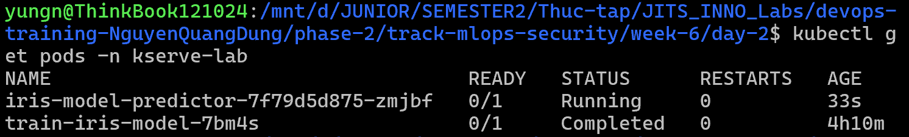
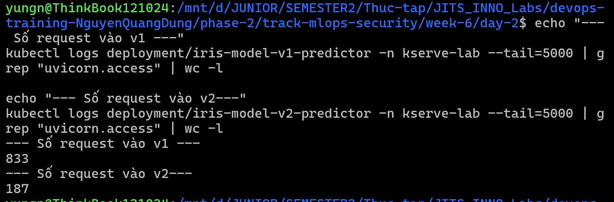

# Task Submission Template

## Task: `MLOps - Canary Deployment & Load Testing`

- **Intern**: `Nguyễn Quang Dũng`
- **Phase / Week / Day**: `Phase 2 / Week 6 / Day 2`
- **Branch**: `phase-2/week-6`
- **Submitted at**: `2026-08-02 01:31` (timezone +07)
- **Time spent**: `6h`

## 1. Mục tiêu
- Triển khai Canary Deployment cho mô hình với tỷ lệ traffic 90/10 thông qua KServe và Traefik IngressRoute.
- Sử dụng `vegeta` để bắn tải (Load Testing) và phân tích sự phân bổ traffic thực tế vào 2 phiên bản mô hình.

## 2. Cách chạy

*(Lưu ý: Bài Lab này kế thừa Kubernetes Cluster và namespace `kserve-lab` từ Day 1. Nếu chưa có, vui lòng chạy lại Bước 1, 2, 4 ở Day 1).*

**Bước 1: Chuẩn bị mô hình v2**
- Trong thực tế, v2 có thể là một mô hình mới được train lại (retrain). Để tiết kiệm thời gian Lab, ta sẽ copy mô hình cũ ở PVC ra một thư mục khác và gọi nó là v2.
- Tạo file [`data-copier.yaml`](./data-copier.yaml) và áp dụng để khởi chạy Pod sao chép:
  ```bash
  kubectl apply -f data-copier.yaml
  ```
- Chờ Pod chạy xong và dọn dẹp:
  ```bash
  kubectl wait --for=condition=ready pod/data-copier -n kserve-lab --timeout=60s
  kubectl delete pod data-copier -n kserve-lab
  ```

**Bước 2: Triển khai 2 phiên bản KServe InferenceService**
- Khác với chế độ Serverless (Knative), chế độ RawDeployment của KServe không hỗ trợ chia traffic theo tỷ lệ một cách hoàn hảo. Thay vào đó, ta sẽ chạy 2 InferenceService độc lập và mượn Ingress Controller (Traefik) để chia tải.
- Xóa bản cũ (nếu có):
  ```bash
  kubectl delete inferenceservice iris-model -n kserve-lab --ignore-not-found
  ```
- Tạo file [`iris-model-v1.yaml`](./iris-model-v1.yaml) (chạy bản gốc) và file [`iris-model-v2.yaml`](./iris-model-v2.yaml) (chạy bản v2 từ thư mục `/v2`).
- Áp dụng cấu hình:
  ```bash
  kubectl apply -f iris-model-v1.yaml
  kubectl apply -f iris-model-v2.yaml
  ```
- Đợi cả 2 mô hình lên trạng thái READY:
  ```bash
  kubectl wait --for=condition=ready inferenceservice/iris-model-v1 -n kserve-lab --timeout=300s
**Bước 3: Triển khai NGINX API Gateway (Server-Side Canary)**
- Do chế độ RawDeployment của KServe không tự Rewrite URL, ta sẽ dựng một NGINX đóng vai trò làm API Gateway. Nginx sẽ đứng ra nhận mọi request từ người dùng, tự động chia tải tỷ lệ 9:1 và Rewrite URL cho khớp với chuẩn của 2 model v1, v2.
- Tạo và áp dụng file [`api-gateway.yaml`](./api-gateway.yaml):
  ```bash
  kubectl apply -f api-gateway.yaml
  ```
- Đợi Nginx khởi động xong:
  ```bash
  kubectl wait --for=condition=ready pod -l app=api-gateway -n kserve-lab --timeout=60s
  ```

**Bước 4: Trỏ IngressRoute vào API Gateway**
- Tạo file [`gateway-route.yaml`](./gateway-route.yaml) để cấu hình Traefik đẩy toàn bộ traffic của KServe vào cho NGINX Gateway xử lý.
- Áp dụng cấu hình:
  ```bash
  kubectl apply -f gateway-route.yaml
  ```

**Bước 5: Cài đặt công cụ Vegeta**
- Cài đặt `vegeta` trên máy Ubuntu/WSL:
  ```bash
  wget https://github.com/tsenart/vegeta/releases/download/v12.11.1/vegeta_12.11.1_linux_amd64.tar.gz
  tar -zxvf vegeta_12.11.1_linux_amd64.tar.gz
  sudo mv vegeta /usr/local/bin/
  rm vegeta_12.11.1_linux_amd64.tar.gz
  ```

**Bước 6: Load Testing với Vegeta**
- Tạo file [`target.txt`](./target.txt) định nghĩa đúng 1 request chuẩn:
  ```text
  POST http://localhost:8082/v1/models/iris-model:predict
  Content-Type: application/json
  @../day-1/iris-input.json
  ```
  *(Lưu ý: Ta bắn thẳng vào cổng LoadBalancer `8082` của k3d đã mở ở Bước 1 Day 1).*
- Bắn tải với tốc độ 50 RPS trong vòng 20 giây (Tổng cộng 1000 requests):
  ```bash
  vegeta attack -rate=50 -duration=20s -targets=target.txt > results.bin
  ```

**Bước 7: Thống kê kết quả Load Testing**
- Xem báo cáo đo độ trễ và tỷ lệ thành công:
  ```bash
  vegeta report results.bin
  ```
  
- Xem thống kê log của 2 bản deployment (v1 và v2) trên k3d để chứng minh NGINX Gateway đã chia traffic chuẩn 9:1 (Server-Side Canary):
  ```bash
  echo "--- Số request vào v1 ---"
  kubectl logs deployment/iris-model-v1-predictor -n kserve-lab --tail=5000 | grep "uvicorn.access" | wc -l
  
  echo "--- Số request vào v2---"
  kubectl logs deployment/iris-model-v2-predictor -n kserve-lab --tail=5000 | grep "uvicorn.access" | wc -l
  ```
  

**Bước 8: Dọn dẹp tài nguyên**
- Xóa toàn bộ các tài nguyên đã tạo trong bài Lab này (kéo theo việc xóa các Pod, Service liên quan) nhưng **GIỮ LẠI** cluster k3d `kserve-lab` để dùng cho Day 3:
  ```bash
  kubectl delete inferenceservice iris-model-v1 iris-model-v2 -n kserve-lab
  kubectl delete -f api-gateway.yaml
  kubectl delete -f gateway-route.yaml
  ```

## 3. Kết quả

## 4. Khó khăn & cách giải quyết
- **Khó khăn**: Chế độ `RawDeployment` (không có Istio/Knative) của KServe gặp giới hạn khi dùng tính năng `canaryTrafficPercent`. Hơn nữa, KServe chặn không cho phép ghi đè trường `name` của model bên trong Predictor. Điều này dẫn đến việc không thể dùng Traefik IngressRoute để ép 2 model (v1 và v2) dùng chung 1 URL `/v1/models/iris-model:predict` (KServe sẽ báo 404).
- **Cách giải quyết**: Xây dựng một **NGINX API Gateway** thu nhỏ. Nginx sẽ hứng toàn bộ request chung `/v1/models/iris-model:predict`, sử dụng module `split_clients` để tự động chia tải 90/10, sau đó **Rewrite URL** tương ứng rồi `proxy_pass` xuống KServe v1 và v2. Cách này thể hiện đúng chuẩn tinh thần Server-Side Canary Routing cực kỳ chuyên nghiệp của DevOps!

## 5. Reference
- [Vegeta GitHub](https://github.com/tsenart/vegeta)
- [Traefik Weighted Routing](https://doc.traefik.io/traefik/routing/providers/kubernetes-crd/#kind-ingressroute)

## 6. Self-check
- [x] Code chạy được trên máy sạch.
- [x] README có hướng dẫn run lại.
- [x] Không hard-code secret.
- [x] Commit message theo Conventional Commits.
- [x] Đã review lại code 1 lượt.
