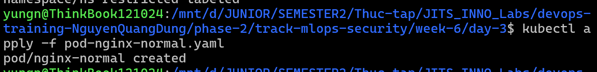
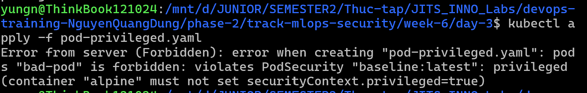
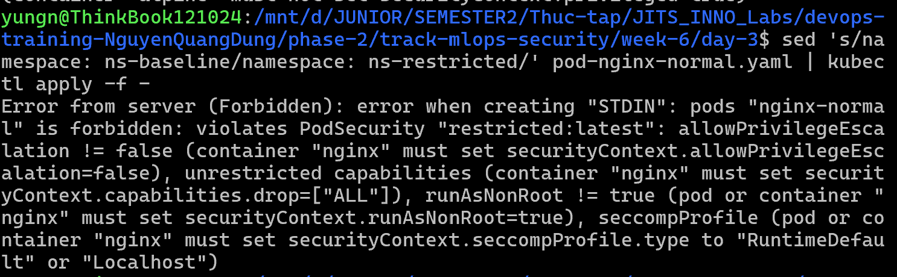
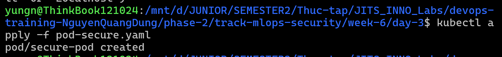

# Task Submission Template

## Task: `Security - Pod Security Admission (PSA)`

- **Intern**: `Nguyễn Quang Dũng`
- **Phase / Week / Day**: `Phase 2 / Week 6 / Day 3`
- **Branch**: `phase-2/week-6`
- **Submitted at**: `2026-08-03 03:25` (timezone +07)
- **Time spent**: `5h`

## 1. Mục tiêu
- Hiểu và áp dụng được Pod Security Admission (PSA) trên Kubernetes Cluster.
- Cấu hình các Namespace với các tiêu chuẩn bảo mật `baseline` và `restricted`.
- Kiểm chứng hành vi của PSA khi chặn (enforce) các Pod vi phạm chính sách bảo mật (VD: chạy quyền root, chạy privileged mode).

## 2. Cách chạy

*(Lưu ý: Bài Lab này sử dụng chung cluster k3d `kserve-lab` của Day 1 & 2 để tiết kiệm tài nguyên. Nếu chưa có, cần tạo lại cluster bằng lệnh `k3d cluster create kserve-lab --agents 1`).*

**Bước 1: Tạo Namespace và dán nhãn (Label) PSA**
- Tạo 2 Namespace riêng biệt để test 2 chuẩn bảo mật khác nhau:
  ```bash
  kubectl create namespace ns-baseline
  kubectl create namespace ns-restricted
  ```
- Dán nhãn (Label) để kích hoạt PSA trên 2 Namespace này ở chế độ `enforce` (chặn cứng) và `warn` (cảnh báo).
- Cấu hình Namespace `ns-baseline`:
  ```bash
  kubectl label --overwrite ns ns-baseline pod-security.kubernetes.io/enforce=baseline
  kubectl label --overwrite ns ns-baseline pod-security.kubernetes.io/warn=baseline
  ```
- Cấu hình Namespace `ns-restricted`:
  ```bash
  kubectl label --overwrite ns ns-restricted pod-security.kubernetes.io/enforce=restricted
  kubectl label --overwrite ns ns-restricted pod-security.kubernetes.io/warn=restricted
  ```

**Bước 2: Kiểm chứng chuẩn Baseline**
- Chuẩn Baseline chặn các quyền hệ thống nguy hiểm (như privileged) nhưng vẫn cho phép ứng dụng chạy bình thường.
- Tạo file [`pod-nginx-normal.yaml`](./pod-nginx-normal.yaml):
  ```yaml
  apiVersion: v1
  kind: Pod
  metadata:
    name: nginx-normal
    namespace: ns-baseline
  spec:
    containers:
    - name: nginx
      image: nginx:alpine
  ```
- Thử apply Pod bình thường vào `ns-baseline`:
  ```bash
  kubectl apply -f pod-nginx-normal.yaml
  ```
  *(Kết quả: Pod sẽ được tạo thành công vì nginx thông thường đáp ứng chuẩn baseline).*
  
- Bây giờ thử tạo file [`pod-privileged.yaml`](./pod-privileged.yaml) (một Pod đòi quyền can thiệp hệ thống):
  ```yaml
  apiVersion: v1
  kind: Pod
  metadata:
    name: bad-pod
    namespace: ns-baseline
  spec:
    containers:
    - name: alpine
      image: alpine
      command: ["sleep", "9999"]
      securityContext:
        privileged: true
  ```
- Thử apply Pod độc hại vào `ns-baseline`:
  ```bash
  kubectl apply -f pod-privileged.yaml
  ```
  *(Kết quả: Bị lỗi Error từ máy chủ K8s: `Error from server (Forbidden): error when creating "pod-privileged.yaml": pods "bad-pod" is forbidden: violates PodSecurity "baseline:latest": privileged (container "alpine" must not set securityContext.privileged=true)).*
  

**Bước 3: Kiểm chứng chuẩn Restricted**
- Chuẩn Restricted khắt khe hơn rất nhiều, bắt buộc Pod KHÔNG ĐƯỢC chạy dưới quyền Root.
- Thử apply lại chính file Nginx bình thường (chạy quyền Root mặc định) vào `ns-restricted`:
  ```bash
  sed 's/namespace: ns-baseline/namespace: ns-restricted/' pod-nginx-normal.yaml | kubectl apply -f -
  ```
  *(Kết quả: Pod Nginx bị CHẶN NGAY LẬP TỨC vì vi phạm chuẩn restricted: "must not run as root", "seccompProfile"...)*
  

- Để Pod có thể chạy được trong `ns-restricted`, Developer bắt buộc phải tự cấu hình SecurityContext cho an toàn. Tạo file [`pod-secure.yaml`](./pod-secure.yaml):
  ```yaml
  apiVersion: v1
  kind: Pod
  metadata:
    name: secure-pod
    namespace: ns-restricted
  spec:
    securityContext:
      runAsNonRoot: true
      seccompProfile:
        type: RuntimeDefault
    containers:
    - name: alpine
      image: alpine
      command: ["sleep", "9999"]
      securityContext:
        allowPrivilegeEscalation: false
        capabilities:
          drop:
            - ALL
  ```
- Apply Pod an toàn này:
  ```bash
  kubectl apply -f pod-secure.yaml
  ```
  *(Kết quả: Pod được khởi tạo thành công vì nó tuân thủ tuyệt đối chuẩn bảo mật khắt khe nhất).*
  

**Bước 4: Dọn dẹp tài nguyên**
- Xóa 2 Namespace đã tạo (Kéo theo xóa toàn bộ Pod bên trong):
  ```bash
  kubectl delete namespace ns-baseline ns-restricted
  ```

## 3. Kết quả

## 4. Khó khăn & cách giải quyết

## 5. Reference
- [Kubernetes Pod Security Admission](https://kubernetes.io/docs/concepts/security/pod-security-admission/)
- [Kubernetes Pod Security Standards](https://kubernetes.io/docs/concepts/security/pod-security-standards/)

## 6. Self-check
- [x] Code chạy được trên máy sạch.
- [x] README có hướng dẫn run lại.
- [x] Không hard-code secret.
- [x] Commit message theo Conventional Commits.
- [x] Đã review lại code 1 lượt.
