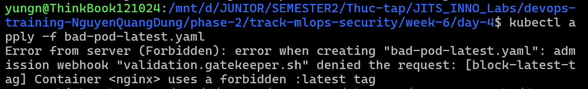
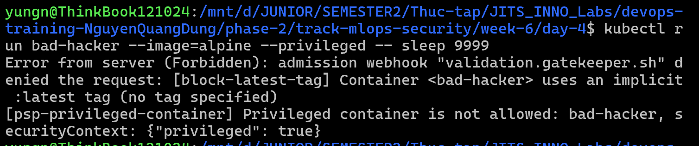

# Task Submission Template

## Task: `Security - OPA Gatekeeper`

- **Intern**: `Nguyễn Quang Dũng`
- **Phase / Week / Day**: `Phase 2 / Week 6 / Day 4`
- **Branch**: `phase-2/week-6`
- **Submitted at**: `2026-08-03 03:50:00` (timezone +07)
- **Time spent**: `5h`

## 1. Mục tiêu
- Cài đặt OPA Gatekeeper lên Kubernetes Cluster.
- Hiểu và áp dụng mô hình Policy as Code (ConstraintTemplate và Constraint).
- Viết luật (bằng Rego) cấm sử dụng image có tag `:latest`.
- Sử dụng thư viện Gatekeeper có sẵn để chặn các Pod chạy quyền Privileged và bắt buộc `runAsNonRoot`.

## 2. Cách chạy

**Bước 1: Khởi tạo Cluster mới & Cài đặt Gatekeeper**
- Tạo một cụm k3d mới:
  ```bash
  k3d cluster create security-lab --agents 1
  ```
- Cài đặt OPA Gatekeeper phiên bản ổn định mới nhất (v3.16.0) trực tiếp từ YAML chính thức:
  ```bash
  kubectl apply -f https://raw.githubusercontent.com/open-policy-agent/gatekeeper/v3.16.0/deploy/gatekeeper.yaml
  ```
- Chờ cho đến khi tất cả các Pod của Gatekeeper trong namespace `gatekeeper-system` đều ở trạng thái `Running`:
  ```bash
  kubectl get pods -n gatekeeper-system -w
  ```
  *(Bấm `Ctrl+C` để thoát khi thấy pods báo Running).*

**Bước 2: Viết luật tự định nghĩa (Custom Policy) cấm tag `:latest`**
- Trong thực tế, việc triển khai image với tag `:latest` tiềm ẩn rủi ro rất lớn (image bị thay đổi bất ngờ, không thể rollback chính xác).
- Áp dụng file [`template-block-latest.yaml`](./template-block-latest.yaml) (chứa mã nguồn logic Rego)
  ```bash
  kubectl apply -f template-block-latest.yaml
  ```
- Áp dụng file [`constraint-block-latest.yaml`](./constraint-block-latest.yaml) (kích hoạt luật đó vào các Pod):
  ```bash
  kubectl apply -f constraint-block-latest.yaml
  ```
- Đợi vài giây cho Gatekeeper đồng bộ luật, sau đó ta sẽ thử triển khai một Pod dùng tag `:latest` (file [`bad-pod-latest.yaml`](./bad-pod-latest.yaml)):
  ```bash
  kubectl apply -f bad-pod-latest.yaml
  ```
- Kết quả: Request bị chặn đứng bởi Gatekeeper Webhook kèm dòng chữ: `Container <nginx> uses a forbidden :latest tag`


**Bước 3: Tái sử dụng Gatekeeper Library (Chặn Privileged & NonRoot)**
- Thay vì tự viết code Rego mất thời gian, cộng đồng Gatekeeper đã xây dựng sẵn một thư viện đồ sộ. Ta sẽ kéo thẳng 2 luật quan trọng nhất về dùng.
- Kéo Template cấm Privileged Pod:
  ```bash
  kubectl apply -f https://raw.githubusercontent.com/open-policy-agent/gatekeeper-library/master/library/pod-security-policy/privileged-containers/template.yaml
  ```
- Áp dụng Constraint cấm Privileged trên toàn Cluster (chỉ bỏ qua namespace `kube-system` và `gatekeeper-system`):
  ```bash
  cat <<EOF | kubectl apply -f -
  apiVersion: constraints.gatekeeper.sh/v1beta1
  kind: K8sPSPPrivilegedContainer
  metadata:
    name: psp-privileged-container
  spec:
    match:
      kinds:
        - apiGroups: [""]
          kinds: ["Pod"]
      excludedNamespaces: ["kube-system", "gatekeeper-system"]
  EOF
  ```
- Thử hack bằng cách chạy một Pod Privileged trực tiếp:
  ```bash
  kubectl run bad-hacker --image=alpine --privileged -- sleep 9999
  ```
- Kết quả: Bị chặn đứng với lỗi: `Privileged container is not allowed...`


**Bước 4: Dọn dẹp tài nguyên**
- Xóa cụm k3d dùng riêng cho bài Lab này:
  ```bash
  k3d cluster delete security-lab
  ```

## 3. Kết quả

## 4. Khó khăn & cách giải quyết
- **Khó khăn**: Mặc dù OPA Gatekeeper mạnh hơn PSA (Pod Security Admission) rất nhiều, nhưng việc phải học ngôn ngữ **Rego** để viết `ConstraintTemplate` tạo ra rào cản lớn cho người mới.
- **Cách giải quyết**: Luôn tận dụng [Gatekeeper Library](https://github.com/open-policy-agent/gatekeeper-library) (thư viện cộng đồng) trước tiên. Hầu hết các chính sách bảo mật phổ biến (chặn HostNetwork, chặn Volume nguy hiểm, bắt buộc Resource Limits...) đều đã được viết sẵn template. Chỉ khi nào có policy nội bộ đặc thù của công ty (như cấm tag latest) thì mới cần tự viết.

## 5. Reference
- [OPA Gatekeeper](https://open-policy-agent.github.io/gatekeeper/website/docs/)
- [Gatekeeper Library GitHub](https://github.com/open-policy-agent/gatekeeper-library)

## 6. Self-check
- [x] Code chạy được trên máy sạch.
- [x] README có hướng dẫn run lại.
- [x] Không hard-code secret.
- [x] Commit message theo Conventional Commits.
- [x] Đã review lại code 1 lượt.
