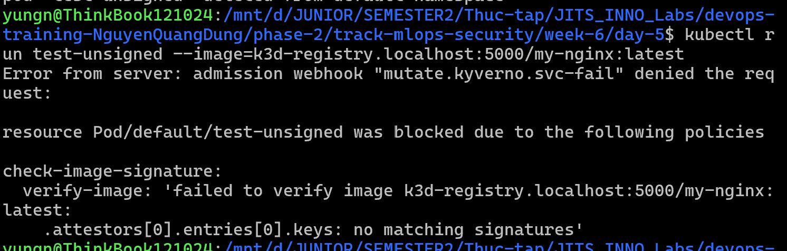
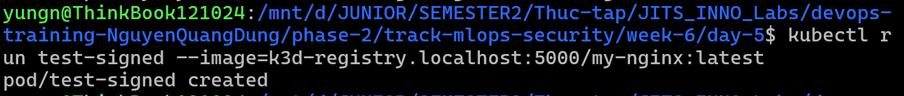

# Task Submission Template

## Task: `Security - Image Scanning & CI/CD Integration (Cosign & Kyverno)`

- **Intern**: `Nguyễn Quang Dũng`
- **Phase / Week / Day**: `Phase 2 / Week 6 / Day 5`
- **Branch**: `phase-2/week-6`
- **Submitted at**: `2026-07-26 23:00` (timezone +07)
- **Time spent**: ``

## 1. Mục tiêu
- Hiểu khái niệm Supply Chain Security và tầm quan trọng của quá trình Image Signing.
- Vận hành công cụ `cosign` để khởi tạo cặp khóa và ký lên Docker Image.
- Triển khai Kyverno làm Admission Controller nhằm tự động từ chối các Image không có chữ ký xác thực trong hệ thống Kubernetes.

## 2. Các bước thực hiện

**Bước 1: Khởi tạo Local Registry và Cluster**
- Để lưu trữ chữ ký số, Image cần được đẩy lên Docker Registry. Quá trình khởi tạo Registry cục bộ và kết nối k3d đã được thực hiện:
- Khởi tạo Registry nội bộ (hoạt động ở Port 5000):
  ```bash
  k3d registry create registry.localhost --port 5000
  ```
- Khởi tạo Cluster k3d tên `cosign-lab`, cấu hình nhận diện Registry:
  ```bash
  k3d cluster create cosign-lab --registry-use k3d-registry.localhost:5000
  ```

**Bước 2: Cài đặt công cụ Cosign**
- Quá trình tải và cấu hình `cosign` CLI cho môi trường Linux/WSL đã được thực hiện:
  ```bash
  wget https://github.com/sigstore/cosign/releases/download/v2.2.4/cosign-linux-amd64
  sudo mv cosign-linux-amd64 /usr/local/bin/cosign
  sudo chmod +x /usr/local/bin/cosign
  ```

**Bước 3: Khởi tạo khóa và cấu hình Image**
- Khởi tạo Public/Private Key bằng Cosign:
  ```bash
  cosign generate-key-pair
  ```
  *(Lệnh yêu cầu thiết lập mật khẩu (1111) bảo vệ cho file `cosign.key`. Hai file sẽ được sinh ra: [`cosign.key`](./cosign.key) và [`cosign.pub`](./cosign.pub))*
- Tải Image Nginx mẫu và đẩy lên Local Registry:
  ```bash
  docker pull nginx:alpine
  docker tag nginx:alpine localhost:5000/my-nginx:latest
  docker push localhost:5000/my-nginx:latest
  ```

**Bước 4: Cài đặt Kyverno**
- Cài đặt Kyverno vào Cluster thông qua cấu hình YAML chính thức:
  ```bash
  kubectl create -f https://github.com/kyverno/kyverno/releases/download/v1.11.4/install.yaml
  ```
- Quan sát cho đến khi hệ thống Kyverno hoàn tất quá trình khởi động:
  ```bash
  kubectl wait --for=condition=ready pod --all -n kyverno --timeout=300s
  ```

**Bước 5: Áp dụng Policy yêu cầu chữ ký**
- Lấy Public Key cosign vừa tạo:
  ```bash
  cat cosign.pub
  ```
- Mở file [`policy-verify-image.yaml`](./policy-verify-image.yaml).
  ```bash
  vi policy-verify-image.yaml
  ```
- Chèn sau dòng `publicKeys: |-` bằng nội dung của file [`cosign.pub`](./cosign.pub) vừa tạo.
- Áp dụng Policy vào Cluster:
  ```bash
  kubectl apply -f policy-verify-image.yaml
  ```

**Bước 6: Kiểm tra cơ chế Admission Controller**
- Khởi tạo Pod sử dụng Image `my-nginx:latest` (Image chưa được ký):
  ```bash
  kubectl run test-unsigned --image=k3d-registry.localhost:5000/my-nginx:latest
  ```
- Kết quả: Yêu cầu bị API Server từ chối bởi Kyverno với thông báo: ` no matching signatures...`


**Bước 7: Ký số Image (Cosign Sign) và xác thực**
- Tiến hành ký số lên Image bằng `cosign`. Cosign mã hóa bằng [`cosign.key`](./cosign.key) và đẩy chữ ký `.sig` lên Registry:
  ```bash
  cosign sign --key cosign.key localhost:5000/my-nginx:latest --tlog-upload=false
  ```
  *(Cung cấp mật khẩu (1111) thiết lập ở Bước 3 khi được yêu cầu)*.
- Thử thực thi lại lệnh khởi tạo Pod:
  ```bash
  kubectl run test-signed --image=k3d-registry.localhost:5000/my-nginx:latest
  ```
- Kết quả: Pod `test-signed` được khởi tạo thành công nhờ chữ ký khớp với Public Key cấu hình trong Kyverno


**Bước 8: Dọn dẹp tài nguyên**
- Xóa Cluster k3d và Registry để hoàn tất:
  ```bash
  k3d cluster delete cosign-lab
  k3d registry delete k3d-registry.localhost
  rm cosign.key cosign.pub
  ```

## 3. Kết quả

## 4. Khó khăn & cách giải quyết
- **Khó khăn**: Mặc dù quy trình Image Scanning đảm bảo tính an toàn của Image trên Registry, chưa có cơ chế xác minh tính toàn vẹn của Image khi được triển khai trên Kubernetes (tránh việc bị đánh tráo).
- **Cách giải quyết**: Triển khai mô hình Supply Chain Security. Tích hợp Cosign để ký số lên Image ngay sau bước quét mã độc. Trên Kubernetes, cấu hình Kyverno làm Admission Controller nhằm kiểm tra chữ ký. Sự sai lệch do sửa đổi Image sẽ dẫn đến bất đồng Hash, khiến Kyverno tự động từ chối request, tuân thủ đúng kiến trúc Zero-Trust.

## 5. Reference
- [Sigstore Cosign](https://docs.sigstore.dev/cosign/overview/)
- [Kyverno Verify Images](https://kyverno.io/docs/writing-policies/verify-images/)

## 6. Self-check
- [x] Code chạy được trên máy sạch.
- [x] README có hướng dẫn run lại.
- [x] Không hard-code secret.
- [x] Commit message theo Conventional Commits.
- [x] Review lại code 1 lượt.
